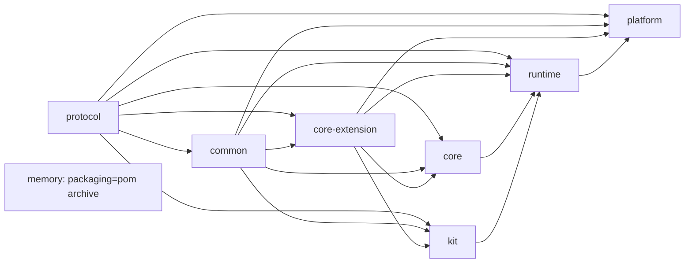

# 架构与执行流程

## 模块结构

箭头表示直接项目依赖。memory 没有依赖，也不被其他模块依赖。

## NEW 请求

1. `UserContextFilter` 校验 `X-User-Id`。
2. `ChatController` 校验 DTO，`ChatService` 创建独立 `SseEmitter` 和请求级 Publisher。
3. `ApexAgentRuntime.newAgent` 同步获取 session lease，创建唯一 CancellationToken 与 Once Publisher。
4. `ApexAgentFactory.createNew` 装配定义、生命周期 Binding 和初始 Session/Turn/Iteration。
5. execution 被登记后交给平台 executor；线程池拒绝则 `cancelBeforeStart()` 收口。
6. `ApexAgent.run` 执行唯一 ReAct 循环：生命周期 -> 历史/压缩 -> 模型 -> 顺序 ToolCall -> 下一 Iteration 或结束。
7. `ApexAgentExecution.run` 的 `finally` 发布一次 END、释放 lease、注销活动 execution；runtime 已关闭且活动数归零时再关闭自有资源。

400/409 在响应提交前返回且没有 END；core 同步准备失败返回事件流，内容只有一个 END。

## 生命周期与定义

生命周期覆盖 AGENT_BUILD、SESSION_START/END、TURN_START/END、ITERATION_START/END、PRE/POST_MODEL_CALL、PRE/POST_TOOL_CALL 共 11 点。

- AGENT_BUILD 使用原始 Binding 的不可变排序快照；本次分发中的定义修改只影响最终定义和后续生命周期。
- 其他生命周期不能增删定义 Binding。
- 普通 Hook 异常记录 warn 并跳过当前 Binding；违反流程契约的错误终止执行。

## 模型、压缩与工具

- ModelRequest 从会话原始消息、独立摘要消息和当前定义生成；摘要不会拼入 system prompt。
- 默认消息压缩通过当前 ModelGateway 的独立无工具请求生成累计摘要，只输入已有摘要和本次被淘汰消息，不递归进入 ReAct 循环。
- 仓储加载摘要及全部原始消息，窗口依据摘要边界移除已覆盖范围，再插入一条 `SUMMARY` 消息并保留范围外消息。
- Agent 级压缩由消息数、可选 token 阈值、可选字符阈值按 OR 关系触发；容量阈值只触发压缩，不拒绝模型调用。
- 压缩先写 Conversation，再写 Session，然后才调用模型；任一步失败都停止传播。
- Spring AI 模型 Adapter 关闭自动工具执行，core 是唯一工具编排者。原生 `AgentTool` 直接执行；callback-backed 工具在 PRE Hook 批准后逐个交给 `ToolCallingManager`，其结果返回 core 后继续 POST Hook 和持久化。
- platform 在启动时收集独立 `ToolCallback` 和 `ToolCallbackProvider`，provider 只生成一次快照。发现的工具仍需以最终 callback 名称进入 Agent `available` 和 session `enabledTools`，不会自动授权给模型。
- 多个 ToolCall 按 ordinal 完成整批 PRE_TOOL_CALL 预处理；只要其中存在人工介入，就先挂起整批，不执行任何真实工具或 POST_TOOL_CALL。
- 预处理计划记录稳定 invocation ID、最终参数、已执行 Hook ID 及 EXECUTE/RETURN_RESULT/INTERVENTION 处置；没有介入时才按原顺序消费。
- 工具中途不可用时生成标准 ToolResult，保持一一配对。
- 达到最大轮次且仍有未完成工具时，由 core 唯一工厂补固定强制结束结果。

## 挂起与恢复

挂起顺序固定为：保存含 `SuspendedToolBatch` 的完整 SessionSnapshot -> 发布一条批量 HUMAN_INTERVENTION -> END 当前传输。

恢复流程：

1. `resumeAgent` 与 NEW 竞争同一 lease。
2. 校验 userId、agentKey、sessionId、`HUMAN_IN_THE_LOOP` 状态和快照版本。
3. 按挂起批次顺序处理稀疏回复；缺失问题/确认在处理对应项时即时采用默认语义，已执行 PRE Hook 不重复执行。
4. 继续各条目剩余 PRE Hook；再次介入则重新扫描并挂起整批，EndTurn 则覆盖已收集介入并为整批生成固定结果。
5. 全部 PRE Hook 清空后，按原 ToolCall 顺序执行固定结果或真实工具、POST Hook 和结果提交。

刷新不执行恢复：只读状态接口读取快照并映射 `pendingInteraction`，前端重放给 reducer 后等待用户显式提交。

## 取消与关闭

- emitter completion/timeout/error、用户中止或 runtime close 都只发请求级取消命令。
- Spring AI 模型调用会 dispose reactive subscription 并唤醒等待线程；callback-backed 工具（包括 MCP）中断当前 Manager 执行线程并清理取消产生的中断标记；HTTP SubAgent 取消 future/stream。
- RUNNING execution 不在 `cancel()` 中释放 lease；只有实际 run finally 释放。
- runtime close 先关接入门，再取消活动 execution；最后一个 execution 结束后才逆序关闭 owned resources。
- 没有取消 timeout/grace period。

## PostgreSQL

Flyway schema：

- `apex_agent_session`：所有权、状态、定义快照、工具/Skill 集合、runtime 快照、挂起工具批次。批次仍写入既有 `suspended_tool_call` TEXT 列，不新增迁移。
- `apex_agent_dialogue_message`：有序消息与 payload，`(session_id, sort_no)` 唯一。
- `apex_agent_dialogue_summary`：压缩摘要和边界。

所有结构化快照以版本化 JSON 写入 TEXT；当前只支持 `1.0.0`。跨 Repository 由 core 保证顺序和失败停止，不承诺原子回滚。

## SSE 与前端

默认生产事件为 STREAM_CONTENT、HUMAN_INTERVENTION、INVOCATION_DECLARED/CHANGE（工具/子调用路径）和 END。兼容 DTO 仍识别 STREAM_THINK、PLAN、TASK_THINK、ARTIFACT，但默认运行不生产。

END 不携带 `execution_status`。前端按有序 `pendingInterventions` 推断统一的 `waiting-intervention`，并使用 `apex:active-session:v1` + 只读状态接口恢复刷新后的整批 HITL 卡片。

## 运行边界

- platform 只能单实例，`replicas=1`，升级停旧再启新。
- 远程 SubAgent 识别 HUMAN_INTERVENTION，但不支持嵌套 HITL；它会转为父工具普通失败。
- 旧版非空单条挂起 JSON 不迁移且会被拒绝，发布前必须清理旧 HUMAN_IN_THE_LOOP 会话。
- memory 归档不进入生产编译或发布物。
- 旧 MySQL 与新 PostgreSQL TEXT schema 不兼容。
