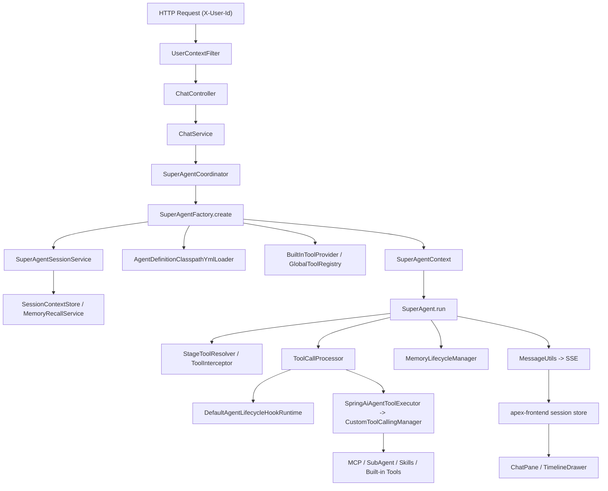

# 架构与执行流程

## 总体结构

当前仓库可以理解为两层：

- 后端 Agent 运行时：负责执行、工具、记忆、SSE
- 前端工作台：负责把 SSE 事件还原成可交互的会话界面

## 请求入口

### `UserContextFilter`

职责：

- 校验请求头中的 `X-User-Id`
- 将用户标识写入 `UserContextHolder`

这意味着会话、记忆、恢复操作都默认以当前用户维度隔离。

### `ChatController` → `ChatService` → `SuperAgentCoordinator`

`ChatController` 当前暴露两个 SSE 相关入口：

- `GET /api/sse/agents`：返回 `{code, data:[{agentKey, name}], message}`
- `POST /api/sse/chat`

`POST /api/sse/chat` 的关键流程：

1. `ChatController` 校验 `sessionId` 非空（否则 400）
2. `ChatService` 创建 `SseEmitter`（超时 600000ms）并调用 `SuperAgentCoordinator.run`
3. `SuperAgentCoordinator` 对同一 `sessionId` 做并发防护：已有执行中的会话直接返回 409
4. `SuperAgentFactory.create(ChatRequest, SseEmitter)` 按 `RequestType.NEW` / `RequestType.HUMAN_RESPONSE` 创建或恢复上下文，并把 `SseEmitter` 注入上下文
5. `SuperAgentCoordinator` 把 `SuperAgent.run()` 派发到 `chatStreamExecutor` 线程池（`TaskDecorator` 传播用户上下文）
6. 执行结束后在 `finally` 中补发 `END`、完成 emitter 并摘除会话注册

> 注意：`SuperAgentFactory.executeContext` 仍在源码中但已无调用点，属于残留 API；旧文档提到的 `SessionExecutionGuard` 已不存在于主模块。

## 上下文创建

### `SuperAgentFactory` / `SuperAgentSessionService`

`SuperAgentFactory` 现在是纯装配工厂：把执行引擎的各个协作者注入并构造 `SuperAgent`；会话上下文的创建与恢复委托给 `SuperAgentSessionService`（`createContext` / `resumeContext`）。

创建新轮次时会做这些事情：

- 读取既有会话并校验 userId / agentKey 是否一致
- 初始化本轮运行状态
- 装配所有可用工具
- 加载记忆召回包
- 追加本轮用户消息并持久化

恢复挂起会话时会做这些事情：

- 从 `SessionContextStore` 读取上下文
- 校验当前会话确实处于 `HUMAN_IN_THE_LOOP`
- 注入前端回传的 `humanResponse`
- 重新做记忆召回

## Agent 定义解析

### `AgentDefinitionClasspathYmlLoader`

该类把 agent 定义拆成了几个独立来源：

- 全局配置：`application.yml`
- workspace 配置：`agents/<agentKey>/config.yml`
- workspace prompt：
  - `REACT_PROMPT.md`
  - `PLAN_EXECUTOR_WRITE_PLAN_PROMPT.md`
  - `PLAN_EXECUTOR_RUN_PROMPT.md`
- workspace 说明：`AGENT.md`
- 缺省 prompt 回退：`agents/defaults/*` 或内置 `StageSystemPrompt`

解析策略有几个关键点：

- `workspace config` 里的 `allow-*` 白名单会覆盖全局配置
- `workspace config` 里的 `hooks` 会覆盖全局 Hook 配置
- `default-execution-mode` 可以来自 workspace，也可以来自全局 agent 配置

## 工具装配

### 1. 内置工具

`BuiltInToolProvider` 当前固定注册：

- `ask_human`
- `write_plan_tool`
- `update_plan_tool`
- `session_search`

### 2. MCP 工具

`GlobalToolRegistry` 会根据 agent 定义里的 MCP 名称：

- 读取 `apex.global.mcps.*`
- 用 stdio 拉起外部 MCP server
- 把远端工具转换成 Spring AI `ToolCallback`

如果外部命令失败，当前实现会记录日志并返回空工具列表，不会直接让整个进程崩掉。

### 3. SubAgent 工具

SubAgent 会被包装成工具调用，底层通过 HTTP + SSE 回调目标 agent 的 `/api/sse/chat`。

### 4. Skills 工具

Skill 加载链路大致是：

1. 从 `apex.global.skills.*` 找到目录
2. 用 `FileSystemSkillLoader` 读取 skill
3. 组合成 `Skills`
4. 暴露为 `activate_skill`

如果 skill 目录不存在，当前实现会记录警告并跳过。

## 执行模式控制

### `StageToolResolver`

它负责决定“当前这一轮到底哪些工具可调用，哪些只能写进 prompt 但不能直接调”。

核心规则：

- `react`
  `write_plan_tool` 与 `update_plan_tool` 都不参与调用，其余允许按规则进入可调用集合
- `plan-executor` 且 `context.plan == null`
  只有 `write_plan_tool` 可调用，其他工具只写进 prompt 描述
- `plan-executor` 且计划已存在
  `update_plan_tool` 变成可调用工具，`write_plan_tool` 被移除

### `ToolInterceptor`

它做的是更硬的运行时守卫，比如：

- `plan-executor` 初始阶段必须先写计划
- 没有 `RUNNING` 阶段时，必须先 `update_plan_tool`

也就是说，工具能不能被模型真正调起，不只看是否注册，还看当前执行态是否合法。

## 工具调用与 Hook

### `ToolCallProcessor`（编排层）

工具执行的编排在 `core/engine/ToolCallProcessor`，关键职责包括：

- 分发 `PRE_TOOL_CALL` / `POST_TOOL_CALL` 生命周期 Hook
- 处理 Hook 流控动作：`BLOCK_TOOL`、`SKIP_TRACE`、`END_TURN`、`REQUEST_CONFIRMATION`
- 触发 `TOOL_CONFIRMATION` 并记录 `PendingToolExecution`（含已执行的 pre-hook 集合，恢复时跳过）
- 分流 `ask_human`，发送 `ASK_HUMAN`
- 在需要时把会话切换到 `HUMAN_IN_THE_LOOP`
- 把 `ToolResponse` 落库

底层真实工具调用走 `SpringAiAgentToolExecutor` → `CustomToolCallingManager`（它仍是 Spring 的 `ToolCallingManager` bean，但只做“调起真实工具”这一件事，Hook 逻辑已迁出；其内部与挂起/确认相关的方法是无调用点的死代码）。注意：本地工具执行当前不向前端发送 `INVOCATION_DECLARED`/`INVOCATION_CHANGE`，这两个事件只在子 Agent 场景被透传。

### `DefaultAgentLifecycleHookRuntime`

生命周期 Hook 的分发器是 `hook/lifecycle/DefaultAgentLifecycleHookRuntime`，覆盖 `HookPoint` 的 8 个生命周期点（turn/trace/model/tool 前后）。对工具而言：

- `pre-tool-call`
  可返回继续执行、更新参数、请求确认
- `post-tool-call`
  可替换工具结果

仓库里已经有几个典型 Hook：

- `ToolConfirmHook`（`hook/tool/builtin/`）
  在工具真正执行前，向前端发 `TOOL_CONFIRMATION`
- `PlainTextTruncateHook`（`hook/tool/builtin/`）
  对长文本工具结果做截断
- `SkillUsageRecorderHook` / `SkillExperienceAugmentHook`（`skills/learning/`）
  记录 skill 使用并注入经验片段

## 人在回路

当前实现里有两种主要挂起恢复场景：

### 1. `ask_human`

模型主动调用 `ask_human`，前端收到 `ASK_HUMAN` 后收集答案，再用 `RequestType.HUMAN_RESPONSE` 恢复会话。

### 2. `TOOL_CONFIRMATION`

工具 pre-hook 要求确认时，后端发 `TOOL_CONFIRMATION`。前端允许：

- 批准
- 拒绝
- 修改可编辑参数

然后再以 `RequestType.HUMAN_RESPONSE` 恢复会话。

## SSE 输出与前端消费

### 后端侧

后端当前主链路会发送的事件，见 [消息标准](../spec/消息标准.md)。

主链路实际发送的是：

- `STREAM_CONTENT`
- `TASK_THINK_CHANGE`（plan-executor 模式的主文本通道）
- `PLAN_DECLARED`
- `PLAN_CHANGE`
- `ASK_HUMAN`
- `TOOL_CONFIRMATION`
- `END`

`INVOCATION_DECLARED` / `INVOCATION_CHANGE` 仅在子 Agent 场景透传；`ARTIFACT_DECLARED` / `ARTIFACT_CHANGE` 当前没有生产者。

### 前端侧

前端主要通过两个文件把事件还原成 UI：

- `apex-frontend/src/stores/session/store.ts`
- `apex-frontend/src/stores/session/reducer.ts`

状态映射关系大致是：

- 消息正文 -> `messages`
- 阶段计划 -> `stages`
- 工具调用 -> `invocations`（主链路当前不发调用事件，实际只在子 Agent 场景有数据）
- 结构化产物 -> `artifacts`（后端无生产者，生产环境恒为空）
- 人工输入挂起 -> `pendingPrompts`
- 工具确认挂起 -> `pendingConfirmations`

对于没有 `stage_id` 的 `react` 调用，前端会自动归到一个本地虚拟阶段 `react-stage`。注意前端 reducer 尚未处理 `TASK_THINK_CHANGE`，plan-executor 的思考流当前会被丢弃。

## Memory 子系统

### 配置入口

`MemoryConfiguration` 会根据 `apex.memory.store.type` 在两套实现间切换：

- `in-memory`
- `jdbc`

### 主要职责拆分

- `SessionContextStore`
  保存/恢复会话上下文
- `MemoryRecallService`
  每轮执行前召回记忆
- `DefaultConversationMemoryManager`
  执行对话摘要压缩
- `MemoryLifecycleManager`
  在回合结束后异步抽取执行历史与经验记忆
- `MemoryController`
  提供记忆管理接口
- `SessionSearchService`
  执行历史会话搜索

### 数据类别

`memory/model/MemoryType` 当前定义的记忆类型是：

- `LONG_TERM`（用户长期画像）
- `FACT`（用户事实）
- `EXECUTION_HISTORY`（执行历史）
- `AGENT_EXPERIENCE`（Agent 经验）

## Skill 经验学习链路

`activate_skill` 相关能力当前已经形成闭环：

1. `SkillUsageRecorderHook` 记录 skill 使用事件
2. `SkillUsageBatchService` 聚合待处理记录
3. `SkillExperienceScheduler` 按 cron 定时跑批
4. `SkillExperienceExtractor` 调模型抽取经验
5. `SkillExperienceAugmentHook` 在后续 skill 激活时注入经验片段

这套链路的配置入口在：

- `apex.skills.learning.*`

## 当前实现边界

- 当前资源目录没有完整的 `default_agent` workspace；`agents/defaults/` 目录不存在，prompt 缺失时实际总是回退到内置 `StageSystemPrompt`
- 当前外部 MCP 与 skill 依赖仍是示例绝对路径
- 后端默认激活 `dev` profile：数据源为 MySQL、`apex.memory.enabled: false`，记忆与 Skill 经验学习链路默认关闭
- JDBC 记忆与搜索实现明显偏向 PostgreSQL/pgvector，但 `pom.xml` 保留的是 MySQL 驱动，依赖配置尚未收口
- `END` 事件当前不携带 `execution_status`，前端终止判断实际走缺失字段的兼容分支
- 前端保留了对旧事件 `STREAM_THINK` 的兼容（后端已无生产者），且尚未消费 `TASK_THINK_CHANGE`
- `SuperAgent.executeLoop` 有硬上限 `MAX_ITERATIONS = 30`
