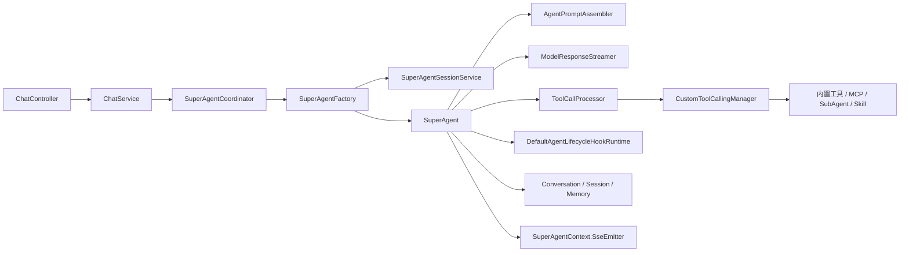
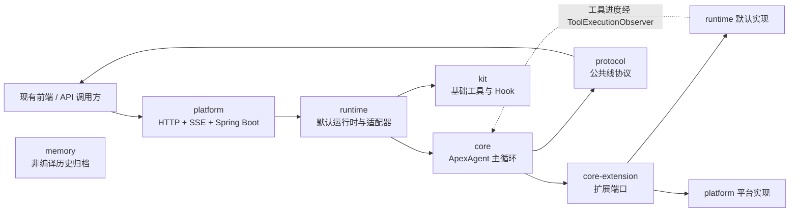
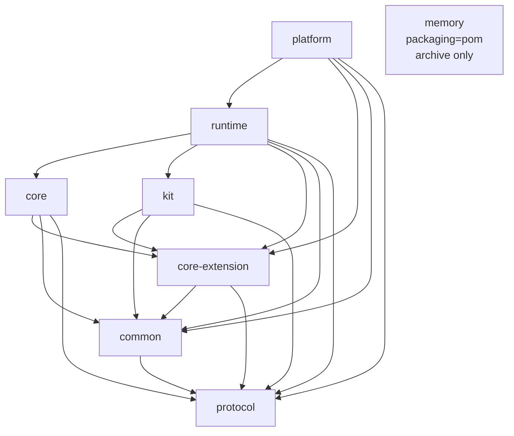
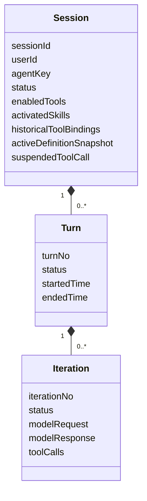
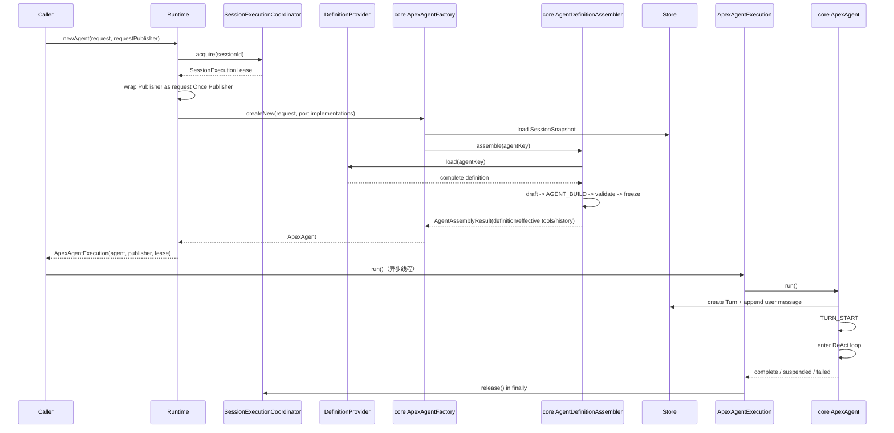
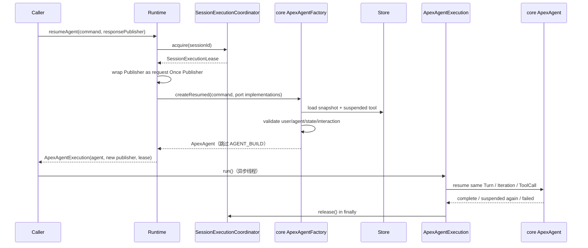
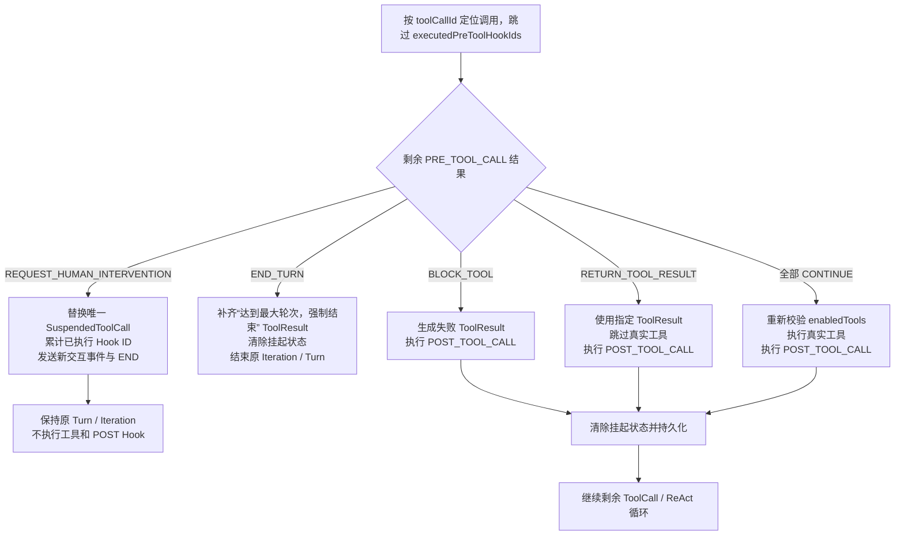
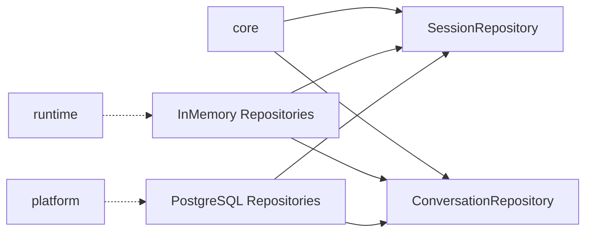

# Apex Agent 后端目标架构

> 状态：目标态架构
> 日期：2026-07-30
> 最近修订：2026-07-31
> 范围：`apex-agent` 后端模块化重构
> 输入：[原始需求](原始需求.md)、[后端模块化重构设计](specs/2026-07-28-apex-agent-backend-refactoring-design.md)
> 源码基线：当前单 Maven 模块，248 个生产 Java 文件、44 个测试 Java 文件
> 外部约束：不修改 `apex-frontend`，HTTP、SSE 与人在回路协议保持兼容

## 1. 文档定位

本文定义 Apex Agent 后端重构完成后的稳定架构，包括模块边界、依赖方向、核心领域模型、扩展端口、运行时装配、执行状态机、持久化边界和平台集成方式。

本文描述的是**目标态**，不是当前源码现状。当前源码仍以 `SuperAgent`、Spring 容器和单模块工程为中心；目标态统一使用 `ApexAgent`，并把核心循环与框架实现、平台实现、可选 Memory 能力解耦。

当本文与当前源码冲突时：

1. 判断当前行为时以源码和测试为准。
2. 判断重构目标时以已确认的设计文档和本文为准。
3. 具体字段、Hook 结果 record、数据库列等实施细节以设计文档为补充。
4. 外部消息协议以当前 [消息标准](../spec/消息标准.md) 为兼容基线。

## 2. 架构目标

### 2.1 核心目标

- 后端拆分为 `protocol`、`common`、`core-extension`、`core`、`kit`、`runtime`、`platform`、`memory` 八个 Maven 模块。
- 核心框架只保留一个 ReAct 循环，不再存在执行模式、PlanExecutor、Stage 驱动或模式切换。
- 保留并强化 `Session -> Turn -> Iteration` 领域层级。
- 核心循环只依赖中立领域模型和扩展接口，不依赖 Spring IoC、Servlet、SSE、数据库、MCP 或具体模型厂商。
- Agent 的模型、工具、Hook、Skill、事件出口和存储都由接口屏蔽实现细节。
- runtime 可以脱离 Spring ApplicationContext，通过普通 Java Builder 创建并运行 Agent。
- platform 只负责 Web 产品接入、SSE、并发入口、Spring 配置和 PostgreSQL 持久化。
- 长期记忆、会话搜索和 Skill Learning 的旧源码/资源归档在 memory 非标准源码目录，不进入编译或默认执行链路。
- 保持既有聊天与 SSE 契约兼容，并新增刷新挂起交互所需的只读状态查询。

### 2.2 非目标

- 不实现数据库版 AgentDefinitionProvider。
- 不兼容历史 MySQL 配置和历史数据。
- 不保留 PlanExecutor 的兼容执行路径。
- 不恢复长期 Memory、`session_search` 或 Skill Learning 到默认运行链路，也不要求 memory 适配、编译或测试。
- 不升级 Spring Boot、Spring AI 或模型供应商版本。
- 不修改 `END` 当前缺少 `execution_status` 的线协议行为。
- 本期不支持 platform 水平多实例部署；上线多实例前必须先实现分布式 session execution lease。

## 3. 当前架构基线与重构驱动

### 3.1 当前主链路

源码中的当前执行链路为：



这条链路已经具备 Turn、Iteration、生命周期 Hook、多工具调用和人在回路恢复的雏形，但边界仍由具体框架类型连接。

### 3.2 源码确认的主要耦合

| 当前事实 | 架构影响 | 目标处理 |
| --- | --- | --- |
| `SuperAgentContext` 同时持有 Spring AI Message、ToolCallback、`SseEmitter`、Plan、Skill、Memory 和恢复状态 | 会话领域对象同时承担运行对象、传输对象和持久化对象职责 | 拆成中立 `SessionContext`、运行态 `ApexAgentContext`、不可变快照和事件端口 |
| `SuperAgent` 直接依赖 Spring AI、Memory、Store、工具解析与 Hook 实现 | 核心循环无法独立测试和复用 | core 仅依赖 protocol、common 与 core-extension |
| `DefaultAgentLifecycleHookRuntime` 通过 `ApplicationContext.getBean` 解析 Hook | runtime 无法脱离 Spring 容器 | 由 `HookResolver` 解析稳定注册名 |
| Hook 使用一个可空字段较多的 `AgentHookResult`，并保存 Bean 名 | 动作语义和恢复语义不稳定 | 按生命周期和动作分型，恢复只保存稳定 Hook Binding ID |
| `PendingToolExecution` 保存 ToolCall 数组索引、Bean 名和部分重复状态 | 配置或数组变化会导致恢复漂移 | 通过 `toolCallId` 定位，只保存已执行 PRE_TOOL_CALL Hook ID |
| `ask_human` 与工具确认走两套恢复分支 | 人在回路状态机重复且行为不一致 | 统一为 PRE_TOOL_CALL 请求人工介入 |
| `StageToolResolver`、`ToolInterceptor`、计划工具共同维护模式规则 | 提示词、工具可见性和执行合法性互相耦合 | 删除执行模式和全部 PlanExecutor 运行逻辑 |
| 当前 Turn 完成时清空激活 Skill 和启用工具集合 | 状态不能跨 Turn 保留 | `enabledTools`、`activatedSkills` 改为 session 级状态 |
| 对话压缩位于 `AgentPromptAssembler.prepareWorkingMessages` 内 | 压缩时机和生命周期不可观察 | 在 core 的每次模型调用前建立显式压缩门 |
| Session 存储位于 memory 包，长期 Memory 与会话连续性混在一起 | 可选能力反向成为核心依赖 | Session/Conversation 端口进入 core-extension，默认实现进入 runtime/platform |
| 协议 DTO 依赖执行上下文和 Hook 类型 | protocol 无法独立发布 | protocol 只保留纯协议 DTO，消息工厂进入 core |
| 生产源码中 Fastjson 与 Jackson 并存 | 序列化规则分裂 | 七个代码模块统一 Jackson 与 common `JsonUtils`；memory archive 不参与编译 |
| 当前并发保护只在 Web 协调器 | 独立 runtime 可能并发覆盖 session | runtime 增加最终 session 执行锁 |

## 4. 总体架构

### 4.1 系统上下文



核心控制方向是：

```text
请求进入 platform
  -> runtime 创建或恢复 ApexAgent
  -> core 按 Session / Turn / Iteration / ReAct 推进
  -> core 通过端口调用模型、工具、Hook、存储和事件出口
  -> runtime 或 platform 提供端口实现
```

### 4.2 Maven 依赖图

下图箭头表示“左侧模块依赖右侧模块”：



对应关系：

```text
common         -> protocol
core-extension -> protocol + common
core           -> protocol + common + core-extension
kit            -> protocol + common + core-extension
runtime        -> protocol + common + core-extension + core + kit
platform       -> protocol + common + core-extension + runtime
memory         -> 无项目依赖（非编译归档模块）
```

这是标准 Maven 生产/测试源码的真实直接依赖图，不是删除冗余边后的传递闭包简图。源码或测试直接引用哪个项目模块的类型，本模块 POM 就必须直接声明哪个模块；memory 的归档目录不是 source root，其中的历史 import 不参与依赖分析。`dependencyManagement` 和其他模块的传递依赖不能替代直接声明。

禁止形成任何反向依赖或环：

- protocol 不依赖其他项目模块。
- common 不依赖 Spring、Spring AI、Servlet、ORM 或数据库驱动。
- core-extension 只包含接口。
- core 不依赖 kit、runtime、platform 或 memory。
- kit 不依赖 core 具体实现。
- runtime 不依赖 platform 或 memory。
- platform、runtime、core、kit 均不依赖 memory。
- memory 使用 `packaging=pom`，不声明项目依赖，不产出 class；其他模块不得扫描其归档目录。

### 4.3 模块目录

```text
apex-agent/
├── pom.xml
├── protocol/
├── common/
├── core-extension/
├── core/
├── kit/
├── runtime/
├── platform/
└── memory/
```

最终态父 POM 只负责聚合、JDK 25、UTF-8、依赖版本和构建规则，只有 platform 生成 Spring Boot 可执行包；memory 只作为归档目录占位模块参与 reactor。

迁移期临时增加 `legacy` 模块：父 POM 切换为 `packaging=pom` 时，原根目录的 `src/main`、`src/test` 和资源整体迁入 `legacy`，由它继续运行旧测试和旧 Spring Boot 入口。迁移期允许 `legacy` 依赖已完成的目标模块，但禁止任何目标模块依赖 `legacy`。新 platform 通过协议、恢复、并发、PostgreSQL 和前端兼容切换门槛后接管默认入口，最终清理 `legacy`；因此上图和八模块目录仍表示最终态。

## 5. 模块职责

### 5.1 protocol：公共线协议

protocol 是前端、platform、core 事件工厂和远程 SubAgent 共用的协议模块。

包含：

- `ChatRequest`、`RequestType`。
- `AgentMessage` 及 Jackson 多态配置。
- 全部 SSE 事件 DTO。
- 刷新恢复用 `SessionStateView` 只读 HTTP DTO，其中 camelCase `pendingInteraction` 复用 ASK_HUMAN/TOOL_CONFIRMATION 消息。
- `AgentEventType`、协议字段常量。
- ASK_HUMAN 与 TOOL_CONFIRMATION 的展示、选项和可编辑字段 DTO。

边界：

- 保持现有 snake_case JSON 字段。
- 不引用 `ApexAgentContext`、HookContext、Spring AI、`SseEmitter` 或数据库实体。
- `ToolConfirmationMessage.from(...)` 一类依赖运行上下文的构造逻辑不属于 protocol。
- `PLAN_*`、`TASK_THINK_*` 和 `STREAM_THINK` 作为兼容 DTO 保留，但默认运行链路不再生产。

### 5.2 common：跨模块领域模型

common 保存扩展接口和核心实现共同使用的中立对象：

- Agent 定义、定义草稿、不可变定义快照和元数据。
- AgentRequest、HumanResponseCommand。
- AgentExecutionDescriptor 等请求级执行元数据。
- Session、Turn、Iteration 及状态。
- 中立消息、模型请求、模型响应、流片段。
- 工具定义、工具调用、工具结果和三层工具状态。
- 请求级 `CancellationToken`、registration 和统一 `CancellationRequestedException`；可写 source 只在 runtime。
- Skill 定义与 session 激活状态。
- HookPoint、HookBinding、生命周期上下文视图和分型结果。
- 消息、工具参数、工具结果、模型请求、压缩请求/结果的专用 Patch。
- HumanInterventionRequest、SuspendedToolCall、SuspensionPoint。
- SessionSnapshot、运行快照和持久化中立结构。
- 统一 Jackson `JsonUtils`。

common 对外暴露不可变集合或防御性副本，不能泄漏可变运行对象。

### 5.3 core-extension：扩展端口

core-extension 严格只声明接口。接口参数和返回值只能来自 JDK、protocol、common，或用于端口组合的 core-extension 同模块 interface；不得引用同模块实现类、record 或 enum。

主要端口：

| 端口 | 责任 |
| --- | --- |
| `AgentDefinitionProvider` | 按 `agentKey` 返回完整 Agent 定义，并通过 `listAgents()` 直接返回轻量元数据列表 |
| `ModelGateway` | 流式调用模型并返回中立响应 |
| `ModelStreamObserver` | 接收模型流片段并暴露请求级 CancellationToken |
| `AgentTool` | 声明并执行单个工具 |
| `ToolExecutionObserver` | 接收工具执行期允许透传的进度事件并暴露同一请求级 CancellationToken |
| `ToolProvider` | 为定义快照解析工具实例 |
| `LifecycleHook<C,R>` | 执行单个生命周期扩展 |
| `HookResolver` | 按生命周期点和注册名解析 Hook |
| `AgentEventPublisher` | 发布 protocol 消息 |
| `AgentEventPublisherFactory` | 未显式传入 Publisher 时，按请求创建独立事件出口 |
| `SessionRepository` | 加载与保存 SessionSnapshot |
| `ConversationRepository` | 追加、读取与压缩对话 |
| `ConversationWindowManager` | 准备业务模型可见的对话窗口 |
| `ConversationCompactionPolicy` | 判断当前模型调用是否需要压缩 |
| `ConversationCompactor` | 生成压缩结果 |
| `SkillProvider` | 提供完整 Skill 注册集合 |
| `SkillActivator` | 激活 Skill 并返回 instructions |
| `IdGenerator`、`TimeProvider` | 隔离 ID 和时钟 |

禁止：

- `default` 方法。
- NoOp、InMemory 等实现。
- Spring 注解。
- 在接口文件中嵌入实现所需的 Spring AI 或数据库类型。

### 5.4 core：Agent 核心语义

core 负责：

- `ApexAgent` 唯一 ReAct 主循环。
- `ApexAgentContext` 与 `AgentRuntimeContext`。
- Session、Turn、Iteration 状态流转。
- `AgentDefinitionAssembler` 独占定义加载、可变草稿、AGENT_BUILD、校验和快照冻结。
- `ApexAgentFactory` 分别创建 NEW 与 HUMAN_RESPONSE 的 core Agent；恢复路径跳过 AGENT_BUILD。
- 生命周期 Hook 调度、类型校验、结果校验与原子应用。
- 模型请求编排和模型调用前压缩门。
- 工具可见性、工具执行编排和执行前二次校验。
- 为每次工具执行创建请求级 `ToolExecutionObserver`，校验允许的进度事件并转发到当前 `AgentEventPublisher`。
- 多 ToolCall 的顺序处理与 ToolResult 对齐。
- 人工介入挂起和 HUMAN_RESPONSE 恢复状态机。
- 协议消息工厂。
- 通过端口提交会话、对话和事件。

core 不负责：

- Spring Bean 查找。
- Spring AI 类型适配。
- MCP、HTTP、文件系统 Skill。
- SSE。
- PostgreSQL/MyBatis。
- 长期 Memory 和 Skill Learning。

### 5.5 kit：基础工具与 Hook

kit 提供可以被任意 runtime 复用的实现：

- `ask_human`。
- `AskHumanInterventionHook`。
- `ToolConfirmHook`。
- `PlainTextTruncateHook`。
- 工具与 Hook 匹配器。
- Tool Confirmation 规格构造器。
- 通用 Hook 组合器。

kit 不包含计划工具、PlanExecutor 守卫或状态机固定 ToolResult 工厂，也不依赖 core 实现类。

### 5.6 runtime：开箱即用运行时

runtime 把 core、kit 和基础设施适配器装配为可以直接使用的运行时：

- `ApexAgentRuntime` 与 Builder。
- 请求级 `ApexAgentExecution`，统一持有 core Agent、事件出口和 session execution lease。
- 默认 ReAct Agent 定义和 Prompt。
- Spring AI ChatModel、Message、ToolCallback 与 common DTO 的适配。
- 默认 ModelGateway 和工具执行器。
- 内存 Session/Conversation Repository。
- 默认对话窗口、压缩策略和摘要 Compactor。
- 请求级 EventPublisherFactory、Print 事件出口和 END 幂等包装。
- Java 对象和文件版 AgentDefinitionProvider。
- Tool、Hook、Skill 注册表。
- 非 learning 的文件 Skill 加载、激活与资源读取。
- MCP stdio/SSE 客户端和资源生命周期。
- HTTP SubAgent 工具及远端 SSE 协议解析。
- `SessionExecutionCoordinator`/`SessionExecutionLease` SPI 与默认进程内实现。

runtime 可以依赖最小范围 Spring AI API，但不能要求启动 Spring IoC 容器。

### 5.7 platform：Web 产品适配层

platform 包含：

- `ApexApplication`。
- Spring Boot 自动装配。
- `ChatController`、`ChatService`。
- 只读 `SessionStateController/Service`，按用户、Agent、Session 查询当前状态和挂起交互。
- `ApexAgentCoordinator`。
- `X-User-Id` Filter、ThreadLocal 传播与清理。
- 请求级 `SseEmitterAgentEventPublisher`，每个 NEW/HUMAN_RESPONSE 请求新建。
- Spring Properties/YAML AgentDefinitionProvider。
- Spring Bean 到 runtime 注册表的适配。
- Controller 返回 emitter 前的同步 execution 准备、HTTP 409 映射和异步执行器。
- PostgreSQL Session/Conversation Repository。
- Agent 列表、会话状态查询接口和 Flyway schema。

platform 不拥有主循环，不重新实现工具、Hook、恢复或 session lease 语义；本期只允许单实例部署。

### 5.8 memory：历史源码归档

memory 归档：

- 用户画像、事实、执行历史和 Agent 经验记忆。
- 召回、抽取、写入和管理。
- pgvector 会话搜索与 `session_search`。
- Skill 使用记录、经验抽取、调度与增强。
- 相关旧 Repository、实体、SQL 和配置资源。

归档文件位于 `archive/` 等非标准 Maven source root，允许保留旧框架引用；memory POM 使用 `packaging=pom`，不声明依赖、不编译、不测试、不提供 schema migration 或可运行管理入口。归档清单记录原路径与用途。普通 Skill 定义、加载、激活和资源读取属于 runtime，不属于 memory；未来若恢复归档能力，必须重新设计后迁入标准源码目录。

## 6. 核心领域模型

### 6.1 Session、Turn、Iteration



Session 是同一 `sessionId` 下跨多个用户输入轮次的连续边界。

Turn 从一个 `RequestType.NEW` 开始，到该输入对应的 ReAct 执行完成、失败或持续挂起为止：

- 同一 Session 内 `turnNo` 单调递增。
- HUMAN_RESPONSE 不创建新 Turn。
- 挂起时 Turn 状态为 `SUSPENDED`，但不执行 `TURN_END`。
- 只有原 Turn 真正收口时执行一次 `TURN_END`。
- 模型调用异常时当前 Iteration、Turn、Session 均标记为 `FAILED` 并立即返回，不再执行后续 Hook、工具、模型调用或结束生命周期；请求级执行句柄仍负责用既有 `END` 收口并释放 lease。
- 请求取消时当前活动 Session、Turn、Iteration 进入 `CANCELLED`，不误记 `FAILED`；若 execution 尚未 run，则只取消已同步创建的 Session/Turn，不创建 Iteration。
- CANCELLED session 可在 lease 释放后接受后续 NEW 并创建递增 Turn，但不能用 HUMAN_RESPONSE 恢复已取消 Turn。

Iteration 表示一次业务模型推理及其产生的全部 ToolCall 处理：

- 每次业务模型调用创建一个 Iteration。
- 模型响应产生工具后，处理完工具并再次调用模型时创建下一 Iteration。
- 人工介入保留当前 Iteration。
- HUMAN_RESPONSE 恢复原 Iteration，不重新调用模型。
- 同一响应的 ToolCall 按原顺序处理，前序结果不可丢失。
- 模型/工具 adapter 响应 token 后抛 `CancellationRequestedException`，停止剩余真实 ToolCall；模型阶段未追加 Assistant entry 时不生成结果，工具阶段已追加时由 core 为未完成调用补标准取消 ToolResult以维持配对。

### 6.2 Agent 定义与定义快照

AgentDefinition 是配置源返回的完整定义，至少包含：

- 元数据。
- `prompt.system`。
- 消息压缩策略。
- 工具可用全集与默认启用集合。
- `enabledSkills`。
- MCP、SubAgent 等外部资源引用。
- 十一个生命周期点的 Hook Binding。
- 定义版本，首版固定为字符串 `1.0.0`。

每个普通 NEW 由 core 的 `AgentDefinitionAssembler` 按以下顺序构造活动定义：

```text
load definition
  -> create mutable draft
  -> run AGENT_BUILD
  -> classify unavailable bindings against existing session
  -> reject new binding / migrate old binding to history
  -> validate tools / skills / hooks / prompt
  -> freeze AgentDefinitionSnapshot
  -> ApexAgentFactory.createNew
```

runtime 只提供 `AgentDefinitionProvider`、Hook/Tool Resolver、Store 等端口实现并调用 core 入口，不直接编排 AGENT_BUILD、校验或冻结。

Assembler 在 `AGENT_BUILD` 完成后先读取 `ToolAvailabilitySnapshot`：新 session 或 AGENT_BUILD 新增的不可用绑定直接拒绝；已有 session 的旧绑定转为 `HistoricalToolBinding` 并退出有效集合。随后执行请求级权威校验，包括 `defaultEnabledTools ⊆ availableTools ⊆ registeredTools`、Skill/Hook 可解析性、HookPoint 与结果族匹配以及 Prompt 完整性。动态 Provider 可以按 `agentKey` 返回不同定义，因此这组规则不能前移到 runtime Builder。

HUMAN_RESPONSE 由 `ApexAgentFactory.createResumed` 从 SessionSnapshot 加载挂起前的定义快照恢复投影，并按快照中的稳定名称重新解析工具和 Hook，不重新执行 AGENT_BUILD。

持久化的恢复投影只包含恢复行为所需的最终定义；`defaultEnabledTools` 只用于新 session 首个 Turn 的初始化，不写入恢复投影，也不能在后续 Turn 或恢复时重新应用。

### 6.3 工具三层状态

```text
registeredTools  runtime 注册的全部工具
      ⊇
availableTools   当前 Agent 定义允许使用的工具
      ⊇
enabledTools     当前 session 实际启用的工具
```

不变量：

- `defaultEnabledTools ⊆ availableTools ⊆ registeredTools`。
- `enabledTools ⊆ availableTools`。
- `defaultEnabledTools` 只初始化新 session 的首个 Turn。
- 后续 Turn 和 HUMAN_RESPONSE 直接沿用 session 的 `enabledTools`。
- 生命周期只能在 `availableTools` 范围内修改 `enabledTools`。
- 模型只看见 `enabledTools`。
- 真实执行前再次校验工具仍启用。
- 定义更新后无法解析 session 已启用工具时显式失败，不静默重置。
- 已登记 MCP/SubAgent 初始化故障是唯一例外：既有绑定移入只读 `historicalToolBindings` 后继续；历史绑定不属于第四层工具状态，不可被模型看到或执行。新绑定仍失败，健康恢复也不自动启用旧 session。

### 6.4 Skill 状态

Skill 分为：

- `enabledSkills`：Agent 定义允许使用的 Skill。
- `activatedSkills`：当前 session 已激活的 Skill。

不变量：

- `activatedSkills ⊆ enabledSkills`。
- 激活状态跨 Turn 保留，不同 session 之间隔离。
- Hook 不动态增删 Skill 集合。
- `activate_skill` 是默认的唯一激活入口。
- instructions 作为 `activate_skill` 的普通 ToolResult 进入对话，不作为固定 system 前缀重复注入。
- 重复激活必须幂等，并允许再次返回 instructions。

### 6.5 人工介入快照

Session 只允许一个挂起对象 `SuspendedToolCall`。至少保存：

- `sessionId`、`turnNo`、`iterationNo`。
- `toolCallId`、`invocationId`、`toolName`。
- 经 Hook 改写后的参数。
- 人工介入类型、交互标识、展示载荷和允许编辑的参数键。
- `executedPreToolHookIds`。
- `SuspensionPoint.PRE_TOOL_CALL`。

明确不保存：

- ToolCall 数组索引。
- Bean 名、Java 类名或对象实例。
- `enabledTools` 的重复副本。
- AgentDefinitionSnapshot 的重复副本。
- 其他生命周期的通用“已执行 Hook 列表”。

## 7. 生命周期架构

### 7.1 生命周期点

目标态共有十一个生命周期点：

1. `AGENT_BUILD`
2. `TURN_START`
3. `ITERATION_START`
4. `PRE_MESSAGE_COMPRESSION`，仅实际需要压缩时执行
5. `POST_MESSAGE_COMPRESSION`，仅压缩成功后执行
6. `PRE_MODEL_CALL`
7. `POST_MODEL_CALL`
8. `PRE_TOOL_CALL`
9. `POST_TOOL_CALL`
10. `ITERATION_END`
11. `TURN_END`

AGENT_BUILD 属于构造生命周期；消息压缩前后属于条件生命周期；其余属于运行生命周期。

### 7.2 Hook 上下文与结果

Hook 只能接收与当前生命周期匹配的只读上下文视图，并通过显式结果请求 core 修改状态。Hook 不能持有或直接操作 core 实现对象。

定义与运行态必须分开：只有 `AGENT_BUILD` 可以返回 `AgentDefinitionOperation` 并修改定义草稿。其他十个生命周期的结果族不暴露任何定义或 Hook Binding 修改入口；它们只能修改各自允许的运行态对象。session `enabledTools` 是运行态，不是定义，改变它不等于修改 `availableTools` 或 `defaultEnabledTools`。

AGENT_BUILD 开始时，core 先复制当时启用的 Binding 并按 `(order, id)` 排序为不可变分发快照。本次 Hook 对 AGENT_BUILD Binding 的增删改仍原子进入最终定义，但不会改变正在遍历的快照；因此不会重复、跳过或递归执行，只对后续构造与生命周期生效。

结果按生命周期分型：

| 生命周期 | 结果族 | 主要动作 |
| --- | --- | --- |
| AGENT_BUILD | `AgentBuildHookResult` | 修改构造草稿并继续 |
| TURN_START、ITERATION_START、ITERATION_END | `LoopHookResult` | CONTINUE、END_TURN |
| PRE_MESSAGE_COMPRESSION | `PreMessageCompressionHookResult` | 修改压缩请求、END_TURN |
| POST_MESSAGE_COMPRESSION | `PostMessageCompressionHookResult` | 修改压缩结果、END_TURN |
| PRE_MODEL_CALL | `PreModelCallHookResult` | 修改模型请求、END_TURN |
| POST_MODEL_CALL | `PostModelCallHookResult` | 修改模型响应/消息、END_TURN |
| PRE_TOOL_CALL | `PreToolCallHookResult` | CONTINUE、BLOCK_TOOL、RETURN_TOOL_RESULT、REQUEST_HUMAN_INTERVENTION、END_TURN |
| POST_TOOL_CALL | `PostToolCallHookResult` | 修改工具结果、END_TURN |
| TURN_END | `TurnEndHookResult` | CONTINUE |

core 必须先验证整个结果，再原子应用。参数、结果、消息和工具集合的部分修改不能在失败时残留。

### 7.3 流控语义

| 动作 | 语义 |
| --- | --- |
| `CONTINUE` | 应用当前 Hook 修改并继续同生命周期的下一个 Hook |
| `BLOCK_TOOL` | 不执行真实工具，生成标准失败 ToolResult，继续 POST_TOOL_CALL 和剩余 ToolCall |
| `RETURN_TOOL_RESULT` | 不执行真实工具，使用给定 ToolResult，继续 POST_TOOL_CALL 和剩余 ToolCall |
| `REQUEST_HUMAN_INTERVENTION` | 保存当前工具与已执行 PRE Hook ID，挂起原 Turn/Iteration |
| `END_TURN` | 停止当前 Hook 链、剩余工具和模型循环；存在 ToolCall 时按原 ID/name 补齐“达到最大轮次，强制结束” ToolResult，执行一次结束生命周期 |

目标态没有 `SKIP_ITERATION`。一个 Iteration 必须以完整模型/工具结果或明确 Turn 结束语义收口。

### 7.4 Hook 异常策略

- 所有 Hook 执行异常统一记录 warn、Tracing 和 Metrics，丢弃该 Hook 的全部修改后继续后续 Hook；不提供 `FAIL_FAST` 或其他运行时错误策略配置。
- AGENT_BUILD 执行异常同样跳过，随后仍由 Assembler 完整校验最终定义；静态类型、Binding、结果族或动作契约非法仍明确失败，不能按执行异常跳过。
- Hook 执行异常不改变 Session、Turn、Iteration 状态，也不产生协议错误事件。
- Hook 审计不作为恢复状态写入 SessionSnapshot。
- runtime 注册表只校验 Hook 实现自身声明的类型元数据；core Assembler 在加载 AgentDefinition 后校验 Hook Binding 的 HookPoint、Context 与 Result 族匹配，core 分发器在运行时再次防御性校验。

## 8. 核心执行架构

### 8.1 NEW 请求



`newAgent` 在返回执行句柄前同步取得 lease；失败时同步抛出 `SessionBusyException`，因此 platform 仍可在响应提交前返回 HTTP 409。取得 lease 后才允许 core 工厂通过端口加载 session；runtime 不解释其业务状态。core 工厂同步构造或恢复准备失败时，runtime 通过请求级 Once Publisher 发布且只发布既有 `END`、完成 Publisher 并释放 lease，再向 platform 抛出带 `endPublished=true` 的准备异常；platform 捕获后返回已完成的 emitter，不映射为 HTTP 4xx/5xx。新 session 的首个 Turn 从 `defaultEnabledTools` 初始化 `enabledTools`；已有 session 的新 Turn 沿用 session 工具和 Skill 状态。

### 8.2 ReAct 主循环

```text
prepare turn
while iterationNo < maxIterations:
    begin iteration
    run ITERATION_START

    baseRequest = prepare model request
    check = build compaction check(baseRequest)
    if compactionPolicy.shouldCompact(check):
        run PRE_MESSAGE_COMPRESSION
        compact
        run POST_MESSAGE_COMPRESSION
        persist final compaction result
        replace baseRequest.messages

    if iterationNo == maxIterations - 1:
        add instruction to baseRequest to output final conclusion and not call tools
    finalRequest = run PRE_MODEL_CALL(baseRequest)
    validate hard context limit
    response = modelGateway.stream(finalRequest); on error mark Iteration/Turn/Session FAILED and return
    run POST_MODEL_CALL

    if response has no tool calls:
        finish iteration
        finish turn
        return

    if iterationNo == maxIterations - 1:
        append "达到最大轮次，强制结束" for every ToolCall
        finish iteration
        finish turn
        return

    for toolCall in response order:
        run PRE_TOOL_CALL
        handle block / direct result / intervention / end turn
        verify tool enabled
        execute tool; convert execution error to current ToolResult
        run POST_TOOL_CALL
        append ToolResult

    finish iteration
```

关键不变量：

- `maxIterations` 是 runtime 配置，默认 30。
- 最后一个允许的 Iteration 提示模型直接输出最终结论且不再调用工具，不创建第 `maxIterations + 1` 个 Iteration；若模型仍返回 ToolCall，则不执行工具并逐个补齐“达到最大轮次，强制结束”。
- Assistant ToolCall 与 ToolResult 一一匹配；工具阶段取消时，core 为当前及剩余未完成调用补“请求已取消，工具未执行完成”结果后结束，不进入下一模型调用。
- 一个工具执行异常只生成该工具的模型可见 ToolResult，不终止 Turn，由下一 Iteration 的模型决定后续行为。
- 多 ToolCall 按模型响应顺序处理。
- 禁用工具不进入模型工具列表；执行前二次校验仅防御伪造或过期 ToolCall。
- END_TURN 遇到未处理 ToolCall 时，为当前及剩余调用按原 toolCallId/name 补内容为“达到最大轮次，强制结束”的结果，不增加自定义 code/payload，也不运行其 PRE/POST Hook。
- 状态机合成 ToolResult 由 core 内部唯一 `ToolResultFactory` 生成；确认拒绝、END_TURN 和请求取消不在 kit 或分支代码中重复构造。

### 8.3 模型调用前压缩门

压缩门位于每个 Iteration 的 `PRE_MODEL_CALL` 之前：

```text
ConversationWindowManager.prepare
  -> build base ModelRequest
  -> ConversationCompactionPolicy.shouldCompact
  -> PRE_MESSAGE_COMPRESSION
  -> ConversationCompactor.compact
  -> POST_MESSAGE_COMPRESSION
  -> transactional persist
  -> PRE_MODEL_CALL
  -> hard-limit validation
  -> ModelGateway.stream
```

约束：

- 每个逻辑业务模型调用只判断一次。
- Turn 创建、工具执行、人工介入和事件发送不触发压缩。
- ModelGateway 内部重试复用最终请求，不重复触发压缩。
- 判定覆盖消息、system prompt 和启用工具定义的共同占用。
- PRE_MODEL_CALL 修改后只做硬上限校验，不回跳压缩门。
- Compactor 内部模型调用不进入业务模型压缩门。
- 压缩结果必须先提交，再调用业务模型。

### 8.4 工具处理

工具执行的控制顺序固定为：

```text
resolve ToolCall
  -> PRE_TOOL_CALL
  -> apply ToolCallPatch
  -> handle flow action
  -> verify enabledTools
  -> create request-bound ToolExecutionObserver
  -> AgentTool.execute
  -> POST_TOOL_CALL
  -> apply ToolResultPatch
  -> append conversation
  -> persist progress
```

模型只提供工具参数。MCP 不接收 sessionId、用户信息、Agent 信息或其他隐式 ToolExecutionContext；本地工具可以通过显式中立 ToolExecutionContext 获得必要上下文。

`ToolExecutionObserver` 是 core-extension 接口，由 core 在调用工具前创建并绑定当前请求的 `AgentEventPublisher`。本期 allowlist 仅包含 `INVOCATION_DECLARED`、`INVOCATION_CHANGE`；`END`、`ASK_HUMAN`、`TOOL_CONFIRMATION`、流内容和其他事件均被拒绝。工具不能取得底层 Publisher。observer 与 `ToolExecutionContext` 暴露同一请求级 `CancellationToken`，adapter 必须把底层可取消 handle 注册为 command；observer 和 token 都不进入 SessionSnapshot，跨请求恢复时由 runtime/core 重新创建。

### 8.5 HUMAN_RESPONSE 恢复

HUMAN_RESPONSE 是原业务 Turn/Iteration 的延续，但属于新的 HTTP/SSE 请求，因此必须绑定新的请求级 Publisher 并重新取得同一 session 的 execution lease：



恢复工具阶段的完整分支为：



恢复时明确跳过：

- AGENT_BUILD。
- TURN_START。
- ITERATION_START。
- PRE/POST_MESSAGE_COMPRESSION。
- PRE_MODEL_CALL。
- 模型调用。
- POST_MODEL_CALL。

工具确认：

- 批准时只合并允许编辑的参数，再执行剩余 PRE Hook 和真实工具。
- 拒绝时映射为 RETURN_TOOL_RESULT，不执行剩余 PRE Hook 和真实工具，生成内容固定为“用户拒绝执行”的 ToolResult 后执行 POST_TOOL_CALL；不增加自定义 code/payload。

任何剩余 PRE Hook 再次请求人工介入时，必须在同一挂起槽位中更新经 Hook 修改后的参数、交互载荷和累计 Hook ID，结束本次 SSE；不能提前清除挂起状态，也不能执行真实工具。

`ask_human`：

- 首次 PRE_TOOL_CALL 由 AskHumanInterventionHook 请求人工介入。
- 恢复后跳过该已执行 Hook。
- 真实 AskHumanTool 从 ToolExecutionContext 读取人工回复并返回普通 ToolResult。

### 8.6 结束事件

- core 接管执行后，由 ApexAgent 在当前 SSE 传输正常完成、失败或挂起退出时请求发布 END。
- Agent 尚未构造成功时由 runtime 使用请求级 Once Publisher 收口；线程池拒绝时由 platform 调用 `ApexAgentExecution.cancelBeforeStart()` 收口。
- SseEmitter Publisher 对 END 只执行 send；execution terminator 先置 TERMINATED，再 complete emitter，因此正常 completion callback 不会反向发出取消命令。
- runtime 为每次执行创建独立 `OnceAgentEventPublisher`；END 幂等状态属于该请求，不能存放在共享 runtime、Session 或 Builder Publisher 中。
- END 只代表本次 SSE 传输结束，不表示挂起的业务 Turn 已完成。

## 9. runtime 架构

### 9.1 公共 API

最小使用方式：

```java
try (ApexAgentRuntime runtime = ApexAgentRuntime.builder()
        .chatModel(chatModel)
        .agentDefinition(agentDefinition)
        .build()) {
    AgentRequest request = AgentRequest.builder()
        .sessionId("session-1")
        .agentKey("default_agent")
        .userId("user-1")
        .query("请处理这个任务")
        .build();

    try (ApexAgentExecution execution = runtime.newAgent(request)) {
        execution.run();
    }
}
```

Web/SSE 等调用方显式注入本次请求的事件出口：

```java
AgentEventPublisher requestPublisher = ...;
try (ApexAgentExecution execution =
        runtime.newAgent(request, requestPublisher)) {
    execution.run();
}

AgentEventPublisher responsePublisher = ...;
try (ApexAgentExecution execution =
        runtime.resumeAgent(command, responsePublisher)) {
    execution.run();
}
```

默认提供：

- 内存 Session/Conversation Repository。
- 每次执行由默认 `AgentEventPublisherFactory` 创建独立 Print Publisher。
- 默认 ReAct Prompt。
- 最大 30 个 Iteration。
- kit 基础工具。
- 默认压缩策略与 Compactor。
- 无 MCP、无 SubAgent、无外部 Skill。

### 9.2 Builder 装配

Builder 在 `build()` 时完成：

- 必需端口校验。
- 恰好配置一个非空 AgentDefinitionProvider 引用。
- 工具、Hook、Skill 注册名去重及注册表项自身的类型元数据校验。
- 默认实现补齐。
- 默认 `AgentEventPublisherFactory` 与 `SessionExecutionCoordinator` 校验。
- 外部资源所有权和关闭策略确认。

Builder 不加载某个 `agentKey` 的 AgentDefinition，也不校验 `defaultEnabledTools`、`availableTools`、Hook Binding 或 Skill 定义关系。上述定义级规则由 core `AgentDefinitionAssembler` 在每次 NEW 构造时统一校验。

对于 Builder 直接接收的静态 ProgrammaticAgentDefinition，可以显式选择启动期预检；预检必须调用 Assembler 使用的同一 core 校验器，不能在 runtime 复制规则，而且请求执行时仍以 Assembler 校验为权威。

### 9.3 session 并发

runtime 的 `SessionExecutionCoordinator` 是唯一并发正确性来源：

- NEW 与 HUMAN_RESPONSE 共用同一 `sessionId` 锁空间。
- `newAgent`/`resumeAgent` 在返回 `ApexAgentExecution` 前同步获取 `SessionExecutionLease`，取得 lease 后才调用 core Factory；由 Factory 通过端口加载快照并创建 core Agent。
- 第二个并发执行在 runtime API 返回前抛出中立 `SessionBusyException`。
- `ApexAgentExecution` 持有 core Agent、请求级 Once Publisher 与 lease；`run()` 在 finally 释放。
- 线程池拒绝或尚未启动时调用 `cancelBeforeStart()`，先由 core 把已准备的 Session/Turn 保存为 CANCELLED，再幂等发布 END 并释放；`close()` 是最后兜底。
- execution 状态为 PREPARED、RUNNING、CANCEL_REQUESTED、TERMINATED。`cancel()` 在 PREPARED 立即收口，在 RUNNING 只发出请求 token 的取消命令并返回；`close()` 委托 `cancel()`，不能忽略运行中执行。
- Agent 构造失败、再次挂起、Publisher 异常、取消和正常完成均只释放一次；RUNNING 取消不能提前发布 END 或释放 lease，必须由实际执行线程 finally 收口。
- runtime 维护活动 execution 注册表；句柄在 API 返回前登记、终止后注销。runtime close 原子拒绝新登记，向全部活动 execution 发出 `cancel()` 后返回，不等待、不设置取消超时或 grace period。
- LockEntry 必须稳定管理，不能在仍有持有者或竞争者时创建同 key 的第二把锁。

platform 不维护独立的 `runningAgents/sessionLocks`；它在响应提交前同步调用 runtime API，从而让入口快速拒绝与 runtime 最终保护使用同一 lease 语义。

默认协调器只保护单个 runtime 进程。本期 platform 明确限制为单实例；水平多实例前必须提供带 owner token、过期与续租语义的 PostgreSQL/分布式 `SessionExecutionCoordinator`。共享 PostgreSQL Repository 本身不等于跨实例并发安全。

### 9.4 内存对象隔离

内存 Repository 在 save 与 load 两侧都使用不可变快照或 `JsonUtils.deepCopy`：

- 保存后修改原对象不影响存储值。
- 修改 load 返回值不影响后续 load。
- Turn、Iteration、ToolCall、Map 和集合都必须深复制。
- 内存实现与 PostgreSQL 实现使用相同的中立快照语义。

### 9.5 外部资源生命周期

runtime 实现 `AutoCloseable`，拥有并关闭自身创建的：

- MCP stdio 进程。
- MCP SSE Client。
- HTTP Client。
- 内部调度器或执行器。

未配置 MCP/SubAgent 时不得创建对应资源。单个 MCP/SubAgent 初始化失败时记录 warn，关闭本次失败产生的资源并在 `ToolAvailabilityProvider` 中登记来源范围、工具名和原因；不提供策略开关，健康集成和 runtime 启动不受影响。

不可用工具不得形成新的活动绑定。新 session 的定义或 AGENT_BUILD 新增绑定命中不可用状态时，core 构造失败；已有 session 的旧绑定转为 `HistoricalToolBinding`，从有效定义、session `enabledTools` 和请求级 ToolCatalog 移除。历史定义投影及既有 ToolCall/ToolResult 只读保留，不向模型暴露、不允许执行，也不在健康恢复后自动启用。

runtime close 的资源顺序为：拒绝新 execution -> 向活动 execution 发取消命令 -> 最后一个 execution 注销后关闭 SubAgent、MCP、模型摘要客户端、executor/scheduler、repository 等自有共享资源。无活动 execution 时同步关闭；有活动 execution 时 close 发完命令即返回，不能提前关闭仍被执行使用的共享资源。默认模型 subscription、MCP call、HTTP future/body stream 必须主动响应 token；不合作的自定义工具可能长期保留 execution、lease 和共享资源，这是本期明确边界。

## 10. platform 架构

### 10.1 HTTP 边界

保持现有入口：

```text
GET  /api/sse/agents
POST /api/sse/chat
Header: X-User-Id
```

ChatRequest 字段保持：

```text
query
sessionId
agentKey
type
humanResponse
```

platform 负责参数校验、用户提取、请求级 SSE Publisher 创建、同步 execution 准备、异步派发和异常映射：

- NEW -> 在 Controller 返回 emitter 前调用 `runtime.newAgent(request, requestPublisher)`。
- HUMAN_RESPONSE -> 在 Controller 返回 emitter 前调用 `runtime.resumeAgent(command, requestPublisher)`。
- 两个 API 同步返回持有 lease 的 `ApexAgentExecution`；同步抛出的 `SessionBusyException` 在响应尚未提交时映射为 HTTP 409。
- core 同步构造/恢复准备失败时，runtime 已通过当前 Once Publisher 发布唯一 `END` 并释放 lease；platform 记录错误、完成 emitter 并以 HTTP 200 `text/event-stream` 返回该仅含 END 的流。Header/请求字段错误仍为 HTTP 400，busy 仍为 409 且不发送 END。
- 取得 execution 后才提交 SSE 响应并异步调用 `execution.run()`。
- 线程池拒绝时调用 `execution.cancelBeforeStart()`，确保 END 和 lease 各自只收口一次。
- emitter completion/timeout/error 通过原子绑定的 execution 调用非阻塞 `cancel()`；callback 早于句柄绑定时由 Publisher closed 标志和绑定后二次检查补发。platform 不直接释放 lease 或维护取消 token。
- platform 不保存另一套 session 并发占用状态。

Agent 列表调用 `AgentDefinitionProvider.listAgents()` 直接读取轻量元数据，不逐个加载完整 AgentDefinition，也不再绑定全局 Spring 配置对象。

### 10.2 用户上下文

`X-User-Id` 的 Filter 和异步 TaskDecorator 位于 platform：

- 请求进入时校验并写入用户上下文。
- 异步派发时传播。
- 请求和异步任务结束时清理。
- core 和 runtime 的命令对象显式携带 userId，不依赖 ThreadLocal。

### 10.3 SSE 适配

`SseEmitterAgentEventPublisher` 把 protocol AgentMessage 写入请求级 emitter：

- 每个 NEW 和每次 HUMAN_RESPONSE 都创建新 Publisher，恢复请求不得复用旧 emitter。
- Event Publisher 是请求级对象，通过 runtime 公共 API 注入，不进入 SessionSnapshot 或共享 Builder 状态。
- `ApexAgentContext` 不持有 `SseEmitter`。
- SSE Publisher 负责序列化和发送异常转换；runtime 的请求级 Once 包装负责跨 core 与兜底路径的 END 幂等。
- 并发 session 的事件只能写入各自 emitter。

## 11. 持久化架构

### 11.1 存储分层



SessionSnapshot 保存恢复所需运行状态；ConversationRepository 保存可排序、可压缩的对话和摘要。长期 Memory 使用独立仓储，不复用核心会话表表达自身语义。

### 11.2 PostgreSQL 表

platform 只支持 PostgreSQL，建议由 Flyway 管理：

#### `apex_agent_session`

关键列：

- `session_id`、`user_id`、`agent_key`、`status`。
- `current_turn_no`。
- `agent_definition_snapshot TEXT`。
- `enabled_tool_names TEXT`。
- `activated_skill_names TEXT`。
- `runtime_snapshot TEXT`。
- `suspended_tool_call TEXT`。
- `last_active_time`、`created_time`、`updated_time`。

#### `apex_agent_dialogue_message`

关键列：

- `id`、`session_id`、`turn_no`、`sort_no`。
- `role`、`message_type`。
- `content TEXT`、`payload TEXT`。
- `compacted`、`created_time`。
- 唯一约束 `(session_id, sort_no)`。

#### `apex_agent_dialogue_summary`

关键列：

- `session_id`。
- `content TEXT`、`payload TEXT`。
- `compacted_to_sort_no`、`source_turn_no`。
- `created_time`、`updated_time`。

本期不创建 `apex_agent_turn`、`apex_agent_iteration`，也不保存独立 `current_iteration_no`。Turn 和 Iteration 是核心领域概念，作为 runtime snapshot 的嵌套状态持久化。

### 11.3 序列化规则

- 七个代码模块标准源码使用 Jackson；memory archive 可保留历史序列化调用但不得进入 classpath。
- common 提供唯一 `JsonUtils` 入口。
- PostgreSQL 不使用 JSONB。
- 快照、集合和扩展 payload 序列化为 JSON 字符串后存入 TEXT。
- 需要查询、排序和索引的字段提升为独立标量列。
- 定义与快照 schema 版本首版固定为字符串 `1.0.0`，本期只提供该版本 Adapter；不实现跨版本升级、版本跨度或未知版本分支。
- 七个代码模块的 Fastjson/fastjson2 依赖和调用全部删除；非编译 archive 不纳入生产源码搜索。

### 11.4 存储提交顺序

本期不提供跨 `SessionRepository` 与 `ConversationRepository` 的事务端口，也不保证两个 Repository 调用原子提交。core 只规定顺序和失败传播：

- 新 Turn 先追加用户消息，再保存 SessionSnapshot。
- 人工介入对象、Session `HUMAN_IN_THE_LOOP` 状态和当前 Turn/Iteration 位于同一个 SessionSnapshot，通过一次 SessionRepository 保存。
- 压缩结果先保存到 ConversationRepository，再保存 SessionSnapshot；两步都成功后才调用业务模型。
- 每个 ToolResult 先追加到 ConversationRepository，再保存最新 SessionSnapshot；两步都成功后才继续后序 ToolCall。
- 任一步失败都停止后续执行并传播错误。测试验证调用顺序和各 Repository 单次操作的一致性，不验证跨 Repository 回滚。
- `entryId`/`compactionId` 只提供单 Repository 及同一 execution 内确定性幂等；没有客户端 requestId 时，不把新的 HTTP 请求猜测为上一次部分提交的重试，也不自动补偿或修复。

## 12. 外部集成

### 12.1 MCP

- runtime 通过 McpTransport 抽象支持 stdio 与 SSE。
- stdio 由 runtime 负责进程启动、初始化、超时和关闭。
- SSE 由 runtime 负责连接、重连、超时和关闭。
- MCP 工具统一适配为 AgentTool。
- MCP 调用只传最终工具参数，不泄漏 session、用户、Agent 或 ToolExecutionContext；adapter 仅在本地读取 context 的 token 并注册当前 call handle cancel。
- Client 缓存按 runtime 实例和 server 定义隔离。
- token 取消时停止活动 call 的读取/重连并抛 `CancellationRequestedException`，不能转换成普通工具失败。

### 12.2 HTTP SubAgent

SubAgent 不是特殊 Agent 类型，而是一个指向普通远程 Agent 的工具适配器：

- 目标仍使用 `POST /api/sse/chat` 和 RequestType.NEW。
- 子调用使用独立 sessionId，不复用父 session。
- 通过 `X-User-Id` 传播用户身份。
- runtime 聚合子 Agent 的 STREAM_CONTENT 为父 ToolResult。
- INVOCATION 事件通过 core 为本次工具执行创建的 `ToolExecutionObserver` 透传到父请求。
- ARTIFACT 事件保持当前无生产者/忽略语义。
- 收到远端 END 后只结束当前工具调用；SubAgent 工具不得通过 observer 发布父请求 END。
- 收到 ASK_HUMAN/TOOL_CONFIRMATION 时取消子请求并按父 ToolCall 普通失败返回模型可见结果；本期不建立父子 session 映射，不透传或恢复子 Agent 人工介入。
- 通过最大调用深度与 agentKey 调用链检测阻止递归闭环。
- HTTP future 和 response body/stream close 注册到父 execution token；取消时停止解析/转发并抛 `CancellationRequestedException`。

## 13. 协议兼容

### 13.1 兼容原则

- 既有 `/api/sse/agents`、`/api/sse/chat` 路径、Header、请求字段和响应语义不变。
- 新增 `GET /api/sse/sessions/{sessionId}?agentKey=...` 只读接口；前端只为 session 定位持久化与刷新回显增加代码。
- SSE 信封 `event_type`、`context`、`messages` 不变。
- 所有运行消息的 `context.mode` 固定为 `"react"`。
- 不再输出 `stage_id`。
- `"react"` 只是线协议兼容值，不是 core 执行模式。

### 13.2 事件

目标默认链路继续生产：

- STREAM_CONTENT。
- ASK_HUMAN。
- TOOL_CONFIRMATION。
- END。
- 当前已有的工具调用/子 Agent 透传事件，保持既有生产条件。

兼容 DTO 保留但默认不生产：

- PLAN_DECLARED、PLAN_CHANGE。
- TASK_THINK_DECLARED、TASK_THINK_CHANGE。
- STREAM_THINK。

END 保持精确兼容：

```json
{"event_type":"END"}
```

本次重构不向 SSE `END` 新增 `execution_status`；只读状态接口另以 REST camelCase `executionStatus` 返回当前会话状态。

## 14. Agent 配置架构

统一入口是 AgentDefinitionProvider。每个 runtime/platform 实例只选择一个 Provider：

- runtime：ProgrammaticAgentDefinitionProvider。
- runtime：FileAgentDefinitionProvider，接收调用方显式指定的 classpath 或文件系统 YAML 资源，初始化时加载一次并缓存。
- platform：SpringPropertiesAgentDefinitionProvider。
- 未来：DatabaseAgentDefinitionProvider，本期不实现。

Provider 必须返回完整定义：

- Provider 还必须通过 `listAgents()` 直接返回 `List<AgentMetadata>`，不得由调用方逐个加载完整定义后拼装列表。
- 不保留“全局配置 + workspace 配置”字段级叠加。
- File Provider 不扫描 workspace 或其他目录、不热加载；本期不提供现有配置迁移映射。
- 多个互相覆盖的配置源同时存在时构造失败。
- Hook Binding 使用稳定且在当前生命周期点唯一的 `id`。
- Hook `name` 是注册表解析名，不等于 Spring Bean 名。
- Agent 定义不再包含 `default-execution-mode`、PlanExecutor Prompt 或 plan 状态。

## 15. 部署形态

### 15.1 嵌入式 runtime

适用于外部 Java 应用：

```text
Application
  -> apex-agent-runtime
  -> ChatModel/ModelGateway
  -> InMemory Stores
  -> Print or custom Publisher
```

不启动 Spring ApplicationContext，不提供 HTTP 服务，内存 session 只能在同一 runtime 实例生命周期内恢复。

### 15.2 platform 服务

适用于现有产品：

```text
apex-agent-platform Spring Boot process
  -> HTTP/SSE
  -> ApexAgentRuntime
  -> PostgreSQL
  -> configured MCP / SubAgent / Skill
```

platform 支持进程重启后的挂起恢复；外部 MCP、Skill 目录和远程 Agent 均是部署配置，不是仓库内置资源。

本期 platform 只能运行一个应用实例。PostgreSQL 保证持久化恢复，不替代进程内 session lease；在提供分布式 `SessionExecutionCoordinator` 前，不得通过多副本、滚动重叠实例或并行消费者宣称水平扩展安全。

### 15.3 memory 归档模块

memory 以 `packaging=pom` 参与父 reactor，归档文件不进入 compile/test，也不进入 platform 默认启动依赖图。未来恢复使用前必须另立设计并补齐框架适配、数据源、安全和测试。

## 16. 当前代码到目标模块的迁移视图

| 当前代码 | 目标 |
| --- | --- |
| `message/*`、ChatRequest、事件常量 | protocol |
| 跨模块 Agent/Session/Turn/Iteration/Tool/Hook DTO | common |
| `IAgentDefinitionLoader`、Hook、Store 等接口 | core-extension |
| `SuperAgent` | core `ApexAgent` |
| `SuperAgentFactory` 中的构造语义 | core `AgentDefinitionAssembler` + `ApexAgentFactory` |
| `SuperAgentContext` | 拆为 common 快照、core 上下文和 platform 事件出口 |
| `HumanInLoopResumer` | core 统一恢复状态机 |
| `ToolCallProcessor` | core 工具编排 + AgentTool 端口 |
| `AgentPromptAssembler` | core 中立编排 + runtime Spring AI Adapter |
| `StageToolResolver`、`StageToolPlan`、`ToolInterceptor` 模式逻辑 | 删除 |
| `WritePlanTool`、`UpdatePlanTool`、Plan、执行 Stage | 删除 |
| `ToolConfirmHook`、`PlainTextTruncateHook`、AskHumanTool | kit |
| `GlobalToolRegistry` | runtime 的 Tool/Hook/Skill 注册表 |
| `CustomToolCallingManager` | runtime Spring AI 工具执行适配 |
| MCP、SubAgent、非 learning Skill | runtime |
| Session/Conversation Store 接口 | core-extension |
| 内存 Session/Conversation Store | runtime |
| 当前 session 内存锁 | runtime `SessionExecutionCoordinator`/`SessionExecutionLease`，由请求级 `ApexAgentExecution` 持有 |
| 共享/上下文内 SSE 状态 | platform 请求级 Publisher + runtime 请求级 Once 包装 |
| PostgreSQL Session/Conversation Store | platform |
| Web、SSE、用户 Filter、异步执行器 | platform |
| 长期 Memory、搜索、管理、Skill Learning | memory |
| `AgentHookRuntime` 与重复生命周期实现 | 合并为 core 的一套调度器 |

`SuperAgent` 相关 Java 类型、日志、注释和测试最终统一更名为 `ApexAgent`；外部 URL 与仓库目录名不变。

## 17. 质量属性与架构约束

### 17.1 可替换性

- core 测试只使用 Fake 端口，不启动 Spring。
- 模型、工具、Hook、事件和存储可独立替换。
- runtime 默认实现与 platform 实现遵守同一快照和恢复语义。

### 17.2 一致性

- 一个 session 同时只有一个活跃执行。
- session 冲突在 runtime 同步准备 execution 时判定，platform 在提交 SSE 响应前返回 409。
- ToolCall 与 ToolResult 一一匹配。
- 每个结束生命周期和 END 都至多执行/发送一次。
- 每次 HTTP 请求的 Publisher 与 END 状态相互隔离。
- 压缩结果先持久化后调用模型。
- 挂起恢复继续原 Turn/Iteration。

### 17.3 隔离性

- common 不含框架类型。
- protocol 不含执行上下文。
- core 不含基础设施实现。
- runtime 不依赖产品平台。
- memory 不反向塑造主链路。

### 17.4 可演进性

- Agent 定义由 Provider 屏蔽来源。
- AGENT_BUILD、校验和冻结由 core 的 Assembler/Factory 独占，runtime 仅调用该入口。
- Hook 使用稳定 ID 和分型结果。
- 快照有版本。
- 数据库查询字段与 TEXT 快照分离。
- 保留协议 DTO 与运行生产逻辑解耦。

### 17.5 可观测性

- runtime/core 记录 session、turn、iteration、toolCall、invocation 和 hookId。
- Hook 失败、配置漂移、工具禁用、压缩和恢复失败使用结构化日志。
- Hook 审计使用日志、Tracing 和 Metrics，不进入恢复快照。
- platform 记录 HTTP/SSE、线程池拒绝和并发冲突。

## 18. 架构验证

### 18.1 自动架构测试

必须自动验证：

- 八个模块依赖图无环且与本文一致。
- common 不导入 Spring。
- core-extension 顶级类型全部是 interface。
- core 不依赖 runtime、platform、memory。
- kit 不依赖 core 实现。
- runtime 不依赖 platform、memory。
- 没有任何主链路模块依赖 memory。
- protocol DTO 不依赖执行上下文。
- 依赖树不含 Fastjson。
- 迁移期任何目标模块都不依赖 legacy；最终 reactor 不包含 legacy 模块。
- runtime 不自行分发 AGENT_BUILD，不复制 core Assembler/Factory 的构造状态机。

### 18.2 核心行为测试

必须覆盖：

- 十一个生命周期点的顺序与条件执行。
- ReAct 多 Iteration、多 ToolCall、最后一次模型最终结论约束和最大 Iteration 强制收口。
- 工具三层状态和执行前二次校验。
- 模型异常后三层 `FAILED` 并直接返回；工具异常转换为 ToolResult 后继续。
- 模型阶段取消不产生孤立结果；工具阶段取消为已追加 Assistant entry 的未完成调用补标准取消 ToolResult，状态为 CANCELLED且不再执行 Hook/真实工具/模型。
- Hook 分型结果、原子修改、执行异常 warn 后跳过和 END_TURN。
- ToolExecutionObserver 只转发 allowlist 内的进度事件，并拒绝 END。
- 每个 Iteration 的压缩门只判定一次。
- `enabledTools`、`activatedSkills` 跨 Turn 保留。
- `AgentDefinitionAssembler` 的加载、AGENT_BUILD、校验与冻结顺序，以及 `ApexAgentFactory` 的 NEW/恢复分流。
- 动态 AgentDefinitionProvider 不在 Builder 阶段加载；不同 agentKey 的定义均在请求构造时通过同一 Assembler 校验。
- 生命周期结果族严格匹配：TURN_START、ITERATION_START、ITERATION_END 使用 `LoopHookResult`，TURN_END 只接受 `TurnEndHookResult`。
- `AgentDefinitionProvider.listAgents()` 不触发完整定义加载；File Provider 只加载显式 YAML 资源一次且不热加载。
- AGENT_BUILD 使用进入点不可变有序 Binding 快照；本次修改自身 Binding 不改变当前分发链。
- MCP/SubAgent 初始化失败关闭失败资源并登记不可用状态；新绑定构造失败，已有绑定转只读历史且从有效工具集合移除，健康工具继续可用。

### 18.3 恢复测试

必须覆盖：

- HUMAN_RESPONSE 不新建 Turn/Iteration，不重新调用模型。
- 已执行 PRE_TOOL_CALL Hook 不重复，未执行 Hook 继续。
- 剩余 PRE Hook 的再次人工介入、END_TURN、BLOCK_TOOL、RETURN_TOOL_RESULT 和全部 CONTINUE 五类分支。
- 配置变化后仍使用挂起前定义快照。
- ToolCall 通过 ID 定位。
- ask_human 与工具确认共用恢复管线。
- 多 ToolCall 中前序结果保留。
- 收口后清除唯一挂起对象。
- 刷新读取 `HUMAN_IN_THE_LOOP` 快照时可从同一挂起对象重建原 ASK_HUMAN/TOOL_CONFIRMATION，且查询无执行副作用。
- 工具确认拒绝结果固定为“用户拒绝执行”；END_TURN 补齐结果固定为“达到最大轮次，强制结束”，均保留原 toolCallId/name 且无自定义 code/payload。
- 拒绝、强制结束和取消三类固定结果均由 core 同一 `ToolResultFactory` 生成；kit 只产生确认介入请求，源码/artifact 不包含等价固定结果工厂。

### 18.4 平台与协议测试

必须覆盖：

- 现有 Controller 路径与请求结构。
- 只读会话状态接口按 `X-User-Id + agentKey + sessionId` 校验归属，非本用户与不存在统一 404；HITL 返回原交互，其他状态不返回伪造交互。
- `X-User-Id` 校验和传播。
- 并发请求映射为 409。
- 并发冲突在 Controller 返回 emitter 前同步产生，NEW/HUMAN_RESPONSE 使用同一 lease 空间。
- 每个请求和每次恢复使用独立 emitter，事件不串写。
- 线程池拒绝调用 `cancelBeforeStart`，END 与 lease 均只收口一次。
- emitter 在 execution 绑定前/后完成、超时或报错均会发出一次取消命令；RUNNING 的 lease 只在 run finally 释放。
- 模型 subscription、MCP call、HTTP SubAgent 在 token 取消时主动 dispose/cancel/close；取消不按工具失败处理，三层状态为 `CANCELLED`。若 Assistant ToolCall 已追加，未完成调用各补一次标准取消 ToolResult。
- runtime close 发出活动 execution 的取消命令后立即返回，无取消超时/grace period；close 与新登记竞态不漏执行。
- SSE Golden File。
- END 只发送一次且精确 JSON 不变。
- core 同步构造/恢复准备失败返回 HTTP 200 的仅 END SSE；断言无 STREAM_CONTENT、交互、工具或错误事件。参数错误 400、busy 409 两条路径均不发送 END。
- PostgreSQL Repository、提交顺序、单 Repository 一致性和进程重启恢复；不要求跨 Repository 原子回滚。
- TEXT 长内容往返不截断。
- `1.0.0` 定义/快照版本可完整往返和重启恢复；跨版本与未知版本不属于本期验收范围。
- 现有前端测试、typecheck 和 build 在不改前端源码的情况下通过。

## 19. 核心架构不变量

重构实现和后续演进必须持续满足：

1. core 中只有一个 ReAct 主循环。
2. `react` 只作为线协议兼容字段，不形成执行模式抽象。
3. Session、Turn、Iteration 是唯一执行层级。
4. HUMAN_RESPONSE 恢复原 Turn 和 Iteration。
5. 只有当前挂起工具的已执行 PRE_TOOL_CALL Hook ID 可以用于恢复。
6. 模型只看到启用工具，执行器只执行启用工具。
7. 工具和 Skill 的 session 状态跨 Turn 保留。
8. 对话压缩只发生在业务模型调用前，并早于 PRE_MODEL_CALL。
9. core 只通过端口访问模型、工具、Hook、存储和事件。
10. runtime 不要求 Spring IoC，platform 不拥有核心语义。
11. memory 不进入默认主链路。
12. 前端协议保持兼容，END 精确载荷保持不变。
13. 模型异常使当前 Iteration、Turn、Session 进入 `FAILED` 并立即返回；Hook 异常 warn 后跳过；工具异常以 ToolResult 告诉模型。
14. `AgentDefinitionProvider.listAgents()` 是 Agent 列表的唯一来源；File Provider 只加载显式 YAML 资源一次，不扫描、不热加载。
15. MCP/SubAgent 初始化失败不阻止 runtime 与健康集成启动；不可用工具禁止新活动绑定，已有绑定只读留痕并从有效工具集合移除，绝不进入模型工具列表或执行器，也不自动重新启用。
16. 首版定义/快照 schema 版本固定为 `1.0.0`，本期不承诺跨版本兼容。
17. PostgreSQL 是 platform 唯一数据库，序列化快照使用 TEXT 和 Jackson。
18. `SuperAgent` 后端概念最终统一更名为 `ApexAgent`。
19. AGENT_BUILD、定义校验与冻结只由 core `AgentDefinitionAssembler`/`ApexAgentFactory` 编排；Builder 不复制定义级校验规则。
20. 每次 NEW/HUMAN_RESPONSE 都拥有独立 Publisher、Once END 状态和 `ApexAgentExecution`。
21. session lease 在 runtime API 返回前同步取得，由 execution 在所有结束路径幂等释放。
22. 默认 lease 只保证单进程安全；本期 platform 只支持单实例部署。
23. 只有 AGENT_BUILD 可以修改 Agent 定义；其他生命周期只能修改其结果类型允许的运行态对象。
24. 请求参数错误返回 400、session busy 返回 409；Publisher 已绑定后的 core 构造/恢复准备失败返回只含一个精确 END 的 SSE。
25. 每个 execution 只有一个请求级取消 token；运行中 cancel/close 只发命令，底层默认 adapter 主动取消，END 与 lease 由执行 finally 收口。
26. runtime close 不等待取消完成且不使用超时/grace period；不合作扩展可能使 lease 和共享资源长期保留。
27. 状态机合成 ToolResult 只由 core 唯一工厂产生；kit 不拥有拒绝、强制结束或取消结果。
28. Maven POM 按源码/测试直接使用声明项目依赖；protocol 测试不回指 common，消费者 JsonUtils 验证位于 common，reactor 图始终无环。
