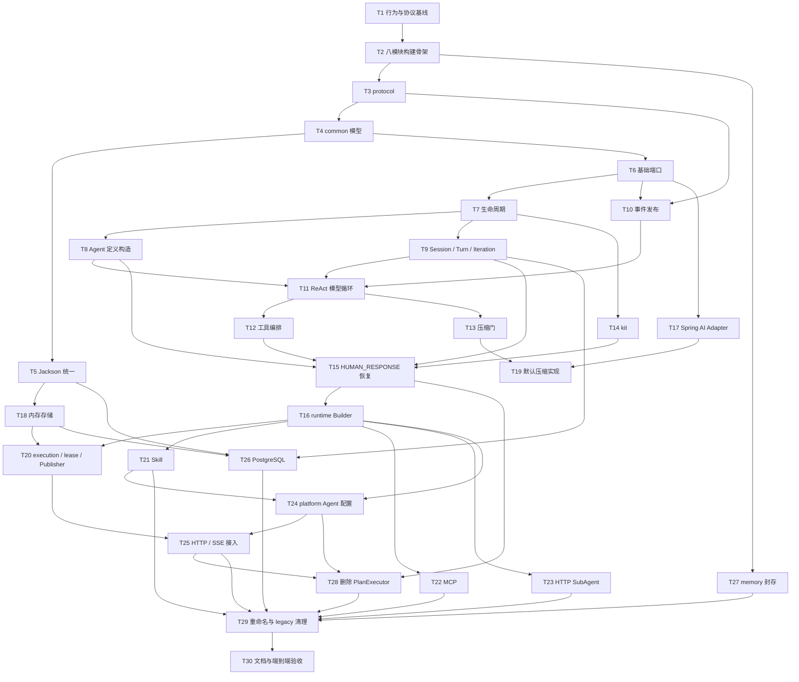

# Apex Agent 后端模块化重构任务拆分

> 状态：待实施
> 日期：2026-07-30
> 范围：仅拆分 `apex-agent` 后端重构任务，不修改 `apex-frontend`
> 输入：[原始需求](原始需求.md)、[后端模块化重构设计](specs/2026-07-28-apex-agent-backend-refactoring-design.md)、[后端目标架构](2026-07-30-apex-agent-backend-architecture.md)
> 源码基线：当前单 Maven 模块，248 个生产 Java 文件、44 个测试 Java 文件；设计文档记录重构前完整后端测试为 137 个测试全部通过

## 1. 需求背景理解

### 1.1 当前系统现状

- 后端是单 Maven 模块，Spring Boot、Spring AI、Web/SSE、Agent 核心循环、Hook、工具、Skill、MCP、SubAgent、会话存储、长期记忆和 Skill Learning 混在同一源码树。
- 当前主链路为：

```text
ChatController
  -> ChatService
  -> SuperAgentCoordinator
  -> SuperAgentFactory
  -> SuperAgentSessionService
  -> SuperAgent
  -> AgentPromptAssembler / ModelResponseStreamer / ToolCallProcessor
  -> Hook Runtime / Session Store / Memory
  -> SseEmitter
```

- `SuperAgentContext` 同时承载领域状态、Spring AI 类型、工具、Skill、计划状态、人在回路状态和 `SseEmitter`。
- Hook 通过 Spring `ApplicationContext` 和 Bean 名解析，无法脱离 Spring 容器。
- 当前只有八个运行生命周期点；对话压缩隐藏在消息准备阶段，不是显式生命周期。
- 存在 `react` 与 `plan-executor` 两套模式，工具可见性、Prompt、Stage、计划工具和执行守卫互相耦合。
- `ask_human` 与工具确认使用两套恢复逻辑；恢复状态包含 Bean 名、ToolCall 数组索引等不稳定信息。
- 会话连续性存储与长期 Memory 位于同一个 `memory` 包。
- Fastjson 与 Jackson 并存。
- 同 session 并发保护主要位于 Web 协调器，runtime 独立使用时没有同等保护。
- 当前默认激活 dev profile，使用 MySQL，且 `apex.memory.enabled=false`。
- 当前配置中至少存在 `default_agent`、`deer-flow`、`meeting_tool`、`contacts_tool` 四个 Agent 定义，并保留全局配置与 workspace 配置叠加。

### 1.2 目标能力

- 后端拆为八个 Maven 模块：`protocol`、`common`、`core-extension`、`core`、`kit`、`runtime`、`platform`、`memory`。
- 核心只保留一个 ReAct 循环，不再存在执行模式、PlanExecutor 或 Stage 驱动。
- 保留 `Session -> Turn -> Iteration`，并把工具启用状态和 Skill 激活状态提升为 session 级状态。
- core 只依赖中立模型和扩展端口。
- 生命周期扩展到十一个点，并使用按生命周期、按动作分型的结果。
- Agent 定义支持 Java 对象、文件和 Spring 配置来源；数据库来源本期只预留接口。
- HUMAN_RESPONSE 恢复原 Turn、Iteration 和 ToolCall，不重新构造 Agent 定义或调用模型。
- runtime 能脱离 Spring IoC，通过普通 Java Builder 运行，默认提供内存存储和 Print 事件出口。
- platform 负责 HTTP/SSE、用户上下文、异步执行、409 映射和 PostgreSQL 持久化。
- 长期 Memory、`session_search` 和 Skill Learning 封存在 memory，不进入默认链路。
- HTTP、SSE 和人在回路协议不变，前端源码不修改。

### 1.3 涉及模块

| 目标模块 | 主要职责 |
| --- | --- |
| protocol | HTTP/SSE/远程 SubAgent 公共协议 |
| common | 跨模块领域模型、快照、JSON 公共能力 |
| core-extension | 模型、工具、Hook、事件、存储、配置等扩展接口 |
| core | Agent 定义构造、生命周期、ReAct、工具、压缩、恢复 |
| kit | `ask_human`、工具确认、结果截断等通用扩展 |
| runtime | Builder、默认实现、Spring AI 适配、内存存储、Skill、MCP、SubAgent |
| platform | Spring Boot、HTTP/SSE、配置、用户上下文、PostgreSQL |
| memory | 长期记忆、搜索和 Skill Learning 的独立封存 |

### 1.4 可能影响范围

- Maven 目录、依赖管理、打包和启动方式。
- 几乎全部后端 package 和测试目录。
- Agent 配置结构与现有四个 Agent 的配置迁移。
- Session、Turn、Iteration、工具和 Skill 的运行状态及快照。
- Hook 接口、配置、调度、错误策略和恢复游标。
- Spring AI 消息、ToolCall、ToolResult 的中立模型转换。
- SSE 出口归属、END 幂等和 session 并发控制。
- MySQL 到 PostgreSQL 的部署、schema 和运维配置。
- MCP 进程/SSE Client、HTTP SubAgent 和文件 Skill 的资源生命周期。
- 默认产品能力变化：长期记忆、`session_search`、Skill Learning 不再装配。
- 前端源码不变，但需要执行兼容验证。

## 2. 需要先确认的设计决策

文档中“八模块、单 ReAct、前端零改动、PostgreSQL、memory 封存、单实例”等属于已确认决策，不需要重新讨论。以下细节尚未被文档完全固定，会影响外部行为，应由负责人确认：

| 编号 | 必须人工确认的决策 | 阻塞任务 |
| --- | --- | --- |
| H1 | Session、Turn、Iteration 的完整状态枚举，以及异常、取消、超限、挂起时的状态映射 | Task 9、26 |
| H2 | `BLOCK_TOOL`、用户拒绝、工具被禁用、`END_TURN` 补齐结果等“标准 ToolResult”的稳定载荷和模型可见文案 | Task 12、15 |
| H3 | 默认摘要压缩的产品语义：摘要 Prompt、必须保留的信息、压缩失败策略和硬上限失败表现 | Task 13、19 |
| H4 | 非法 HUMAN_RESPONSE、交互 ID 不匹配、快照漂移等恢复错误在不改协议前提下如何对 HTTP/SSE 调用方呈现 | Task 15、25 |
| H5 | MCP/SubAgent 等可选资源初始化失败时，默认采用启动失败还是受控降级；调用方注入资源的关闭所有权 | Task 16、22、23 |
| H6 | HTTP SubAgent 默认最大调用深度、超时/取消规则，以及除现有 INVOCATION 外的事件处理边界 | Task 23 |
| H7 | 现有四个 Agent 在新结构中的工具全集、默认启用集合、Skill 和 Hook 最终映射 | Task 24 |
| H8 | PostgreSQL schema 管理方式、部署 profile、旧 MySQL 数据处置、切换窗口，以及挂起会话是否需要跨应用版本升级恢复 | Task 26、30 |

其余实现细节可由开发者决定，包括内部类拆分、集合实现、锁表结构、临时 Adapter 组织、单元测试替身、架构测试工具、日志字段和包内私有命名，只要不改变已确认语义。

## 3. 开发任务拆分

## Task 1: 冻结现有行为与协议基线

### 目标

在搬迁和重写前建立可比较的行为基线，防止把既有行为丢失误判为重构成功。

### 输入 / 输出

- 输入：当前源码、现有 44 个测试文件、当前消息协议。
- 输出：核心链路特征测试和 SSE Golden Files。

### 修改范围

- 模块：当前单模块测试代码。
- package：`core`、`core.engine`、`web`、`message`。
- 核心场景：普通 Turn、多 Iteration、多 ToolCall、两类人工介入、END。

### 验收标准

- 现有后端测试保持通过。
- 新增测试覆盖前序 ToolCall 成功、后序挂起及恢复。
- `context.mode="react"` 和 END 精确 JSON 被快照锁定。
- Golden Files 可供新旧链路对比。

### 风险点

- 现有行为可能包含缺陷；特征测试只冻结明确要求兼容的部分。
- 测试若过度依赖内部类，会阻碍后续模块化。

### 决策标识

- 人工：出现“当前行为与已确认设计冲突”时确认取舍。
- 开发者：测试组织、替身和 Golden File 存放方式。

## Task 2: 建立八模块 Maven 骨架与依赖约束

### 目标

把单模块构建转为目标 Maven Reactor，为后续迁移提供稳定边界。

### 输入 / 输出

- 输入：Task 1 基线。
- 输出：父 POM、八个子模块及可持续运行的迁移构建。

### 修改范围

- `apex-agent/pom.xml`。
- 八个子模块 POM 和源码目录。
- JDK、UTF-8、依赖版本、编译、测试、打包规则。
- 模块依赖和架构约束测试。

### 验收标准

- 父 POM 能一次构建八个模块。
- 只有 platform 执行 Spring Boot repackage。
- 依赖关系与目标架构一致且无环。
- 每个迁移阶段仍可编译和运行测试。

### 风险点

- 直接移动全部源码会导致长时间不可构建。
- 测试依赖和资源路径可能因模块边界变化失效。

### 决策标识

- 人工：无。
- 开发者：临时 Adapter 和迁移期源码安置方式；最终不得保留额外 legacy 模块。

## Task 3: 提取并净化 protocol 模块

### 目标

形成不依赖执行上下文和平台框架的独立线协议模块。

### 输入 / 输出

- 输入：现有消息 DTO、ChatRequest、事件类型和 Task 1 Golden Files。
- 输出：可独立发布的 protocol artifact。

### 修改范围

- 当前 `message/*`、`domain/dto/ChatRequest`、请求/事件常量。
- Jackson 多态配置。
- `ToolConfirmationMessage` 等依赖上下文的构造逻辑。

### 验收标准

- HTTP/SSE JSON 字段、snake_case、多态类型与基线一致。
- `PLAN_*`、`TASK_THINK_*`、`STREAM_THINK` DTO 保留。
- protocol 不引用 core、Spring AI、Servlet、SSE 或数据库类型。
- 协议 Golden Files 全部通过。

### 风险点

- 移出消息工厂时容易改变默认值、空字段或多态标识。
- 保留 DTO 不等于继续生产对应事件，需要避免误解。

### 决策标识

- 人工：协议基线与设计冲突时确认。
- 开发者：DTO 使用 record、POJO 或 Lombok。

## Task 4: 建立 common 中立领域模型与快照契约

### 目标

定义各模块共享但不依赖框架的领域数据边界。

### 输入 / 输出

- 输入：protocol、目标 Session/Turn/Iteration 和恢复语义。
- 输出：Agent、模型、工具、Skill、会话及快照的中立数据结构。

### 修改范围

- `AgentDefinition`、定义草稿、快照和元数据。
- Session、Turn、Iteration 及运行快照。
- 中立消息、模型请求/响应、ToolCall/ToolResult。
- Tool/Skill 状态、人工介入对象和 Patch 数据。
- common 模块依赖。

### 验收标准

- common 不含 Spring、Spring AI、Servlet、ORM 或数据库类型。
- 跨边界集合为不可变副本或防御性副本。
- 快照不包含 emitter、Bean、客户端连接或运行对象。
- 挂起对象不重复保存工具集合或定义快照。

### 风险点

- 中立模型过度简化会丢失 Spring AI ToolCall、metadata 或顺序信息。
- 中立模型过度泛化又会把基础设施细节带入 core。

### 决策标识

- 人工：H1。
- 开发者：内部不可变结构和复制方式。

## Task 5: 统一 Jackson 序列化契约并移除 Fastjson

### 目标

消除双 JSON 栈，保证协议、快照、远程消息和数据库载荷使用一致规则。

### 输入 / 输出

- 输入：protocol/common 数据结构和现有序列化样本。
- 输出：common `JsonUtils` 及全项目统一 Jackson 的结果。

### 修改范围

- common JSON 公共入口。
- `SubAgentToolCallback`、`ToolCallProcessor` 等 Fastjson 调用。
- 零散 ObjectMapper 配置。
- Maven 依赖。

### 验收标准

- 依赖树不包含 Fastjson/fastjson2。
- 泛型、时间、record、枚举和 deep-copy 测试通过。
- 协议精确 JSON 不变。
- 快照序列化后可以按明确目标类型恢复。

### 风险点

- 空值、枚举、时间、多态和 Map 数值类型可能变化。
- 统一配置不能把 Spring AI 或数据库类型反向注册进 common。

### 决策标识

- 人工：无。
- 开发者：ObjectMapper 内部配置和辅助 API 组织。

## Task 6: 定义 core-extension 基础端口

### 目标

建立 core 与基础设施之间的可替换接口边界。

### 输入 / 输出

- 输入：common 中立模型。
- 输出：Definition、Model、Tool、Event、Storage、Compaction、Skill、ID 和时钟端口。

### 修改范围

- core-extension 模块。
- 现有 `IAgentDefinitionLoader`、Session Store、工具和模型接口的迁移。
- 接口级契约测试。

### 验收标准

- 所有顶级类型均为 interface。
- 参数和返回值只来自 JDK、protocol 或 common。
- 不存在 default 方法、Spring 注解、NoOp 或 InMemory 实现。
- 接口可由纯 Fake 实现并编译 core 测试。

### 风险点

- 接口过早绑定 Spring AI 类型会破坏模块目标。
- 接口粒度过大可能把整个运行上下文重新暴露给实现层。

### 决策标识

- 人工：无。
- 开发者：接口内部拆分粒度和方法命名。

## Task 7: 建立生命周期契约与 core 调度器

### 目标

统一现有重复 Hook Runtime，并实现十一个生命周期点及分型结果语义。

### 输入 / 输出

- 输入：common、core-extension、生命周期设计。
- 输出：生命周期数据契约、Resolver 接口和 core 调度行为。

### 修改范围

- `HookPoint`、Hook Binding、错误策略。
- 生命周期上下文视图和分型结果。
- 当前 `DefaultAgentLifecycleHookRuntime`、旧 `DefaultAgentHookRuntime`。
- Hook 排序、匹配、校验和原子应用。

### 验收标准

- 十一个生命周期点顺序可用 Fake 验证。
- 各生命周期只接受匹配的结果族。
- 默认错误策略为 CONTINUE，AGENT_BUILD 固定 fail-fast。
- Hook 修改失败不会留下部分状态。
- 不持久化通用 Hook 执行历史。

### 风险点

- END_TURN 在不同生命周期的收口行为不同。
- 旧 Hook 使用 Bean 名，迁移到稳定 ID 时容易造成恢复不兼容。

### 决策标识

- 人工：无，主要流控已确认。
- 开发者：调度器内部结构和日志实现。

## Task 8: 实现 Agent 定义构造、校验与冻结

### 目标

让 Agent 定义构造语义只存在于 core，并确保 NEW 与恢复使用不同路径。

### 输入 / 输出

- 输入：AgentDefinitionProvider、Hook/Tool/Skill 注册信息。
- 输出：经过 AGENT_BUILD 和权威校验的不可变定义快照。

### 修改范围

- core 的定义装配、校验和工厂入口。
- Prompt、工具三层关系、Skill、Hook Binding 校验。
- 定义恢复投影和版本字段。
- 现有定义加载逻辑的调用边界。

### 验收标准

- 顺序固定为加载、草稿、AGENT_BUILD、校验、冻结。
- 每个 NEW 执行一次 AGENT_BUILD。
- HUMAN_RESPONSE 只使用持久化快照，不执行 AGENT_BUILD。
- Builder 不加载动态定义或复制定义级校验。
- 配置引用无法解析时明确失败。

### 风险点

- AGENT_BUILD 修改结果若未进入快照，恢复会漂移。
- 后续 Turn 的新定义可能与 session 已启用工具不一致。

### 决策标识

- 人工：跨版本恢复要求纳入 H8。
- 开发者：校验器的内部组织和错误类型层级。

## Task 9: 实现 Session、Turn、Iteration 状态编排

### 目标

建立独立于 Spring 和 Web 的核心执行层级及快照流转。

### 输入 / 输出

- 输入：common 状态模型、Session/Conversation 端口。
- 输出：NEW、继续、挂起、完成和失败时的中立状态机。

### 修改范围

- `ApexAgentContext`、运行上下文。
- Turn/Iteration 创建、编号、状态和结束。
- SessionSnapshot 保存和恢复。
- 当前 `SuperAgentContext`、`SuperAgentSessionService` 的领域职责。

### 验收标准

- NEW 创建新 Turn；HUMAN_RESPONSE 不创建 Turn/Iteration。
- turnNo、iterationNo 的递增规则正确。
- 挂起不执行 TURN_END。
- 多工具处理过程中已提交的前序结果可恢复。
- 状态与快照更新保持一致。

### 风险点

- 状态提交时机不清会产生“消息已写入、快照未更新”的半状态。
- 失败、取消、超限的状态定义需要先统一。

### 决策标识

- 人工：H1。
- 开发者：内存运行对象的内部组织。

## Task 10: 建立 core 事件工厂与发布语义

### 目标

让 core 只通过事件端口发送协议消息，不再接触 `SseEmitter`。

### 输入 / 输出

- 输入：protocol DTO、AgentEventPublisher 端口。
- 输出：core 消息工厂和统一发布入口。

### 修改范围

- 当前 `MessageUtils` 和消息构造逻辑。
- STREAM_CONTENT、ASK_HUMAN、TOOL_CONFIRMATION、END。
- `context.mode` 和 `stage_id` 兼容处理。
- `SuperAgentContext.sseEmitter` 的替代边界。

### 验收标准

- core 不导入 `SseEmitter`。
- 所有运行事件 `context.mode` 固定为 `react`。
- 不再产生 `stage_id`。
- END 保持精确空终止事件。
- Fake Publisher 可完整测试事件顺序。

### 风险点

- core、runtime、platform 都存在兜底路径，最终可能重复 END。
- 流式事件聚合标识可能在迁移中变化。

### 决策标识

- 人工：无。
- 开发者：消息工厂内部拆分。

## Task 11: 实现唯一 ReAct 模型循环

### 目标

用中立模型和端口建立唯一主循环，彻底取消模式分支。

### 输入 / 输出

- 输入：定义快照、状态编排、生命周期调度、ModelGateway。
- 输出：支持多 Iteration 和最大迭代限制的 core ReAct 循环。

### 修改范围

- 当前 `SuperAgent` 主循环。
- 模型请求准备、流式响应和 POST_MODEL_CALL。
- 最大 Iteration 配置。
- 无工具最终响应和异常收口。

### 验收标准

- core 中只有一个 ReAct 循环。
- 每次业务模型调用创建一个 Iteration。
- 无工具响应正常结束 Turn。
- 超过最大 Iteration 明确失败。
- 使用 Fake ModelGateway 测试，不启动 Spring。

### 风险点

- 当前流式响应可能同时承担事件发送和响应聚合。
- 模型失败时 Iteration、Turn、Session 的收口必须与 H1 一致。

### 决策标识

- 人工：H1。
- 开发者：循环内部方法拆分。

## Task 12: 实现工具三层状态与多 ToolCall 编排

### 目标

保证模型只看见启用工具，执行器也只能执行当前仍启用的工具。

### 输入 / 输出

- 输入：注册工具、定义快照、session `enabledTools`、模型 ToolCall。
- 输出：有序工具执行、Hook 流控及标准 ToolResult。

### 修改范围

- 当前 `ToolCallProcessor`、工具解析和执行边界。
- `registeredTools`、`availableTools`、`defaultEnabledTools`、`enabledTools`。
- BLOCK、直接返回、END_TURN 和普通执行。
- 多 ToolCall 结果对齐与进度持久化。

### 验收标准

- 默认工具集合只初始化新 session 的首个 Turn。
- 启用工具状态跨 Iteration 和后续 Turn 保留。
- 执行前二次校验工具仍启用。
- ToolCall 与 ToolResult 一一匹配。
- 一个工具失败不默认终止整个 Turn。
- END_TURN 为未处理调用补齐标准结果。

### 风险点

- session 状态与新 Agent 定义发生工具漂移。
- 标准失败结果会进入模型上下文，内容会影响后续推理。

### 决策标识

- 人工：H2。
- 开发者：工具查找和有序处理的数据结构。

## Task 13: 实现模型调用前压缩门

### 目标

把摘要压缩从隐藏消息准备逻辑变为 core 中显式、可扩展、可测试的生命周期。

### 输入 / 输出

- 输入：基础 ModelRequest、压缩策略、压缩器和存储端口。
- 输出：压缩判断、前后 Hook、原子提交及最终模型请求。

### 修改范围

- 当前 `AgentPromptAssembler` 中的压缩职责。
- PRE/POST_MESSAGE_COMPRESSION。
- ConversationWindowManager、Policy、Compactor 端口调用。
- PRE_MODEL_CALL 前的硬上限校验。

### 验收标准

- 每个逻辑业务模型调用只判断一次。
- 判定 false 时不执行压缩 Hook 或 Compactor。
- 成功顺序为判断、PRE、压缩、POST、持久化、PRE_MODEL_CALL、模型。
- ModelGateway 重试不重复压缩。
- HUMAN_RESPONSE 恢复工具阶段不触发压缩。
- 压缩器内部模型调用不递归进入业务压缩门。

### 风险点

- 压缩结果晚于模型调用提交会造成恢复不一致。
- PRE_MODEL_CALL 修改后超限不能再次压缩，只能失败。

### 决策标识

- 人工：H3。
- 开发者：token 估算实现和内部调用组织。

## Task 14: 迁移 kit 基础工具与 Hook

### 目标

把可复用的人工介入、确认和结果处理能力迁入不依赖 core 实现的 kit。

### 输入 / 输出

- 输入：生命周期接口、中立 Tool/Hook 上下文。
- 输出：可由任意 runtime 注册的基础工具和 Hook。

### 修改范围

- `AskHumanTool`。
- `ToolConfirmHook`、`PlainTextTruncateHook`。
- 匹配器、确认规格和 ToolResult 辅助构造。
- 现有 Hook 单元测试。

### 验收标准

- kit 只依赖 core-extension。
- 基础 Hook 不接触 core 实现、Spring Bean 或 SSE。
- ask_human 和工具确认均能产生统一人工介入请求。
- 结果截断和匹配行为保持现有兼容性。

### 风险点

- 工具确认包含展示字段和可编辑参数，不能在中立化时丢失。
- 工具名仍是跨配置、Hook 和协议的稳定键。

### 决策标识

- 人工：H2 涉及拒绝结果文案。
- 开发者：匹配器和辅助构造器内部形式。

## Task 15: 实现统一人工介入与 HUMAN_RESPONSE 恢复

### 目标

让 ask_human 和工具确认共用同一挂起/恢复状态机。

### 输入 / 输出

- 输入：HumanResponseCommand、SessionSnapshot、SuspendedToolCall。
- 输出：恢复原 Turn/Iteration/ToolCall 的五类明确分支。

### 修改范围

- 当前 `HumanInLoopResumer`、`PendingToolExecution`。
- PRE_TOOL_CALL 执行进度。
- QUESTION、TOOL_CONFIRMATION。
- 再次挂起、END_TURN、BLOCK、直接结果、真实执行。
- 参数合并、拒绝、清理和持久化。

### 验收标准

- 恢复不执行 AGENT_BUILD、TURN_START、ITERATION_START、压缩、模型前后 Hook 或模型调用。
- 通过 toolCallId 定位，不保存数组 index。
- 只跳过已经执行的 PRE_TOOL_CALL Hook ID。
- 再次人工介入更新唯一挂起对象。
- 拒绝不执行剩余 PRE Hook 或真实工具，但执行 POST_TOOL_CALL。
- ask_human 恢复后真实执行工具。
- 收口后清除挂起对象和 Hook ID。

### 风险点

- 清除挂起状态过早会使二次人工介入无法恢复。
- 非法人工响应若被误当成 NEW 会破坏 Turn 语义。

### 决策标识

- 人工：H2、H4。
- 开发者：状态机内部拆分和校验顺序。

## Task 16: 实现 runtime Builder、注册表与定义 Provider

### 目标

建立不依赖 Spring IoC 的默认运行时装配入口。

### 输入 / 输出

- 输入：core、kit、端口及调用方注册项。
- 输出：Builder、Tool/Hook/Skill 注册表、Programmatic/File Provider。

### 修改范围

- `ApexAgentRuntime` Builder。
- 默认 Agent 定义和 ReAct Prompt。
- 工具、Hook、Skill 去重与基础契约校验。
- Java 对象和文件配置源。
- 外部资源所有权配置。

### 验收标准

- Builder 不启动 Spring ApplicationContext。
- 每个 runtime 只接受一个完整 AgentDefinitionProvider。
- 不执行全局/workspace 字段级叠加。
- Builder 不加载动态定义或复制 core 定义校验。
- 未配置可选能力时不创建外部资源。

### 风险点

- Builder 与 Assembler 重复校验会产生两套规则。
- 静态启动预检不能替代请求期权威校验。

### 决策标识

- 人工：H5。
- 开发者：Builder API 的内部组织及静态预检的实现方式。

## Task 17: 实现 Spring AI 中立模型适配

### 目标

隔离 Spring AI 消息、流响应和 ToolCallback，使 core 不依赖具体框架类型。

### 输入 / 输出

- 输入：common 模型和当前 Spring AI 样本。
- 输出：ModelGateway、消息和工具的双向 Adapter。

### 修改范围

- 当前 ModelResponseStreamer。
- Spring AI Message、ChatResponse、ToolCall、ToolResponse。
- ChatModel 流式调用。
- 本地工具执行适配。

### 验收标准

- ToolCall ID、名称、参数和顺序 Round Trip 不丢失。
- 流片段和最终响应可同时正确聚合。
- core 测试无需加载 Spring。
- Adapter 使用真实 Spring AI 样本完成契约测试。

### 风险点

- Spring AI 多版本依赖已经混用，类型转换风险较高。
- metadata 或供应商扩展字段可能没有中立映射。

### 决策标识

- 人工：发现必须暴露供应商专有字段时确认。
- 开发者：Adapter 内部实现。

## Task 18: 实现 runtime 内存 Session/Conversation 存储

### 目标

为嵌入式 runtime 提供与平台存储语义一致的内存实现。

### 输入 / 输出

- 输入：SessionRepository、ConversationRepository 和中立快照。
- 输出：可恢复、对象隔离的内存仓储。

### 修改范围

- 当前 InMemorySessionContextStore。
- Session、消息、摘要和压缩边界存储。
- save/load 深复制。
- 多工具进度保存。

### 验收标准

- 保存后修改原对象不影响存储值。
- 修改 load 结果不影响下一次 load。
- 嵌套 Turn、Iteration、ToolCall、Map 和集合均被隔离。
- 当前 runtime 实例存活期间可以完成挂起恢复。

### 风险点

- 只复制顶层对象会产生隐蔽别名污染。
- 内存实现不得因为持有完整定义对象而绕过快照规则。

### 决策标识

- 人工：无。
- 开发者：不可变快照或深拷贝的具体选择。

## Task 19: 实现 runtime 对话窗口与默认压缩实现

### 目标

为 core 压缩门提供可直接运行的默认策略和摘要能力。

### 输入 / 输出

- 输入：Conversation Window/Policy/Compactor 端口。
- 输出：默认窗口管理器、压缩策略和摘要 Compactor。

### 修改范围

- 当前 ConversationMemoryManager 中的窗口和摘要职责。
- token/字符/消息数判断。
- 摘要模型调用和分片硬上限。
- 压缩结果构造。

### 验收标准

- 默认实现可在 runtime-only 测试中完成压缩。
- 判断覆盖消息、system prompt 和启用工具定义。
- Compactor 调用模型时不递归进入 core 压缩门。
- 结果符合 core 持久化契约。

### 风险点

- 摘要质量会直接影响跨 Turn 连续性。
- 过大的摘要输入仍可能超过模型限制。

### 决策标识

- 人工：H3。
- 开发者：估算算法、分片方法和内部缓存。

## Task 20: 实现请求级执行句柄、事件隔离与 session lease

### 目标

由 runtime 统一持有 core Agent、请求 Publisher 和 session 执行租约。

### 输入 / 输出

- 输入：Agent 请求、core Factory、Publisher、SessionExecutionCoordinator。
- 输出：`ApexAgentExecution` 及幂等执行/取消/关闭语义。

### 修改范围

- runtime NEW/resume 公共 API。
- `SessionExecutionCoordinator`、Lease、忙碌异常。
- Once Publisher、默认 PublisherFactory、Print Publisher。
- run、cancelBeforeStart、close。

### 验收标准

- new/resume 返回前同步获取 lease。
- NEW 与 HUMAN_RESPONSE 共用同一 session 锁空间。
- 同 session 第二个请求同步失败。
- 完成、失败、再次挂起、构造失败、Publisher 异常、拒绝和关闭均只释放一次。
- 每次请求有独立 Publisher 和 END 状态。
- LockEntry 不会在竞争期间产生同 key 第二把锁。

### 风险点

- 同步准备与异步执行之间容易泄漏 lease。
- core 和兜底路径并发结束时容易重复 END。

### 决策标识

- 人工：无，单进程/单实例边界已确认。
- 开发者：锁表和原子状态实现。

## Task 21: 迁移普通 Skill 运行能力

### 目标

保留非 learning 的 Skill 加载、激活和资源读取行为，并建立 session 隔离状态。

### 输入 / 输出

- 输入：现有 `skills` 非 learning 代码和 SkillProvider。
- 输出：runtime Skill 注册、`activate_skill` 和资源读取能力。

### 修改范围

- `org.gemo.apex.skills` 非 learning 部分。
- `enabledSkills`、`activatedSkills`。
- Skill 文件发现、解析、instructions、资源读取。
- Tool 注册和对话消息写入。

### 验收标准

- `activatedSkills ⊆ enabledSkills`。
- 激活跨 Turn 保留，不同 session 隔离。
- Hook 不能动态修改 Skill 集合。
- instructions 只作为普通 ToolResult 进入对话。
- 重复激活幂等并可再次返回 instructions。
- 现有文件 Skill 回归测试通过。

### 风险点

- workspace 合并语义被删除后，现有资源发现路径可能变化。
- instructions 被压缩是预期行为，不能从激活状态偷偷重新注入。

### 决策标识

- 人工：H7。
- 开发者：Provider 缓存和文件扫描实现。

## Task 22: 迁移 MCP runtime 集成

### 目标

把 stdio/SSE MCP 客户端和工具适配迁入 runtime，并明确资源边界。

### 输入 / 输出

- 输入：MCP 定义、传输配置和 AgentTool 接口。
- 输出：可选的 MCP ToolProvider 及可关闭客户端资源。

### 修改范围

- 当前 MCP 定义和客户端。
- stdio 进程、SSE 连接、超时、重连和关闭。
- 工具参数转换。
- runtime 资源生命周期。

### 验收标准

- 未配置 MCP 时不启动进程或创建客户端。
- MCP 只接收最终工具参数。
- 不泄漏 session、用户、Agent 或 ToolExecutionContext。
- Client 按 runtime/server 隔离。
- runtime 关闭时释放自建资源。

### 风险点

- 初始化降级可能导致定义中的工具无法解析。
- stdio 进程和 SSE 连接的关闭路径不同。

### 决策标识

- 人工：H5。
- 开发者：Client 缓存和重连实现。

## Task 23: 迁移 HTTP SubAgent runtime 集成

### 目标

把远程 Agent 作为普通 HTTP 工具接入，而不引入新的 Agent 类型。

### 输入 / 输出

- 输入：SubAgent 配置、现有 chat 协议和 AgentTool 接口。
- 输出：HTTP 调用、SSE 解析和 ToolResult 聚合能力。

### 修改范围

- 当前 `SubAgentToolCallback` 和消息 Handler。
- 子 sessionId、X-User-Id、调用链和 trace。
- STREAM_CONTENT、INVOCATION、ARTIFACT、END 处理。
- 超时、取消和递归检测。

### 验收标准

- 子请求使用 NEW、目标 agentKey 和独立 sessionId。
- STREAM_CONTENT 聚合为父 ToolResult。
- INVOCATION 保持兼容透传。
- 收到 END 后结束当前工具调用。
- 调用深度和 agentKey 链能阻止递归闭环。
- Fastjson 不再出现。

### 风险点

- 每层新 session 无法天然阻止逻辑递归。
- 远端中途断流与正常 END 必须区分。

### 决策标识

- 人工：H5、H6。
- 开发者：HTTP/SSE 客户端内部实现。

## Task 24: 迁移 platform Agent 配置与列表接口

### 目标

把 Spring 配置转换为完整中立定义，并保持 Agent 列表响应兼容。

### 输入 / 输出

- 输入：现有 application.yml、dev profile、workspace 配置和 H7 映射。
- 输出：SpringPropertiesAgentDefinitionProvider 和 Agent 元数据列表。

### 修改范围

- 当前 AgentConfig、全局配置、workspace loader。
- 四个现有 Agent 定义。
- Hook 的 Bean 名到稳定注册名/ID 映射。
- `GET /api/sse/agents`。

### 验收标准

- Provider 返回完整定义，不做全局/workspace 字段级叠加。
- 多个冲突配置源时明确失败。
- Agent 列表响应结构和字段不变。
- 不再包含执行模式、Plan Prompt 或 Skill Learning Hook。
- 所有定义通过 core 权威校验。

### 风险点

- 当前配置的继承和 workspace 覆盖较隐蔽。
- 默认工具集合配置错误会改变模型可见能力。

### 决策标识

- 人工：H7。
- 开发者：Spring 属性绑定和资源根解析方式。

## Task 25: 接入 platform HTTP/SSE 与异步执行

### 目标

让现有 Web API 使用 runtime，同时保持每个请求的事件、并发和用户上下文隔离。

### 输入 / 输出

- 输入：ChatRequest、runtime new/resume API、请求级 emitter。
- 输出：兼容现有 API 的 Spring Boot 平台链路。

### 修改范围

- ChatController、ChatService、Coordinator。
- SseEmitterAgentEventPublisher。
- X-User-Id Filter 和 TaskDecorator。
- HTTP 409、线程池拒绝、异常和 emitter 收口。

### 验收标准

- 路径、Header 和请求字段不变。
- Controller 返回 emitter 前同步取得 execution。
- session 冲突在响应提交前映射为 409。
- 每次 NEW/HUMAN_RESPONSE 使用独立 emitter。
- 线程池拒绝调用 cancelBeforeStart。
- 不维护 platform 私有 session 锁表。
- 用户上下文正确传播并清理。

### 风险点

- SSE 响应若过早提交，无法再返回 409。
- emitter 回调、runtime END 和线程池异常存在竞态。

### 决策标识

- 人工：H4。
- 开发者：异步执行器和异常映射的内部组织。

## Task 26: 实现 platform PostgreSQL 持久化

### 目标

提供支持进程重启恢复的 PostgreSQL Session/Conversation 实现。

### 输入 / 输出

- 输入：中立快照、Repository 端口、状态和事务语义。
- 输出：PostgreSQL schema、Repository、迁移和集成测试。

### 修改范围

- Session、Dialogue Message、Dialogue Summary 表。
- TEXT 序列化列和可查询标量列。
- 事务边界。
- PostgreSQL 驱动、platform 配置。
- MySQL 依赖和 dev profile 清理。

### 验收标准

- PostgreSQL 是 platform 唯一数据库。
- 不使用 JSONB。
- 不创建独立 Turn/Iteration 表或 `current_iteration_no`。
- 长消息、摘要、工具结果和快照往返不截断。
- 人工介入、压缩、ToolResult 和 Turn 收口事务符合设计。
- 进程重启后可恢复挂起会话。

### 风险点

- TEXT 快照不可直接查询，必要索引字段必须独立。
- DTO 演进可能使旧快照无法反序列化。
- 本期明确不兼容旧 MySQL 数据，但实际切换仍有运维风险。

### 决策标识

- 人工：H1、H8。
- 开发者：Repository 内部实现和测试容器选择。

## Task 27: 封存 memory 与 Skill Learning

### 目标

把长期记忆和 Skill Learning 保持为可独立编译测试、但不进入默认产品链路的模块。

### 输入 / 输出

- 输入：当前 memory、搜索、管理、skills/learning 代码。
- 输出：独立 memory 模块和断开的默认装配。

### 修改范围

- 用户画像、事实、执行历史、Agent 经验。
- recall、extract、write、search、management。
- pgvector、`session_search`。
- Skill Learning 记录、抽取、调度和增强。
- memory 自有仓储和 schema。

### 验收标准

- memory 可独立编译并运行现有相关测试。
- runtime/platform/core/kit 不依赖 memory。
- 默认配置不注册 `session_search` 或 Skill Learning Hook。
- 普通 Skill 功能不被迁入 memory。
- Session/Conversation 核心存储不留在 memory。

### 风险点

- 当前 memory 同时拥有核心会话存储，搬迁时容易误删会话连续性。
- Memory 管理接口虽然保留代码，但默认 platform 不再暴露。

### 决策标识

- 人工：若仍要求默认暴露 Memory 管理接口，需要重新确认范围。
- 开发者：封存模块内部包结构。

## Task 28: 删除 PlanExecutor 和执行模式

### 目标

在新链路可替代旧链路后，彻底删除模式、计划和 Stage 运行逻辑。

### 输入 / 输出

- 输入：已接入 platform 的单 ReAct 链路。
- 输出：无执行模式、无 PlanExecutor 的代码和配置。

### 修改范围

- ModeEnum、StageToolResolver、StageToolPlan、ToolInterceptor 模式守卫。
- StagePromptBuilder 模式分支。
- WritePlanTool、UpdatePlanTool。
- Plan、执行 Stage、Plan Prompt 和配置。
- TASK_THINK 生产逻辑及持久化字段。

### 验收标准

- 源码、配置和默认 Prompt 中不存在执行模式。
- core 只有一个 ReAct 主循环。
- 计划 DTO 仍保留在 protocol。
- 所有运行事件 mode 固定为 react。
- 默认注册表不包含计划工具。

### 风险点

- 工具名和模式字符串可能散落在配置、Prompt 和测试数据中。
- 过早删除会让旧平台链路在迁移中不可运行。

### 决策标识

- 人工：无，删除范围已确认。
- 开发者：实际删除时机应在新链路切换之后。

## Task 29: 完成 ApexAgent 重命名与 legacy 清理

### 目标

移除临时 Adapter、旧 SuperAgent 类型和重复实现，使最终源码与目标架构一致。

### 输入 / 输出

- 输入：全部新模块实现和已切换的平台链路。
- 输出：只包含目标架构概念的最终代码库。

### 修改范围

- SuperAgent、Context、Factory、Coordinator、Configuration。
- 旧 Hook Runtime、无调用点 API 和临时迁移 Adapter。
- JavaDoc、日志、异常、测试类名和 Prompt 文案。
- 模块依赖与未使用配置。

### 验收标准

- 后端概念统一使用 ApexAgent。
- 不存在重复 Hook Runtime 或旧主循环。
- 不存在额外 legacy 模块。
- 无模块反向依赖或对 memory 的主链路依赖。
- 仓库 URL、HTTP 路径和协议字段保持不变。

### 风险点

- 机械重命名可能误改协议或外部配置键。
- 清理前必须证明没有生产调用点。

### 决策标识

- 人工：无。
- 开发者：内部私有类型的最终命名。

## Task 30: 更新当前态文档并完成端到端验收

### 目标

证明目标架构、运行行为、持久化和前端兼容性形成完整闭环。

### 输入 / 输出

- 输入：全部实现任务及 H8 发布决策。
- 输出：当前态文档、构建报告、协议兼容结果和发布说明。

### 修改范围

- `docs/reference/`、`docs/overview/`、`docs/spec/`。
- 父 POM 全量测试。
- runtime-only 集成测试。
- platform PostgreSQL 集成测试。
- 前端现有 test、typecheck、build。
- 发布说明和单实例部署约束。

### 验收标准

- 八模块完整构建和测试通过。
- 架构测试验证依赖边界。
- 现有前端源码零修改且测试、typecheck、build 通过。
- HTTP/SSE Golden Files 一致。
- PostgreSQL 进程重启恢复通过。
- 发布说明明确 Memory、session_search、Skill Learning 和 MySQL 兼容性的变化。
- 部署文档明确本期只支持单 platform 实例。

### 风险点

- 前端构建通过不代表真实 SSE 时序完全兼容，仍需要端到端联调。
- 外部 MCP、Skill 路径和 PostgreSQL 环境不能依赖开发者个人机器。

### 决策标识

- 人工：H8，并由负责人确认最终上线验收。
- 开发者：验证脚本和报告形式。

## 4. 总体任务依赖关系



## 5. 推荐开发顺序与复杂度

| 顺序 | Task | 直接前置 | 复杂度 |
| ---: | --- | --- | --- |
| 1 | T1 行为与协议基线 | 无 | 中 |
| 2 | T2 八模块构建骨架 | T1 | 高 |
| 3 | T3 protocol 提取 | T1、T2 | 中 |
| 4 | T4 common 中立模型 | T2、T3 | 高 |
| 5 | T5 Jackson 统一 | T3、T4 | 中 |
| 6 | T6 core-extension 基础端口 | T4 | 中 |
| 7 | T7 生命周期契约与调度 | T4、T6 | 高 |
| 8 | T8 Agent 定义构造 | T7 | 高 |
| 9 | T9 Session/Turn/Iteration | T4、T6、T7 | 高 |
| 10 | T10 core 事件发布 | T3、T6 | 中 |
| 11 | T11 ReAct 模型循环 | T8、T9、T10 | 高 |
| 12 | T12 工具三层状态与编排 | T7、T9、T11 | 高 |
| 13 | T13 模型调用前压缩门 | T7、T9、T11 | 高 |
| 14 | T14 kit 基础能力 | T7 | 中 |
| 15 | T15 HUMAN_RESPONSE 恢复 | T8、T9、T10、T12、T14 | 高 |
| 16 | T16 runtime Builder/Provider | T8、T11—T15 | 高 |
| 17 | T17 Spring AI Adapter | T4、T6 | 高 |
| 18 | T18 runtime 内存存储 | T4、T5、T6 | 中 |
| 19 | T19 默认窗口与压缩实现 | T13、T17、T18 | 高 |
| 20 | T20 execution/lease/Publisher | T10、T16、T18 | 高 |
| 21 | T21 普通 Skill | T12、T16、T18 | 中 |
| 22 | T22 MCP | T12、T16、T17 | 高 |
| 23 | T23 HTTP SubAgent | T3、T12、T16、T17 | 高 |
| 24 | T24 platform Agent 配置与列表 | T16、T21 | 中 |
| 25 | T25 platform HTTP/SSE | T20、T24 | 高 |
| 26 | T26 PostgreSQL 持久化 | T5、T9、T18、T24 | 高 |
| 27 | T27 memory 封存 | T2、T4、T5、T6 | 高 |
| 28 | T28 删除 PlanExecutor | T15、T24、T25 | 中 |
| 29 | T29 重命名与 legacy 清理 | T21—T28 | 中 |
| 30 | T30 文档与端到端验收 | T29 | 中 |

实际执行时，以下工作可以并行：

- T8、T9、T10、T14 在 T7 后并行。
- T17、T18 可在 core 主循环完成前提前开发。
- T21、T22、T23 可在 runtime 骨架稳定后并行。
- T25、T26、T27 分别属于 Web、数据库、封存能力，可并行推进。
- T28 必须等新平台链路可用后再删除旧模式；T29、T30 应保持为最终收口任务。
