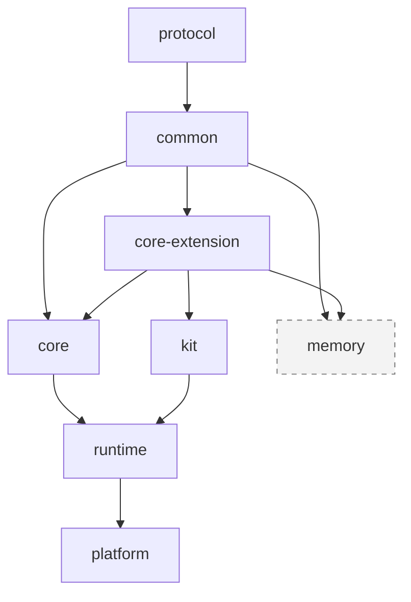
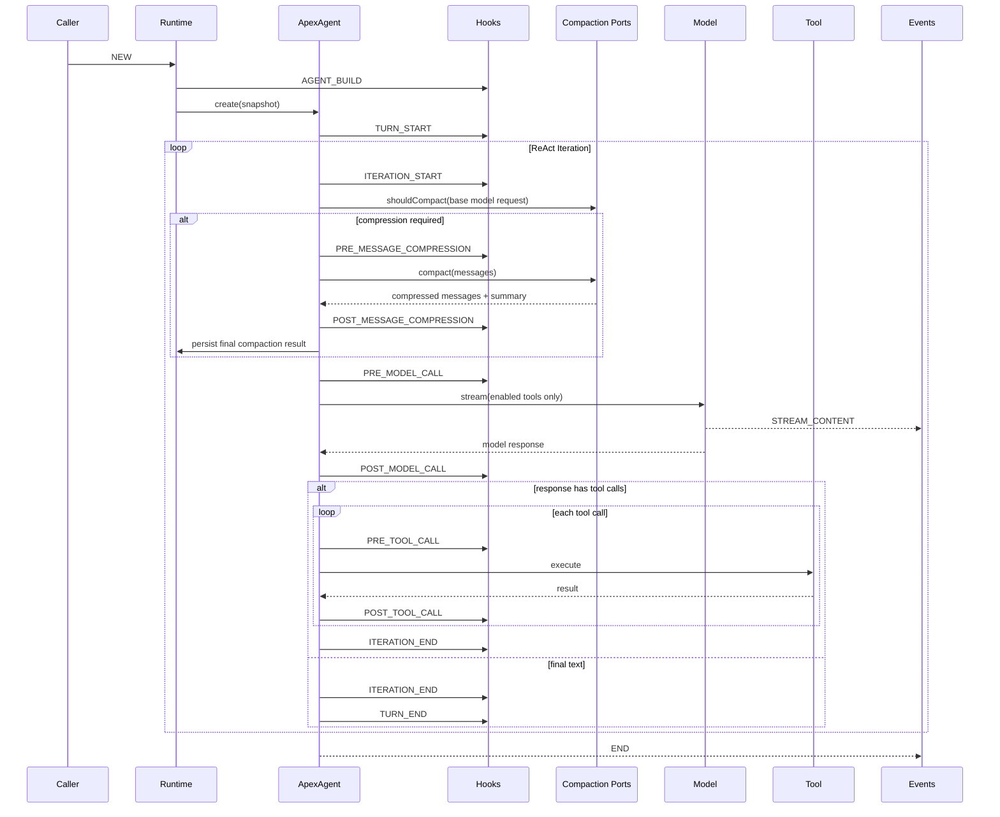
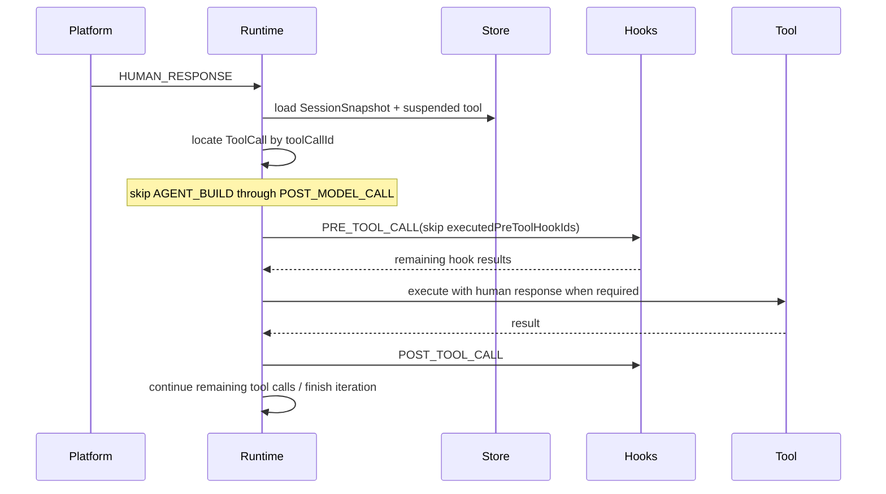
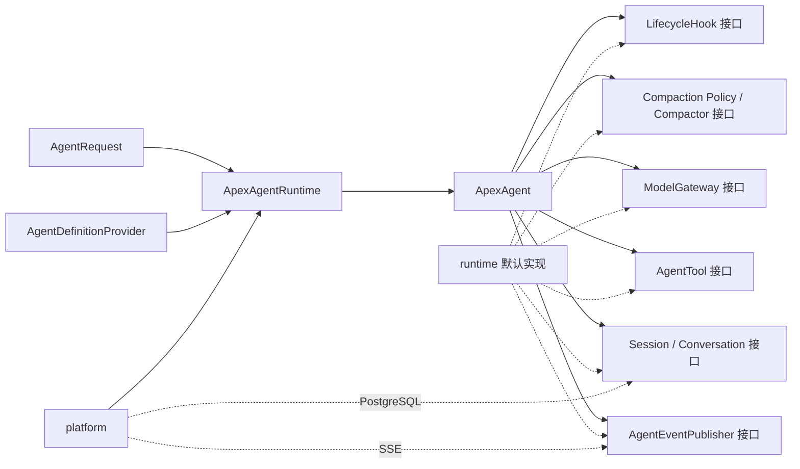

# Apex Agent 后端模块化重构设计

> 状态：已确认
> 日期：2026-07-28
> 最近修订：2026-07-30
> 范围：仅重构 `apex-agent` 后端，不修改 `apex-frontend`
> 基线：当前单模块后端共有 248 个生产源码文件、44 个测试源码文件；重构前完整后端测试为 137 个测试全部通过

## 1. 背景

当前 `apex-agent` 是一个单 Maven 模块，Agent 执行、生命周期 Hook、工具、Skill、MCP、SubAgent、Web/SSE、会话存储、执行记录、长期记忆与 Skill Learning 均处于同一源码树中。

主链路为：

```text
ChatController
  -> ChatService
  -> SuperAgentCoordinator
  -> SuperAgentFactory
  -> SuperAgentSessionService
  -> SuperAgent
  -> ModelResponseStreamer / ToolCallProcessor / HookRuntime
  -> SessionContextStore / AgentExecutionStore / MemoryLifecycleManager
  -> SseEmitter
```

现有实现已经形成 `Session -> Turn -> Iteration` 的运行层级，但模块职责仍然混杂：

- `SuperAgentContext` 同时持有会话身份、Spring AI 消息、Spring AI 工具、计划模式、Skill、Memory、人在回路状态和 `SseEmitter`。
- `SuperAgent` 直接依赖工具解析、Hook、会话存储、长期记忆、流式模型和 Spring AI 类型。
- 消息实体 `ToolConfirmationMessage` 反向依赖执行上下文和 Hook 类型，使公共协议无法独立发布。
- Hook 分发通过 Spring `ApplicationContext` 查找 Bean，runtime 无法脱离 Spring 容器使用。
- `memory` 包同时承担 Agent 必需的会话持久化和可选的长期记忆能力。
- Agent 定义、工具全集、默认启用工具、Skill 和 Hook 的配置与运行态没有明确分层。
- `react` 与 `plan-executor` 两种模式使提示词、工具可见性、工具合法性、消息类型和上下文状态互相耦合。
- Web 层、核心循环和 SSE 发送之间缺少稳定的端口接口。

本次重构将后端改为八个 Maven 模块，并把框架收敛为唯一的 ReAct 循环。不同业务能力通过构造和运行生命周期 Hook 介入，不再保留“执行模式”概念。

## 2. 已确认的设计决策

本方案以下列决策为不可变前提：

1. `apex-agent/pom.xml` 改为父聚合 POM。
2. 最终模块固定为 `protocol`、`common`、`core-extension`、`core`、`kit`、`runtime`、`platform`、`memory`。
3. `core-extension` 严格只包含接口；接口使用的实体、枚举和结果对象放在 `common`。
4. `SuperAgent` 及相关后端概念统一更名为 `ApexAgent`。
5. 删除 PlanExecutor 和全部执行模式概念，核心框架只有一个 ReAct 循环。
6. 保留 `PLAN_*`、`TASK_THINK_*` 协议实体，但默认运行链路不再产生这些事件。
7. 为兼容现有前端，所有出站事件的 `context.mode` 固定为 `"react"`。
8. 新增 `AGENT_BUILD` 生命周期点。普通新执行创建 `ApexAgent` 时执行；`HUMAN_RESPONSE` 恢复时不执行。
9. HUMAN_RESPONSE 恢复原 Turn 和原 Iteration，跳过 `PRE_TOOL_CALL` 之前已经完成的生命周期。
10. 只允许持久化当前挂起工具已经执行的 `PRE_TOOL_CALL` Hook 标识；不得用通用的“已执行 Hook 列表”恢复其他生命周期。
11. 工具配置分为可用全集和默认启用集合；`enabledTools` 是 session 级状态，只在新 session 的首个 Turn 使用 `defaultEnabledTools` 初始化，后续 Turn 直接沿用。
12. Agent 定义只配置 `enabledSkills`，不再配置 `availableSkills`；`activatedSkills` 是其 session 级子集，在同一 session 内跨 Turn 保留。
13. Skill 集合不由生命周期 Hook 动态增删；`activate_skill` 是改变激活状态的唯一默认入口，Skill instructions 只作为普通对话消息存在。
14. 对话摘要压缩保留在 runtime；只在 ReAct 循环即将调用业务模型时判断和执行，并且位于 `PRE_MODEL_CALL` 之前。
15. 长期记忆、会话搜索和 Skill Learning 封存在 `memory`，其他模块不依赖 `memory`。
16. runtime 提供内存存储、Print 消息出口和默认 Agent，使外部项目只依赖 runtime、通过 `new` 对象即可运行。
17. MCP 进程管理和 HTTP SubAgent 都属于 runtime。
18. platform 保留 Spring Boot、Web/SSE、并发协调和 PostgreSQL 持久化。
19. Agent 数据库配置源本期不实现，只定义统一接口；本期提供 Java 对象、文件和 Spring 配置实现。
20. platform 正式切换到 PostgreSQL，不考虑现有 MySQL 或历史表数据兼容。
21. HTTP、SSE 和人在回路协议保持不变，不修改前端。
22. Agent 定义只允许来自一个完整配置源，不保留全局配置与 workspace 配置叠加。
23. Hook 返回值按生命周期能力分型；涉及多个动作的生命周期再按动作定义不同 record，不使用一个包含全部可选字段的万能 `HookResult`。
24. 工具确认与 `ask_human` 统一由 `PRE_TOOL_CALL` Hook 请求人工介入。
25. runtime 自身保证同一 `sessionId` 只有一个活跃执行，内存存储通过不可变快照或深拷贝隔离运行对象。
26. 项目 JSON 处理统一使用 Jackson，并彻底移除 Fastjson。
27. PostgreSQL 不使用 JSONB；快照、集合和消息载荷由 Jackson 序列化后存入 `TEXT`。

## 3. 目标与非目标

### 3.1 目标

- 建立单向、无环的模块依赖。
- 让核心循环只依赖公共模型和扩展接口。
- 让 runtime 无需 Spring 容器即可创建并运行 Agent。
- 让 platform 成为 runtime 的平台适配层，而不是核心能力的拥有者。
- 让 Agent 定义可以来自 Java 对象、配置文件或未来的数据库实现。
- 让生命周期 Hook、工具、模型、消息出口和存储均可替换。
- 完整保留 Turn、Iteration、人在回路、工具确认和多工具调用语义。
- 保证现有前端在不修改任何代码的情况下继续工作。
- 将可选且暂不启用的 Memory/Skill Learning 从主运行链路中隔离。

### 3.2 非目标

- 不修改 `apex-frontend`。
- 不新增或修改外部 HTTP/SSE 字段。
- 不修复 `END` 当前缺少 `execution_status` 的协议现状。
- 不实现数据库版 Agent 定义。
- 不保留 PlanExecutor 兼容执行路径。
- 不兼容旧 MySQL 配置或旧数据库数据。
- 不在本次重构中升级 Spring Boot、Spring AI 或模型供应商版本；只在父 POM 中集中管理现有依赖版本。
- 不把 `memory` 重新接入主运行链路。

## 4. 总体架构

### 4.1 目标依赖图



箭头表示“被依赖模块 -> 依赖它的模块”。对应 Maven 依赖关系为：

```text
common         -> protocol
core-extension -> common
core           -> common + core-extension
kit            -> core-extension
runtime        -> core + kit
platform       -> runtime
memory         -> common + core-extension
```

约束：

- `protocol` 不依赖任何项目模块。
- `common` 不依赖 Spring、Spring Boot、Spring AI、MyBatis、Servlet 或数据库驱动。
- `core-extension` 除接口外不包含类、枚举、record、默认实现、静态工厂或 Spring 注解。
- `core` 不依赖 runtime、kit、platform、memory、Servlet、SSE、Spring ApplicationContext 或数据库。
- `kit` 不依赖 core 的具体实现。
- `runtime` 不依赖 platform 和 memory。
- `platform` 可以引入完整 Spring 与数据库依赖。
- 没有任何模块依赖 `memory`。
- 全部模块使用 Jackson；依赖树中不得出现 Fastjson。

### 4.2 Maven 目录

```text
apex-agent/
├── pom.xml
├── protocol/
│   └── pom.xml
├── common/
│   └── pom.xml
├── core-extension/
│   └── pom.xml
├── core/
│   └── pom.xml
├── kit/
│   └── pom.xml
├── runtime/
│   └── pom.xml
├── platform/
│   └── pom.xml
└── memory/
    └── pom.xml
```

统一坐标：

```text
groupId:    org.gemo.apex
version:    1.0-SNAPSHOT
artifactId: apex-agent-{module}
```

父 POM 负责：

- JDK 25 和 UTF-8。
- 统一依赖版本。
- Maven Compiler、Surefire、Enforcer 和测试插件版本。
- 模块清单。
- 禁止循环依赖和未声明依赖。
- 不承担 Spring Boot repackage；只有 platform 执行 repackage。

## 5. 模块职责

### 5.1 protocol

职责：维护所有对前端或远程 SubAgent 可见的公共协议。

包含：

- `ChatRequest`。
- `RequestType`。
- `AgentEventType`。
- `AgentMessage` 及全部具体消息。
- `STREAM_CONTENT`、`STREAM_THINK`。
- `PLAN_DECLARED`、`PLAN_CHANGE`。
- `TASK_THINK_DECLARED`、`TASK_THINK_CHANGE`。
- `INVOCATION_DECLARED`、`INVOCATION_CHANGE`。
- `ARTIFACT_DECLARED`、`ARTIFACT_CHANGE`。
- `ASK_HUMAN`、`TOOL_CONFIRMATION`、`END`。
- 工具确认中的展示字段、可编辑字段和选项 DTO。
- 协议字段常量和 JSON 序列化配置。

规则：

- 所有 JSON 字段名保持当前 snake_case。
- `AgentMessage` 的 Jackson 多态协议保持不变。
- 消息 DTO 不得依赖 `ApexAgentContext`、Hook 上下文、Spring AI、`SseEmitter` 或 platform 类型。
- 现有 `ToolConfirmationMessage.from(SuperAgentContext, ...)` 必须移出 protocol；core 使用独立消息工厂组装 DTO。
- `PLAN_*`、`TASK_THINK_*` 继续存在，仅作为兼容协议，不代表默认运行时仍支持 PlanExecutor。

允许的依赖：

- Jackson 注解和数据绑定所需的最小依赖。
- Lombok 可保留，但更推荐使用明确的 POJO/record，避免协议构造受 Lombok 版本影响。

### 5.2 common

职责：维护真正跨模块的、与实现框架无关的公共实体。

建议包含：

- `AgentDefinition`、`AgentDefinitionSnapshot`、`AgentMetadata`。
- `AgentRequest`、`HumanResponseCommand`。
- `SessionContext`、`SessionStatus`。
- `Turn`、`TurnStatus`。
- `Iteration`、`IterationStatus`。
- `AgentMessageEntry`、`ModelRequest`、`ModelResponse`、`ModelStreamChunk`。
- `ToolDefinition`、`ToolCall`、`ToolResult`、`ToolExecutionStatus`。
- `ToolSetDefinition`：工具全集、默认启用集合。
- `SkillDefinition`、`SkillSetDefinition`。
- `HookPoint`、`HookBinding`、`HookErrorPolicy`。
- 各生命周期专用的 HookContext 数据视图。
- `LifecycleHookResult` 标记接口，以及按生命周期、按动作定义的结果 record。
- `ConversationCompactionCheck`、`ConversationCompactionRequest`、`ConversationCompactionResult`。
- `HumanInterventionRequest`、`SuspendedToolCall`、`SuspensionPoint`。
- `MessageOperation`、`AgentDefinitionOperation`、`HookMutations`、`ToolActivationDelta`。
- ToolCall、ModelRequest 和 ConversationCompaction 的专用 Patch record。
- `ExecutionStatus`。
- 运行时不可变快照及持久化所需的中立数据结构。
- 基于 Jackson 的 `JsonUtils`。

规则：

- 不包含 Spring 或 Spring AI 类型。
- 不包含 `ToolCallback`、`ChatResponse`、`SseEmitter`、`ApplicationContext`。
- 不包含数据库实体或 ORM 注解。
- 集合字段在跨边界时使用不可变副本。
- 对持久化快照中的 Hook 使用稳定的 `hookId`，不使用 Spring Bean 名或 Java 类名。
- `JsonUtils` 提供 `toJson`、`fromJson`、`toTree`、`convert` 和 `deepCopy` 等便捷方法；其他模块不直接散落 `ObjectMapper` 配置。
- `JsonUtils` 只依赖 Jackson，不引入 Spring；所有 Fastjson API 和依赖必须移除。

### 5.3 core-extension

职责：只声明扩展接口，不提供实现。

建议接口：

```java
public interface AgentDefinitionProvider {
    AgentDefinition load(String agentKey);
}

public interface ModelGateway {
    ModelResponse stream(ModelRequest request, ModelStreamObserver observer);
}

public interface AgentTool {
    ToolDefinition definition();
    ToolResult execute(ToolCall call, ToolExecutionContext context);
}

public interface ToolProvider {
    List<AgentTool> loadTools(AgentDefinitionSnapshot definition);
}

public interface LifecycleHook<C extends HookContextView, R extends LifecycleHookResult> {
    R apply(C context);
}

public interface HookResolver {
    LifecycleHook<?, ?> resolve(HookPoint point, String name);
}

public interface AgentEventPublisher {
    void publish(AgentMessage message);
}

public interface SessionRepository {
    Optional<SessionSnapshot> load(String sessionId);
    void save(SessionSnapshot snapshot);
}

public interface ConversationRepository {
    void append(...);
    List<AgentMessageEntry> load(...);
    void compact(...);
}

public interface ConversationWindowManager {
    List<AgentMessageEntry> prepare(...);
}

public interface ConversationCompactionPolicy {
    boolean shouldCompact(ConversationCompactionCheck check);
}

public interface ConversationCompactor {
    ConversationCompactionResult compact(ConversationCompactionRequest request);
}
```

还应声明：

- `IdGenerator`。
- `TimeProvider`。
- `SkillProvider`。
- `SkillActivator`。

严格限制：

- 不使用 `default` 方法。
- 不提供 NoOp 或 InMemory 实现。
- 不使用 `@Component`、`@Service`、`@Repository`。
- 所有接口参数和返回值只能来自 JDK、protocol 或 common。

### 5.4 core

职责：实现 Agent 核心语义。

包含：

- `ApexAgent` 主循环。
- `ApexAgentContext`。
- `AgentRuntimeContext`。
- Turn/Iteration 创建、流转和结束。
- 生命周期调度器。
- Agent 定义构造和冻结。
- Prompt/模型请求的中立编排。
- ReAct 循环内、`PRE_MODEL_CALL` 之前的消息压缩判断、压缩生命周期调度和结果提交。
- 工具调用编排。
- 工具启用状态管理和执行前二次校验。
- 人在回路挂起状态生成。
- HUMAN_RESPONSE 恢复状态机。
- 协议消息工厂。
- 包含当前 Turn/Iteration 的 SessionSnapshot 持久化接口调用。

不包含：

- Spring Bean 查找。
- 模型厂商实现。
- Spring AI `ToolCallback`。
- MCP、HTTP SubAgent、文件 Skill。
- `SseEmitter`。
- PostgreSQL/MyBatis。
- 长期记忆和 Skill Learning。

core 只定义循环与接口使用，不决定扩展的来源。

### 5.5 kit

职责：提供可复用的基础工具和生命周期扩展。

包含：

- `ask_human`。
- `AskHumanInterventionHook`。
- `ToolConfirmHook`。
- `PlainTextTruncateHook`。
- Tool/Hook 匹配器。
- Tool Confirmation 规格构造器。
- 不依赖 Spring 容器的通用 Hook 组合器。

明确删除：

- `WritePlanTool`。
- `UpdatePlanTool`。
- PlanExecutor 工具守卫。

kit 中的实现只通过 `core-extension` 接口和 common 上下文工作，不强制使用 core 实现类。

### 5.6 runtime

职责：提供可以直接实例化的默认运行时。

包含：

- `ApexAgentRuntime` 和 Builder API。
- 默认 Agent 定义。
- 默认 ReAct Prompt。
- Spring AI `ChatModel`/消息/ToolCallback 与 common 模型之间的适配。
- 默认模型网关。
- 默认工具执行器。
- 内存 Session/Conversation 存储；当前 Turn/Iteration 作为 SessionSnapshot 的一部分保存。
- 对话窗口管理、默认 `ConversationCompactionPolicy` 和摘要 `ConversationCompactor`。
- Print 消息出口。
- Java 对象和文件版 AgentDefinitionProvider。
- 默认 HookResolver/ToolProvider 注册表。
- MCP stdio/SSE 客户端生命周期和工具适配。
- HTTP SubAgent 工具和远程 SSE 消息解析。
- 保留现有 `org.gemo.apex.skills` 中非 learning 的 Skill 加载、解析、资源读取和 `activate_skill` 逻辑。
- session 级执行锁。

runtime 可以使用最小范围的 Spring AI 依赖，但不得要求 Spring IoC 容器。

MCP 和 SubAgent 是 runtime 的可选能力：

- 未配置时不得启动外部进程或创建 HTTP 客户端。
- 初始化失败时应产生明确的配置异常或受控降级，策略由 runtime Builder 配置。
- 资源必须由 runtime 实例负责关闭，建议实现 `AutoCloseable`。

### 5.7 platform

职责：把 runtime 接入当前 Web 平台。

包含：

- `ApexApplication`。
- Spring Boot 自动装配。
- `ChatController`、`ChatService`。
- `ApexAgentCoordinator`。
- 同 session 并发防护。
- 异步线程池和用户上下文传播。
- `X-User-Id` Filter。
- `SseEmitterAgentEventPublisher`。
- Spring YAML AgentDefinitionProvider。
- Spring Bean/配置到 runtime Hook、Tool 注册表的适配。
- PostgreSQL Session/Conversation 存储；Turn/Iteration 暂不单独建表。
- Agent 列表接口。
- platform 配置与数据库迁移脚本。

platform 不拥有核心循环，也不重新实现 runtime 的工具和 Hook 语义。

### 5.8 memory

职责：封存当前长期记忆与 Skill Learning 能力，使其可以独立编译和测试，但不进入默认产品链路。

包含：

- 用户画像和事实记忆。
- 执行历史记忆。
- Agent 经验记忆。
- 记忆召回、抽取、写入和管理。
- pgvector 搜索。
- `session_search`。
- Skill 使用记录。
- Skill 经验抽取、调度和增强。
- Memory/Skill Learning 自有的仓储和 schema。

边界：

- 不包含 runtime 必需的 Session/Conversation 存储实现。
- 不包含普通 Skill 定义、加载或 `activate_skill`。
- platform、runtime、core 和 kit 均不依赖 memory。
- platform 默认配置不再引用 `skillExperienceAugmentHook` 或 `skillUsageRecorderHook`。
- memory 可以实现 core-extension 中的扩展接口，供未来显式集成，但本期不装配。

## 6. 核心领域模型

### 6.1 Session

Session 表示同一 `sessionId` 下可持续多轮的会话边界。

建议状态：

```text
IN_PROGRESS
COMPLETED
FAILED
HUMAN_IN_THE_LOOP
```

Session 持久化：

- `sessionId`、`agentKey`、`userId`。
- 当前状态。
- 当前 Turn/Iteration 运行快照。
- 构造完成后的 `AgentDefinitionSnapshot` 恢复投影。
- 对话消息和摘要边界。
- session 级当前启用工具集合 `enabledTools`。
- session 级已激活 Skill 集合。
- 唯一的人工介入挂起对象 `SuspendedToolCall`。
- 最近活跃时间。

不持久化：

- `SseEmitter`。
- Spring Bean。
- Spring AI `ToolCallback` 实例。
- MCP Client/HTTP Client。
- 通用的已执行生命周期 Hook 列表。

### 6.2 Turn

Turn 表示从一次 `RequestType.NEW` 用户输入开始，到该输入对应的 ReAct 执行最终完成或失败为止的业务轮次。

规则：

- 同一 Session 的 `turnNo` 单调递增。
- HUMAN_RESPONSE 不创建新 Turn。
- HUMAN_RESPONSE 恢复原 Turn。
- 工具确认、`ask_human` 等人工介入只会挂起当前 Turn，不表示 Turn 结束。
- 只有新 session 的首个 Turn 使用 Agent 定义中的 `defaultEnabledTools` 初始化 session 的 `enabledTools`。
- 同一 session 的后续 Turn 直接沿用 `enabledTools`，不得重新应用 `defaultEnabledTools`。
- 新 Turn 不清空 session 级 `activatedSkills`。
- Turn 挂起时状态为 `SUSPENDED`，但不触发 `TURN_END`。

### 6.3 Iteration

Iteration 表示一个 Turn 内的一次模型推理以及由该模型响应触发的工具处理。

规则：

- 每次模型调用创建一个新 Iteration。
- 模型返回工具调用并继续 ReAct 循环时，下一次模型调用创建下一 Iteration。
- 工具确认或 `ask_human` 挂起时保留当前 Iteration。
- HUMAN_RESPONSE 恢复原 Iteration，不重新调用模型。
- 同一模型响应包含多个工具调用时按响应顺序处理。
- 前面已完成工具的响应必须保留；挂起恢复后只继续未完成调用。

## 7. Agent 定义

### 7.1 配置结构

删除 `default-execution-mode` 和全部 PlanExecutor Prompt 后，Agent 定义至少包含：

```yaml
agent-key: default_agent
name: 通用智能体
description: 通用智能体

prompt:
  system: classpath:agents/default_agent/REACT_PROMPT.md

message-compression:
  enabled: true
  trigger-estimated-tokens: 24000
  retain-latest-messages: 20

tools:
  available:
    - ask_human
    - activate_skill
    - read_skill_resource
    - meeting-server/*
    - subagent/researcher
  default-enabled:
    - ask_human
    - activate_skill
    - read_skill_resource
    - meeting-server/*
    - subagent/researcher

skills:
  enabled:
    - meeting-skill

subagents:
  researcher:
    agent-key: researcher_agent
    endpoint: http://agent-platform.example.com/api/sse/chat
    description: 负责检索和整理研究资料
    timeout: 60s

hooks:
  agent-build:
    - id: normalize-agent-definition
      name: normalizeAgentDefinition
      order: 10
  pre-message-compression:
    - id: redact-before-compression
      name: redactBeforeCompressionHook
      order: 50
  post-message-compression:
    - id: normalize-compression-result
      name: normalizeCompressionResultHook
      order: 50
  pre-tool-call:
    - id: confirm-contact-detail
      name: toolConfirmHook
      order: 100
      tools: ["contacts_get_detail"]
      options: {}
  post-tool-call:
    - id: truncate-plain-text
      name: plainTextTruncateHook
      order: 200
      tools: ["*"]
      options:
        max-length: 4000
```

要求：

- 每个 Hook Binding 必须有稳定且在当前生命周期点内唯一的 `id`。
- `name` 是 Hook 注册表中的解析名，不等于 Spring Bean 名。
- `pre-message-compression` 和 `post-message-compression` 只在压缩策略判定需要压缩时执行。
- `default-enabled` 必须是 `available` 的子集。
- `default-enabled` 只属于 Agent 定义，不写入 session；session 只保存实际的 `enabledTools`。
- `skills.enabled` 是该 Agent 允许激活的 Skill 集合，不再提供 `skills.available` 配置。
- `subagents` 把任意目标 Agent 声明为 HTTP 工具；生成的工具名仍需出现在 `tools.available`，是否默认启用仍由 `tools.default-enabled` 决定。
- `message-compression` 只配置压缩策略参数；即使关闭压缩，ReAct 循环每次准备调用业务模型时仍经过策略判断并得到 false。
- 本期 Prompt 只实现 `prompt.system`，不解析或合并 `prompt.rules`。
- 重复工具名、Skill 名、Hook ID 在构造阶段直接失败。
- runtime Builder 可以直接传同构 Java 对象，不要求 YAML。

### 7.2 配置来源

统一入口为 `AgentDefinitionProvider`。

本期实现：

- `ProgrammaticAgentDefinitionProvider`：runtime，直接接收 Java 对象。
- `FileAgentDefinitionProvider`：runtime，支持 classpath 和文件系统。
- `SpringPropertiesAgentDefinitionProvider`：platform，将 `application.yml` 转换为中立定义。

配置源规则：

- 每个 runtime/platform 实例只选择一个 `AgentDefinitionProvider`。
- Provider 必须返回一份完整定义，不做“全局默认值 + workspace 覆盖”的字段级叠加。
- 同时配置多个互相覆盖的定义源时构造失败，不按优先级静默合并。
- workspace 路径可以作为文件 Provider 的资源根目录，但不再具有独立配置层语义。

本期不实现：

- `DatabaseAgentDefinitionProvider`。
- Agent 配置管理 REST API。

数据库实现未来只需实现同一接口，不得侵入 core。

### 7.3 定义快照

每次普通创建 `ApexAgent` 时：

1. 从 Provider 加载原始定义。
2. 创建可变构造草稿。
3. 执行 `AGENT_BUILD` Hook。
4. 校验工具、Skill、Hook 和 Prompt。
5. 冻结为不可变 `AgentDefinitionSnapshot`。
6. 该快照作为当前 Turn 的运行定义。
7. 在 SessionSnapshot 中保存当前活动 Turn 使用的恢复投影，挂起时只更新会话运行快照，不在挂起工具对象中重复保存。

持久化快照是必要条件：HUMAN_RESPONSE 恢复不能重新执行 `AGENT_BUILD`，但必须继续使用挂起前由构造 Hook 产生的最终定义。

快照只保存可序列化定义：

- `prompt.system` 文本或稳定资源版本。
- 消息压缩策略参数。
- 可用工具名；`defaultEnabledTools` 是 session 初始化参数，不进入 SessionSnapshot 的恢复投影。
- Skill 定义或稳定引用。
- Hook Binding ID、name、顺序、匹配规则和 options。
- 定义版本。

工具实例、Hook 实例和客户端连接由 runtime 根据快照重新解析。内存 Repository 也必须保存同样的恢复投影，不能因为进程内仍有完整 Agent 定义对象而把 `defaultEnabledTools` 作为 session 状态保留。

## 8. 生命周期

### 8.1 生命周期点

最终生命周期顺序：

1. `AGENT_BUILD`
2. `TURN_START`
3. `ITERATION_START`
4. `PRE_MESSAGE_COMPRESSION`，仅本次循环模型调用需要压缩时执行
5. `POST_MESSAGE_COMPRESSION`，仅压缩成功后执行
6. `PRE_MODEL_CALL`
7. `POST_MODEL_CALL`
8. `PRE_TOOL_CALL`
9. `POST_TOOL_CALL`
10. `ITERATION_END`
11. `TURN_END`

`AGENT_BUILD` 是构造生命周期；`PRE_MESSAGE_COMPRESSION`、`POST_MESSAGE_COMPRESSION` 是新增的条件生命周期；其余复用现有概念。

### 8.2 正常执行顺序



### 8.3 Hook 能力

Hook 通过显式结果对象修改运行时，不直接持有 core 实现对象。结果模型采用“生命周期结果接口 + 动作 record”，不定义包含所有场景字段的万能 `HookResult`。

```java
public sealed interface PreToolCallHookResult extends LifecycleHookResult
        permits ContinuePreToolCall,
                BlockTool,
                ReturnToolResult,
                RequestHumanIntervention,
                EndTurnFromPreToolCall {
}

public record ContinuePreToolCall(
        HookMutations mutations,
        ToolCallPatch toolCallPatch) implements PreToolCallHookResult {}

public record BlockTool(
        HookMutations mutations,
        String reason) implements PreToolCallHookResult {}

public record ReturnToolResult(
        HookMutations mutations,
        ToolResult toolResult) implements PreToolCallHookResult {}

public record RequestHumanIntervention(
        HookMutations mutations,
        HumanInterventionRequest request) implements PreToolCallHookResult {}

public record EndTurnFromPreToolCall(
        HookMutations mutations,
        String reason) implements PreToolCallHookResult {}
```

其他生命周期按能力定义独立结果族：

| 生命周期 | 返回接口 | 主要 record |
| --- | --- | --- |
| `AGENT_BUILD` | `AgentBuildHookResult` | `ContinueAgentBuild`，只携带 `AgentDefinitionOperation` |
| `TURN_START`、`ITERATION_START`、`ITERATION_END` | `LoopHookResult` | `ContinueLoop`、`EndTurnFromLoop` |
| `PRE_MESSAGE_COMPRESSION` | `PreMessageCompressionHookResult` | `ContinueMessageCompression`、`EndTurnBeforeCompression` |
| `POST_MESSAGE_COMPRESSION` | `PostMessageCompressionHookResult` | `ContinueAfterMessageCompression`、`EndTurnAfterCompression` |
| `PRE_MODEL_CALL` | `PreModelCallHookResult` | `ContinueModelCall`、`EndTurnBeforeModelCall` |
| `POST_MODEL_CALL` | `PostModelCallHookResult` | `ContinueAfterModelCall`、`EndTurnAfterModelCall` |
| `PRE_TOOL_CALL` | `PreToolCallHookResult` | 上述五种动作 record |
| `POST_TOOL_CALL` | `PostToolCallHookResult` | `ContinueAfterToolCall`、`EndTurnAfterToolCall` |
| `TURN_END` | `TurnEndHookResult` | `ContinueTurnEnd` |

压缩生命周期的专用数据：

- `PreMessageCompressionContext` 提供尚未经过 `PRE_MODEL_CALL` 的基础 ModelRequest、压缩前消息、system/tool token 估算、总 token/字符统计、阈值、保留窗口和触发原因。
- `ContinueMessageCompression` 可以返回 `ConversationCompactionRequestPatch`，但不能伪造压缩结果。
- `PostMessageCompressionContext` 同时提供原消息和 `ConversationCompactionResult`。
- `ContinueAfterMessageCompression` 可以返回 `ConversationCompactionResultPatch`，用于修订摘要、保留消息或 metadata。

通用约定：

- record 类型本身表达动作，不再返回独立流控枚举。
- 每个 record 只携带该生命周期和动作需要的数据，禁止依赖大量可空字段判断实际语义。
- `HookMutations` 只封装多个运行生命周期真正共享的消息操作和 `ToolActivationDelta`；工具参数、工具结果、构造定义和压缩结果使用各自专用类型。
- 所有集合在构造 record 时转为不可变副本；必填动作载荷不得为 null。
- core 在注册 Hook 时校验 HookPoint、Context 类型和 Result 类型匹配，在运行时再次防御性校验。
- core 先校验整个结果 record，再一次性应用；任一字段非法时不得留下部分修改。

可修改项：

- 工作消息：追加、删除、替换。
- session 级启用工具集合。
- 当前工具参数。
- 当前工具结果。
- 构造阶段的 Agent 定义草稿，包括工具全集、默认启用工具和 Hook 配置。
- Skill 定义的元数据或说明内容可以在构造阶段规范化，但不允许运行期通过 Hook 动态增删 `enabledSkills`/`activatedSkills`。

工具启用变更规则：

- 只能启用 `availableTools` 中存在的工具。
- 禁用立即生效。
- 变更立即写入 SessionContext，并在当前及后续 Turn 持续有效。
- 挂起和恢复直接使用 session 的 `enabledTools`，挂起工具对象不重复保存集合。
- `defaultEnabledTools` 只在新 session 首个 Turn 初始化一次，此后不参与重置。

### 8.4 流控动作

下表中的大写名称用于描述统一语义，不要求实现为一个 `HookFlowAction` 枚举；实际控制流由当前生命周期结果族中的具体 record 类型表达。

| 生命周期点 | 允许动作 |
| --- | --- |
| `AGENT_BUILD` | `CONTINUE` |
| `TURN_START` | `CONTINUE`、`END_TURN` |
| `ITERATION_START` | `CONTINUE`、`END_TURN` |
| `PRE_MESSAGE_COMPRESSION` | `CONTINUE`、`END_TURN` |
| `POST_MESSAGE_COMPRESSION` | `CONTINUE`、`END_TURN` |
| `PRE_MODEL_CALL` | `CONTINUE`、`END_TURN` |
| `POST_MODEL_CALL` | `CONTINUE`、`END_TURN` |
| `PRE_TOOL_CALL` | `CONTINUE`、`BLOCK_TOOL`、`RETURN_TOOL_RESULT`、`REQUEST_HUMAN_INTERVENTION`、`END_TURN` |
| `POST_TOOL_CALL` | `CONTINUE`、`END_TURN` |
| `ITERATION_END` | `CONTINUE`、`END_TURN` |
| `TURN_END` | `CONTINUE` |

动作语义：

| 动作 | 对当前 Hook 链、工具与循环的影响 |
| --- | --- |
| `CONTINUE` | 原子应用当前生命周期专用 record 中的修改，然后执行当前生命周期点的下一个 Hook；Hook 链结束后继续正常流程。 |
| `BLOCK_TOOL` | 仅允许在 `PRE_TOOL_CALL` 返回。停止当前工具剩余的 PRE Hook，不调用真实工具，以标准失败 `ToolResult` 表示拦截，再执行该结果的 `POST_TOOL_CALL`，之后继续剩余 ToolCall。 |
| `RETURN_TOOL_RESULT` | 仅允许在 `PRE_TOOL_CALL` 返回。停止当前工具剩余的 PRE Hook，不调用真实工具，把 record 中的 `toolResult` 当作工具结果，再执行 `POST_TOOL_CALL`，之后继续剩余 ToolCall。该动作可用于缓存、Mock、权限代理和人工拒绝。 |
| `REQUEST_HUMAN_INTERVENTION` | 仅允许在 `PRE_TOOL_CALL` 返回。当前 Hook 记为已执行，停止当前 Hook 链并保存人工介入状态；不执行工具、`POST_TOOL_CALL`、`ITERATION_END` 或 `TURN_END`。HUMAN_RESPONSE 到达后恢复同一 Turn/Iteration，并从尚未执行的 PRE Hook 继续。 |
| `END_TURN` | 先原子应用当前 record，再停止当前生命周期点剩余 Hook、剩余 ToolCall 和后续模型循环。若发生在 `PRE_MESSAGE_COMPRESSION`，不执行压缩及其 POST Hook；若发生在 `POST_MESSAGE_COMPRESSION`，提交已经生成并经 Hook 修订的压缩结果。若 Iteration 已创建且尚未结束，则只执行一次 `ITERATION_END`；随后只执行一次 `TURN_END`。处于两种结束 Hook 内时不递归重入：`ITERATION_END` 返回该动作只停止其剩余 Hook 后转入 `TURN_END`。被跳过的普通 Hook 不补跑。 |

`END_TURN` 若发生在尚有未处理 ToolCall 的位置，core 为当前及剩余 ToolCall 追加标准“Turn 已终止”结果以维持 Assistant ToolCall 与 ToolResult 一一匹配，但不执行这些工具的 PRE/POST Hook。

本方案不存在 `SKIP_ITERATION`。需要终止当前处理时使用定义明确的工具级动作，或使用 `END_TURN` 结束整个 Turn，避免产生没有模型/工具结果的半完成 Iteration。

返回不属于当前生命周期结果族的 record，或 record 缺少该动作必填载荷，均视为 Hook 执行失败并按错误策略处理。

### 8.5 Hook 错误策略

- `AGENT_BUILD` 固定为 fail-fast。
- 其他 Hook 支持 `FAIL_FAST` 和 `CONTINUE`。
- 默认策略为 `CONTINUE`；只有显式配置 `FAIL_FAST` 时才终止执行。
- `CONTINUE` 必须记录结构化日志和指标，但不在持久化快照中保存“已执行 Hook 列表”。
- Hook 对消息、工具参数/结果、工具集合或压缩请求/结果的修改以单个 Hook 为原子边界：失败时不得留下部分修改。

## 9. ReAct 主循环

### 9.1 循环定义

core 中只保留一个循环：

```text
prepare turn
while iteration < maxIterations:
    begin iteration
    run ITERATION_START

    baseModelRequest = prepare model request
    compressionCheck = build compression check(baseModelRequest)
    if compactionPolicy.shouldCompact(compressionCheck):
        preCompression = run PRE_MESSAGE_COMPRESSION
        handle end turn
        compactionResult = compactor.compact(preCompression.request)
        postCompression = run POST_MESSAGE_COMPRESSION
        handle end turn
        persist final compaction result
        baseModelRequest.messages = final compacted messages

    candidateModelRequest = run PRE_MODEL_CALL(baseModelRequest)
    validate final model request hard limit
    call model with candidateModelRequest
    run POST_MODEL_CALL

    if no tool call:
        finish iteration
        finish turn
        return

    for toolCall in modelResponse.toolCalls:
        hookResult = run PRE_TOOL_CALL
        handle block / direct result / human intervention / end turn
        check tool is enabled
        execute tool
        run POST_TOOL_CALL
        append tool response

    finish iteration

fail when maxIterations exceeded
```

关键规则：

- `maxIterations` 从硬编码常量改为 runtime 配置，默认仍为 30。
- 模型看见的工具只来自 `enabledTools`。
- 工具执行前必须再次检查工具仍被启用，防止伪造或过期 ToolCall 绕过模型入参。
- 工具参数改写在调用真实工具前完成。
- 工具结果改写在写入对话前完成。
- `AssistantMessage` 与每个 `ToolResult` 必须一一匹配。
- 一个 ToolCall 失败只生成对应工具响应；是否终止 Turn 由错误策略或 Hook 决定。
- `ask_human` 是普通可配置工具：首次调用在 PRE Hook 被挂起，HUMAN_RESPONSE 后真实执行该工具，由工具读取用户回复并返回 `ToolResult`。
- 不存在 Stage、Plan、PlanExecutor Prompt 或模式切换。

### 9.2 ReAct 循环模型调用前压缩门

压缩门只存在于 ReAct 循环内部：每个 Iteration 在即将调用一次业务模型时判断一次，位置固定在 `PRE_MODEL_CALL` 之前。

1. `ConversationWindowManager` 组装基础消息，core 结合 `prompt.system` 和当前启用工具定义生成基础 `ModelRequest`。
2. core 基于基础请求构造 `ConversationCompactionCheck`，交给 `ConversationCompactionPolicy.shouldCompact`。
3. 不满足条件时直接跳过两个压缩生命周期。
4. 满足条件时执行全部 `PRE_MESSAGE_COMPRESSION` Hook。
5. 使用 Hook 修订后的 `ConversationCompactionRequest` 调用 `ConversationCompactor`。
6. 压缩成功后执行全部 `POST_MESSAGE_COMPRESSION` Hook。
7. 校验最终压缩结果并原子保存摘要、压缩边界和保留消息，再替换基础 `ModelRequest.messages`。
8. 执行 `PRE_MODEL_CALL`，生成最终 `ModelRequest`。
9. 校验最终请求的硬上限后调用一次业务模型。

规则：

- 只在主循环到达“本 Iteration 调用业务模型”这一位置时判断；Turn 创建、消息追加、工具执行、人工介入挂起/恢复、事件发送和持久化阶段都不触发压缩。
- 每个 Iteration 的逻辑模型调用只判断一次。ModelGateway 内部重试复用已经准备好的最终请求，不重复判断，也不重复执行压缩生命周期。
- 是否压缩由接口策略决定，runtime 默认可综合 token 估算、消息数、字符数和保留窗口配置。
- 判断必须覆盖消息、system prompt 和启用工具定义对模型上下文的共同占用，不能只统计历史消息。
- `PRE_MODEL_CALL` 位于压缩之后，可以继续修改最终请求，但不会再次触发压缩；core 必须在调用模型前执行硬上限校验，超限时失败而不是二次压缩。
- `PRE_MESSAGE_COMPRESSION` 返回 `END_TURN` 时不执行压缩、POST 压缩 Hook 或模型调用。
- `ConversationCompactor` 成功后才执行 `POST_MESSAGE_COMPRESSION`；压缩器失败不伪造 POST 生命周期。
- POST Hook 修订后的压缩结果必须先持久化，再执行 `PRE_MODEL_CALL`；即使后续 Hook 或模型失败，也不能恢复为压缩前窗口。
- 如果默认摘要实现内部也调用模型，该调用属于 compactor 的基础设施实现，不再次进入 ApexAgent 的业务模型压缩门，防止递归压缩；Compactor 必须自行构造有硬上限的分片输入并校验长度。

## 10. HUMAN_RESPONSE 恢复

### 10.1 总体原则

HUMAN_RESPONSE 是原执行的延续，不是新消息 Turn，也不是新的模型 Iteration。

恢复时：

- 不执行 `AGENT_BUILD`。
- 不执行 `TURN_START`。
- 不执行 `ITERATION_START`。
- 不执行 `PRE_MESSAGE_COMPRESSION`。
- 不执行 `POST_MESSAGE_COMPRESSION`。
- 不执行 `PRE_MODEL_CALL`。
- 不再次调用模型。
- 不执行 `POST_MODEL_CALL`。
- 从挂起工具尚未执行的 `PRE_TOOL_CALL` Hook 开始继续。
- 不触发 `TURN_END`；只有原 Turn 最终完成或失败时才结束。

### 10.2 允许持久化的 Hook 进度

只允许在 `SuspendedToolCall` 中保存：

```text
executedPreToolHookIds: List<String>
```

该列表：

- 只属于当前挂起 ToolCall。
- 只记录成功执行完成的 `PRE_TOOL_CALL` Hook Binding ID。
- 不记录 Bean 名、类名或对象。
- 不记录其他生命周期点。
- 工具完成、拒绝或执行失败收口后立即清除。

不得保存：

- `TURN_START` 已执行列表。
- 模型调用前后 Hook 已执行列表。
- `POST_TOOL_CALL` 已执行列表。
- Iteration/Turn 结束 Hook 已执行列表。
- 全局通用 Hook 游标。

Turn、Iteration 和挂起阶段由明确状态字段表达，而不是通过 Hook 历史推断。

### 10.3 统一的人工介入模型

工具确认与 `ask_human` 不再使用两套 core 恢复逻辑，二者都由 kit 中的 `PRE_TOOL_CALL` Hook 返回：

```java
RequestHumanIntervention(
        HookMutations mutations,
        HumanInterventionRequest request)
```

`RequestHumanIntervention.request()` 区分：

- `QUESTION`：向用户提问，对外发送现有 `ASK_HUMAN` 消息。
- `TOOL_CONFIRMATION`：请求确认或编辑工具参数，对外发送现有 `TOOL_CONFIRMATION` 消息。

协议消息保持不变，“人工介入”只是内部统一概念。`SuspendedToolCall` 至少保存：

- `sessionId`、`turnNo`、`iterationNo`。
- `toolCallId`、`invocationId`、`toolName`。
- Hook 改写后的工具参数。
- 人工介入类型、交互标识、展示载荷及允许编辑的参数键。
- `executedPreToolHookIds`。
- `SuspensionPoint.PRE_TOOL_CALL`。

明确不保存：

- ToolCall 的数组 `index`。恢复时通过 `toolCallId` 在当前 Iteration 的模型响应中定位。
- `enabledToolNames`。该集合是 SessionSnapshot 的一级状态，恢复时直接读取。
- `AgentDefinitionSnapshot`。当前活动 Turn 的构造快照属于 SessionSnapshot，不能在挂起对象中重复保存。

请求人工介入时：

1. PRE_TOOL_CALL Hook 按定义顺序执行。
2. 每个成功结束的 Hook ID 追加到 `executedPreToolHookIds`。
3. 返回 `REQUEST_HUMAN_INTERVENTION` 的 Hook 也视为已执行。
4. 保存 `SuspendedToolCall` 和包含当前 Turn/Iteration 的 SessionSnapshot。
5. Session 状态切为 `HUMAN_IN_THE_LOOP`。
6. 根据介入类型发送现有 `ASK_HUMAN` 或 `TOOL_CONFIRMATION` 协议消息。
7. 不执行真实工具、`POST_TOOL_CALL`、`ITERATION_END` 或 `TURN_END`。

### 10.4 HUMAN_RESPONSE 恢复流程



通用恢复步骤：

1. 在 runtime 的 session 锁内校验 `userId`、`agentKey`、session 状态、交互标识和 `toolCallId`。
2. 从 SessionSnapshot 恢复同一 Turn、同一 Iteration、session 的 `enabledTools` 和活动 Agent 定义快照。
3. 通过 `toolCallId` 定位 ToolCall，不依赖数组索引。
4. 重新解析 Hook/Tool 实例，并把人工回复放入只对本地工具可见的 `ToolExecutionContext`。
5. PRE_TOOL_CALL 分发器跳过 `executedPreToolHookIds`，只执行尚未执行的 Hook。
6. 新成功完成的 PRE Hook ID 继续追加；如果后续 Hook 再次请求人工介入，则更新唯一的挂起记录并再次挂起。
7. 所有 PRE Hook 完成后再次校验工具仍在 session 的 `enabledTools` 中。
8. 获得 ToolResult 后运行 `POST_TOOL_CALL`，清除挂起状态，并继续同一模型响应的剩余 ToolCall。
9. 完成原 Iteration 后才进入下一次模型推理；原 Turn 最终收口时才运行 `TURN_END`。

### 10.5 两类介入的差异

`ask_human`：

- 首次到达 PRE_TOOL_CALL 时，由 `AskHumanInterventionHook` 请求人工介入，不执行工具。
- HUMAN_RESPONSE 恢复后，该 Hook 因已执行而被跳过。
- 其余 PRE Hook 执行完成后，真实 `AskHumanTool` 从 `ToolExecutionContext.humanResponse` 读取用户消息，并将其作为正常 ToolResult 返回。
- core 不直接伪造 `ask_human` 的 ToolResult。

工具确认：

- 批准时只合并配置允许编辑的参数，然后执行剩余 PRE Hook 和真实工具。
- 拒绝时把用户决定映射为 `RETURN_TOOL_RESULT`，不执行剩余 PRE Hook 或真实工具，生成“用户拒绝”的 ToolResult，并按该动作语义执行 `POST_TOOL_CALL`。
- 参数非法、响应类型与人工介入类型不匹配时恢复失败，不把该请求当作新的 Turn。
- 两类介入收口后都清除 `SuspendedToolCall` 和 `executedPreToolHookIds`。

## 11. 工具体系

### 11.1 三层状态

工具状态分为：

1. `registeredTools`：runtime 注册表中可以被解析的所有工具。
2. `availableTools`：当前 Agent 定义允许使用的工具全集。
3. `enabledTools`：当前 session 实际启用的工具。

Agent 定义保存 `availableTools` 和 `defaultEnabledTools`。SessionSnapshot 只保存 `enabledTools`，没有独立的 `defaultEnabledTools` 字段。

规则：

- `defaultEnabledTools ⊆ availableTools ⊆ registeredTools`。
- Agent 构造时完成校验。
- 生命周期只能在 `availableTools` 范围内改变 `enabledTools`。
- 模型请求只携带 `enabledTools` 的工具定义。
- 执行器只允许执行 `enabledTools`。
- 新 session 的首个 Turn 使用定义快照中的 `defaultEnabledTools` 初始化 `enabledTools`。
- 同一 session 后续 Turn 和 HUMAN_RESPONSE 都直接沿用 SessionSnapshot 中的 `enabledTools`。
- 若新 Turn 构造出的 Agent 定义已无法解析 session 中某个已启用工具，则构造失败并报告配置漂移；不得静默重置为默认集合。
- `defaultEnabledTools` 是初始化参数，不随 SessionSnapshot 单独持久化，也不参与后续 Turn 的恢复或重置。

### 11.2 工具来源

runtime 默认支持：

- kit 基础工具。
- 调用方通过 Builder 注册的本地工具。
- MCP stdio 或 SSE 工具。
- HTTP SubAgent 工具。
- Skill 工具。

工具统一适配为 `AgentTool`，core 不感知来源。

### 11.3 MCP

- MCP 配置属于 Agent 定义引用和 runtime 外部资源配置。
- runtime 通过 `McpTransport` 抽象支持 stdio、SSE；具体 server 自行选择 transport，不限定为本地进程模式。
- 对 stdio，runtime 负责进程启动、初始化、超时和关闭；对 SSE，runtime 负责连接、重连、超时和关闭。
- 调用 MCP 工具时只传模型产生并经 PRE Hook 改写后的工具参数。
- MCP 工具不得接收 `ToolExecutionContext`、SessionSnapshot、`sessionId`、用户信息、Agent 信息或其他隐式上下文。
- MCP Client 缓存按 runtime 实例和 server 定义隔离。
- runtime 关闭时释放全部 MCP Client。

### 11.4 HTTP SubAgent

- “SubAgent”不是单独的 Agent 类型。任意已注册 Agent 都可以独立处理用户请求，也可以被另一个 Agent 作为 HTTP 工具调用。
- Agent 定义通过 SubAgent 工具配置声明目标 `agentKey`、名称、描述、服务地址、超时等；runtime 将其适配为普通 `AgentTool`，core 不感知父子关系。
- 调用时 runtime 向目标平台的现有 `POST /api/sse/chat` 发送 `RequestType.NEW`，使用目标 `agentKey` 和独立的子 sessionId，不复用父 sessionId。
- 用户身份继续通过 `X-User-Id` 传播；父调用链深度和 trace 信息只用于 runtime 侧防递归与观测，不改变前端协议。
- runtime 负责 HTTP 请求、SSE 解析、超时、取消和异常转换，protocol 提供消息反序列化模型。
- 子 Agent 的 `STREAM_CONTENT` 聚合为父 Agent 当前 ToolCall 的 ToolResult。
- `INVOCATION_*` 按当前行为透传；`ARTIFACT_*` 保持当前无生产者/忽略语义；收到 `END` 后完成当前工具调用。
- 子 Agent 请求与普通用户请求走同一个 chat 接口和同一套 ApexAgent 主循环，因此任何 Agent 都天然具备作为 SubAgent 的能力。
- 必须限制最大调用深度，并拒绝目标 `agentKey` 已出现在当前 SubAgent 调用链中的递归调用，避免每层创建新 session 后仍形成 Agent 闭环。

## 12. Skill

### 12.1 状态

Skill 使用一个定义集合和一个 session 隔离集合：

- `enabledSkills`：Agent 定义配置的、该 Agent 可以使用的 Skill 集合。
- `activatedSkills`：当前 session 已激活 Skill。

规则：

- `activatedSkills ⊆ enabledSkills`。
- `activate_skill` 成功后把 Skill 名加入 session 的 `activatedSkills`。
- 新 Turn 不清空 `activatedSkills`。
- HUMAN_RESPONSE 恢复保持集合不变。
- 不同 session 和不同用户之间不共享激活状态。
- 生命周期 Hook 不动态增删这两个集合。
- 配置结构中没有 `availableSkills`；Skill 注册表中存在但未列入 `enabledSkills` 的 Skill 对该 Agent 不可见、不可激活。
- Agent 定义重新加载时，如果某个已激活 Skill 不再位于 `enabledSkills`，应在下一个普通新 Turn 构造阶段移除该激活项并记录告警。

### 12.2 instructions 的消息语义

- `enabledSkills` 的名称和摘要可以用于生成 Skill 目录消息，帮助模型选择 `activate_skill`。
- `activate_skill` 读取 Skill 后，将完整 instructions 作为该工具的正常 ToolResult 写入对话消息列表。
- runtime 不把已激活 Skill instructions 作为固定 system 前缀，也不在每次模型调用前重新注入。
- 跨 Turn 时，模型是否能看到 instructions 取决于正常的对话窗口与摘要结果；`activatedSkills` 只记录状态，不复制正文。
- 对已激活 Skill 再次调用 `activate_skill` 必须幂等，并可再次返回 instructions，以便模型主动恢复已被窗口压缩的内容。
- Skill 资源读取工具只能访问 `enabledSkills` 中的资源。

### 12.3 现有 Skill 逻辑的保留边界

- `src/main/java/org/gemo/apex/skills` 下非 `learning` 的加载、发现、解析、instructions 读取、资源读取和工具使用逻辑必须保留其行为。
- 这些实现按依赖边界迁移到 runtime；纯接口和中立实体分别落在 core-extension/common，但不能以“重写”为由删减现有文件 Skill 能力。
- 不保留全局 Skill 配置与 workspace Skill 配置的叠加；一个 `SkillProvider` 返回当前 runtime 的完整 Skill 注册集合。
- `org.gemo.apex.skills.learning` 迁入 memory 并保持封存。

### 12.4 Skill Learning

Skill Learning 全部移动到 memory：

- runtime 不记录 Skill 使用经验。
- runtime 不调度经验抽取。
- runtime 不注入历史 Skill 经验。
- 普通 Skill 激活和资源读取不受影响。

## 13. 消息发送

### 13.1 统一端口

core 只调用：

```java
public interface AgentEventPublisher {
    void publish(AgentMessage message);
}
```

实现：

- runtime：`PrintAgentEventPublisher`，按现有 JSON 协议输出到 PrintStream。
- platform：`SseEmitterAgentEventPublisher`，写入当前请求的 `SseEmitter`。

`ApexAgentContext` 不再持有 `SseEmitter`。

### 13.2 事件构造

core 内部使用消息工厂：

```text
AgentEventFactory
  -> streamContent(...)
  -> askHuman(...)
  -> toolConfirmation(...)
  -> end()
```

兼容要求：

- 所有运行消息的 `context.mode` 固定为 `"react"`。
- 不再输出 `stage_id`。
- `STREAM_CONTENT` 的 `content_id` 聚合语义不变。
- `ASK_HUMAN` 的 `tool_call_id` 不变。
- `TOOL_CONFIRMATION` 的 confirmation/tool/invocation 标识不变。
- `END` 继续保持当前空终止事件，不新增 `execution_status`。

### 13.3 END 的唯一发送

- `ApexAgent` 正常完成、失败或挂起退出当前传输时，通过事件端口发送一次 `END`。
- platform 在 Agent 尚未成功构造、任务被线程池拒绝等 core 无法接管的失败路径发送兜底 `END`。
- platform 的事件出口必须有“只结束一次”保护，防止 core 和兜底逻辑重复发送。
- `END` 只代表本次 SSE 结束，不改变人在回路业务语义。

## 14. runtime 公共 API

### 14.1 最小创建方式

目标 API：

```java
ChatModel chatModel = ...;

try (ApexAgentRuntime runtime = ApexAgentRuntime.builder()
        .chatModel(chatModel)
        .agentDefinition(agentDefinition)
        .build()) {

    ApexAgent agent = runtime.newAgent(AgentRequest.builder()
            .sessionId("session-1")
            .agentKey("default_agent")
            .userId("user-1")
            .query("请帮我处理这个任务")
            .build());

    agent.run();
}
```

默认值：

- 内存 Session/Conversation Repository。
- Print 事件出口。
- 默认 ReAct Prompt。
- 默认最大 Iteration 数 30。
- kit 基础工具。
- 无 MCP、无 SubAgent、无外部 Skill。
- 不启动 Spring ApplicationContext。

### 14.2 自定义扩展

```java
ApexAgentRuntime runtime = ApexAgentRuntime.builder()
        .modelGateway(modelGateway)
        .agentDefinitionProvider(definitionProvider)
        .sessionRepository(sessionRepository)
        .conversationRepository(conversationRepository)
        .eventPublisher(eventPublisher)
        .registerTool(customTool)
        .registerHook("toolConfirmHook", toolConfirmHook)
        .registerSkill(skill)
        .build();
```

Builder 在 `build()` 时完成：

- 必需依赖校验。
- 工具、Hook、Skill 重名校验。
- 默认实现补齐。
- 资源生命周期归属确认。

### 14.3 恢复

```java
ApexAgent resumed = runtime.resumeAgent(HumanResponseCommand.builder()
        .sessionId("session-1")
        .agentKey("default_agent")
        .userId("user-1")
        .humanResponse(response)
        .build());

resumed.run();
```

`resumeAgent` 会创建恢复执行对象，但明确不分发 `AGENT_BUILD`，而是加载持久化的 `AgentDefinitionSnapshot`。

内存 runtime 只能在同一 runtime 实例存活期间恢复；platform 的 PostgreSQL 实现支持进程重启后恢复。

### 14.4 session 并发保护

runtime 必须独立保证同一 `sessionId` 只能有一个活跃执行，不能把正确性依赖于 platform：

- `ApexAgent.run()` 进入时通过 `SessionExecutionCoordinator` 获取 session 级内存锁，`NEW` 与 `HUMAN_RESPONSE` 使用同一锁空间。
- 从加载 SessionSnapshot、修改运行态到最终保存的整个执行区间都在锁内。
- 第二个并发执行立即抛出中立的 `SessionBusyException`，不排队、不覆盖第一个执行的状态。
- 锁在 `finally` 中释放；获取失败、构造失败和事件发送异常都不得泄漏锁。
- 锁表使用稳定 LockEntry 或引用计数清理，禁止在仍有等待者/持有者时从 Map 删除并创建第二把同 key 锁。
- platform 可以保留入口级快速拒绝，但 runtime 的检查是最终一致性保障。

### 14.5 内存存储的对象隔离

runtime 的内存 Repository 不能直接保存调用方传入的可变对象引用：

- `save` 时把 SessionSnapshot、消息载荷和集合转为不可变快照或使用 `JsonUtils.deepCopy` 复制。
- `load` 时再次返回独立副本，调用方不得获得存储内部引用。
- 嵌套的 Turn、Iteration、ToolCall、Hook 参数 Map 和 Skill/工具集合都必须被复制，不能只复制顶层对象。
- 测试必须覆盖“保存后修改原对象不影响存储值”和“修改 load 返回值不影响下一次 load”两个方向。
- platform 的 PostgreSQL Repository 也使用相同的中立快照序列化，避免 ORM 实体或 Jackson Tree 被运行态直接持有。

### 14.6 JSON 统一策略

common 提供唯一的 Jackson 便捷入口：

```java
String json = JsonUtils.toJson(value);
MyType value = JsonUtils.fromJson(json, MyType.class);
List<MyType> values = JsonUtils.fromJson(json, new TypeReference<>() {});
JsonNode tree = JsonUtils.toTree(value);
Target target = JsonUtils.convert(source, Target.class);
SessionSnapshot copy = JsonUtils.deepCopy(snapshot, SessionSnapshot.class);
```

规则：

- `JsonUtils` 内部集中配置 `ObjectMapper`、Java Time、record、枚举及 snake_case 所需模块。
- protocol 中用于保持既有字段名的 Jackson 注解继续有效。
- runtime/platform 的 Spring AI 或数据库特殊类型通过各自 Adapter 先转为 common DTO，再调用 `JsonUtils`，不把项目依赖模块注册进 common。
- PostgreSQL Repository 使用 `toJson` 写入 TEXT、使用带明确目标类型的 `fromJson` 读取；不得把数据库 TEXT 直接作为未校验 Map 传给 core。
- 删除 Fastjson/fastjson2 依赖、import 和工具调用；禁止双 JSON 栈并存。

## 15. platform

### 15.1 HTTP 边界

保持不变：

```text
GET  /api/sse/agents
POST /api/sse/chat
Header: X-User-Id
```

`ChatRequest` 字段保持：

```text
query
sessionId
agentKey
type
humanResponse
```

platform 处理：

- 参数校验。
- 用户身份提取。
- session 并发防护。
- 创建请求级 SSE Publisher。
- `NEW` 调用 `runtime.newAgent`。
- `HUMAN_RESPONSE` 调用 `runtime.resumeAgent`。
- 异步执行。
- Emitter 完成和异常兜底。

### 15.2 Agent 列表

`GET /api/sse/agents` 从 `AgentDefinitionProvider` 读取元数据，不直接绑定 Spring `ApexGlobalProperties`。

响应结构继续为：

```json
{
  "code": 200,
  "data": [
    {
      "agentKey": "default_agent",
      "name": "通用智能体"
    }
  ],
  "message": "success"
}
```

### 15.3 并发

- 保留同一 `sessionId` 只允许一个活跃执行。
- runtime 的 `SessionExecutionCoordinator` 是最终并发保护。
- platform 可保留当前基于内存的入口锁用于更早拒绝，但不得形成与 runtime 不同的 session 锁语义。
- core 不依赖 HTTP 409；runtime 通过 `SessionBusyException` 表达冲突，platform 将其映射为 409。
- 用户上下文不再位于 memory 包，移动到 platform。
- 异步 TaskDecorator 继续传播并清理用户上下文。

## 16. PostgreSQL 持久化

### 16.1 原则

- platform 只支持 PostgreSQL。
- 移除 MySQL 驱动和 dev profile 的 MySQL 配置。
- 不兼容旧表数据。
- 不使用 JSONB。结构化快照、集合和消息载荷由 common `JsonUtils` 序列化为 JSON 字符串后保存到 PostgreSQL `TEXT`。
- Prompt、消息正文、摘要、工具参数/结果和其他可能较长的字段统一使用 `TEXT`，不设置容易截断内容的 `VARCHAR(n)`。
- 需要检索、排序或建立索引的属性必须提升为独立标量列；本期不依赖数据库解析快照 TEXT 内部的 JSON。
- 建议引入 Flyway 管理 platform schema。
- JDBC/MyBatis Plus 只存在于 platform。
- 时间字段统一使用 `*_time`，例如 `created_time`、`updated_time`、`start_time`、`end_time`，不再使用 `*_at`。
- 本期不为 Turn 和 Iteration 建独立表；二者仍是核心领域概念，但作为 SessionSnapshot 的嵌套运行状态持久化。

### 16.2 建议表

#### `apex_agent_session`

- `session_id`。
- `user_id`。
- `agent_key`。
- `status`。
- `current_turn_no`。
- `agent_definition_snapshot TEXT`：Jackson JSON 字符串，表示当前活动 Turn 的恢复投影，不包含初始化专用的 `defaultEnabledTools`。
- `enabled_tool_names TEXT`：Jackson JSON 字符串数组。
- `activated_skill_names TEXT`：Jackson JSON 字符串数组。
- `runtime_snapshot TEXT`：Jackson JSON 字符串，保存当前活动 Turn/Iteration、模型响应、已完成 ToolResult 等恢复所需状态。
- `suspended_tool_call TEXT`：Jackson JSON 字符串。
- `last_active_time`。
- `created_time`、`updated_time`。

`apex_agent_session` 不保存：

- `current_iteration_no` 独立列；当前 Iteration 位于 `runtime_snapshot`。
- `default_enabled_tool_names`；默认集合只存在于 Agent 定义。
- ToolCall 数组 index；恢复通过 `toolCallId` 定位。
- 挂起对象内重复的 `enabledToolNames` 或 `AgentDefinitionSnapshot`。

本期明确不创建 `apex_agent_turn`、`apex_agent_iteration`。如未来出现跨 Turn/Iteration 的独立查询、审计或归档需求，再基于实际查询模型拆表，不能提前让 core 依赖数据库表形态。

#### `apex_agent_dialogue_message`

- `id`。
- `session_id`。
- `turn_no`。
- `sort_no`。
- `role`。
- `message_type`。
- `content TEXT`。
- `payload TEXT`：Jackson JSON 字符串；没有扩展载荷时使用 null，不使用空对象占位。
- `compacted`。
- `created_time`。
- 唯一约束 `(session_id, sort_no)`。

#### `apex_agent_dialogue_summary`

- `session_id`。
- `content TEXT`。
- `payload TEXT`：Jackson JSON 字符串。
- `compacted_to_sort_no`。
- `source_turn_no`。
- `created_time`、`updated_time`。

### 16.3 Hook 持久化限制

platform schema 不在 SessionSnapshot 的 Turn/Iteration 状态中保存通用 `hook_executions` 数组。

唯一允许持久化的执行 Hook 标识位于：

```text
apex_agent_session.suspended_tool_call.executedPreToolHookIds
```

Hook 审计使用日志、Tracing 和 Metrics，不使用恢复快照。

### 16.4 事务边界

- 新 Turn 创建、用户消息追加和 Session 快照保存为一个事务。
- 任一人工介入挂起、SuspendedToolCall 和 Session 状态切换为一个事务。
- 消息压缩结果、摘要、`compacted` 标记、压缩边界和 SessionSnapshot 更新为一个事务，并在业务模型调用前提交。
- HUMAN_RESPONSE 参数合并和恢复占用同一 session 执行锁。
- 每个 ToolResult 追加后及时提交，保证多工具调用中途挂起时前序结果可恢复。
- Turn/Iteration 嵌套状态结束与 Session 状态更新保持一致。

## 17. PlanExecutor 清理

删除：

- `ModeEnum`。
- `PLAN_EXECUTOR`。
- `default-execution-mode` 配置。
- `executionMode` 上下文字段。
- `SuperAgentContext.Stage.EXECUTION` 这类仅为模式服务的内部 Stage。
- `StageToolResolver`、`StageToolPlan`。
- `ToolInterceptor` 中 PlanExecutor/ReAct 模式守卫。
- `StagePromptBuilder` 的模式分支。
- `PLAN_EXECUTOR_WRITE_PLAN_PROMPT.md`。
- `PLAN_EXECUTOR_RUN_PROMPT.md`。
- `WritePlanTool`。
- `UpdatePlanTool`。
- `Plan`、执行用 `Stage` 及相关状态。
- `TASK_THINK_CHANGE` 的运行生产逻辑。
- 数据库中的 `execution_mode`、`current_stage`、plan snapshot。

保留：

- protocol 中的 `PLAN_DECLARED`、`PLAN_CHANGE`。
- protocol 中的 `TASK_THINK_DECLARED`、`TASK_THINK_CHANGE`。
- 前端已有类型和兼容消费逻辑，且不做任何修改。

固定兼容字段：

```json
{
  "context": {
    "mode": "react"
  }
}
```

`"react"` 在新架构中只是线协议兼容值，不是 core 执行模式。

## 18. 重命名

主要重命名：

| 当前名称 | 目标名称 |
| --- | --- |
| `SuperAgent` | `ApexAgent` |
| `SuperAgentContext` | `ApexAgentContext` |
| `SuperAgentFactory` | 由 `ApexAgentRuntime`/`ApexAgentBuilder` 取代 |
| `SuperAgentCoordinator` | `ApexAgentCoordinator` |
| `SuperAgentSessionService` | 拆分为 runtime 会话服务与 core 恢复逻辑 |
| `SuperAgentConfiguration` | `ApexAgentPlatformConfiguration` |
| `StagePromptBuilder` | `AgentPromptBuilder` |

同步修改：

- JavaDoc、注释、日志和异常消息。
- 测试类名。
- Prompt 中“超级智能体（SuperAgent）”文字。
- 当前态文档。

不修改：

- `/api/sse/*`。
- `sessionId`、`agentKey` 等协议字段。
- SSE 事件名。
- 仓库根目录名称。

## 19. 当前代码迁移映射

| 当前包/类型 | 目标模块 |
| --- | --- |
| `message/*` | protocol |
| `domain/dto/ChatRequest` | protocol |
| 事件、请求、消息字段常量 | protocol |
| Agent/Turn/Iteration/Tool/Hook 中立实体 | common |
| Fastjson 调用和零散 Jackson 配置 | common `JsonUtils`，Fastjson 删除 |
| `IAgentDefinitionLoader` 接口 | core-extension |
| 生命周期 Hook 接口 | core-extension |
| Session/Conversation Store 接口 | core-extension |
| `SuperAgent` 主循环 | core，重写为 `ApexAgent` |
| `HumanInLoopResumer` | core，改为恢复状态机 |
| `ToolCallProcessor` | core，拆分编排与执行端口 |
| `AgentPromptAssembler` | core 编排 + runtime Spring AI 适配 |
| `ToolConfirmHook`、`PlainTextTruncateHook` | kit |
| `AskHumanTool` | kit |
| `WritePlanTool`、`UpdatePlanTool` | 删除 |
| `GlobalToolRegistry` | runtime，拆为 Tool/Hook/Skill 注册表 |
| `CustomToolCallingManager` | runtime Spring AI Tool 执行适配 |
| MCP 定义和客户端 | runtime |
| `SubAgentToolCallback`、消息 Handler | runtime |
| `org.gemo.apex.skills` 非 learning 部分 | runtime，保留现有加载和使用行为 |
| 内存 Session/Conversation Store | runtime |
| 当前 session 内存锁 | runtime `SessionExecutionCoordinator` |
| 对话摘要压缩 | core 压缩门与生命周期编排 + runtime 默认 Policy/Compactor |
| Web、SSE、线程池、用户 Filter | platform |
| PostgreSQL Session/Conversation Store | platform |
| 长期 Memory、搜索、管理接口 | memory |
| `skills/learning` | memory |

旧的 `AgentHookRuntime`/`DefaultAgentHookRuntime` 与新的 Lifecycle Runtime 重复，最终统一为一套生命周期扩展接口和一套 core 分发器，旧实现全部删除。

## 20. 分阶段实施

### 阶段 0：冻结行为

- 保留当前 137 个通过测试作为基线。
- 为以下链路补充特征测试：
  - 普通无工具 Turn。
  - 多 Iteration 工具循环。
  - 多 ToolCall 前序成功、后序挂起。
  - ask_human 挂起恢复。
  - Tool Confirmation 挂起恢复。
  - 已执行 PRE_TOOL_CALL Hook 不重复。
  - context.mode 为 react。
  - END 精确 JSON。
- 保存当前协议 Golden Files。

### 阶段 1：父 POM、protocol、common

- 改父聚合 POM。
- 搬迁并净化协议实体。
- 建立无 Spring common 模型。
- 在 common 建立 `JsonUtils`，替换 Fastjson 并移除其依赖。
- 保持 platform 临时调用旧链路，确保协议测试继续通过。

### 阶段 2：core-extension

- 定义 Model、Tool、Hook、Message、Storage、Definition、Compaction 接口。
- 增加架构测试，保证模块只有接口。
- 为现有实现编写临时 Adapter，避免一次性重写全部功能。

### 阶段 3：core

- 实现 `ApexAgent`。
- 实现十一个生命周期点。
- 实现按生命周期/动作分型的结果 record、流控语义和默认 `CONTINUE` 错误策略。
- 实现 ReAct 循环每个 Iteration、`PRE_MODEL_CALL` 之前的压缩判断门、压缩 Hook 编排和结果提交。
- 实现 session 级工具启用状态。
- 实现 Turn/Iteration。
- 实现统一人工介入、挂起快照和 HUMAN_RESPONSE 恢复。
- 删除 core 对 Spring、Web、Memory 的直接依赖。

### 阶段 4：kit

- 迁移 `ask_human`。
- 迁移统一的人工介入 Hook、工具确认和结果截断 Hook。
- 为 `RETURN_TOOL_RESULT` 提供通用辅助构造器。
- 删除计划工具。
- 完成 Hook 行为单元测试。

### 阶段 5：runtime

- 实现 Builder 和无 Spring 容器启动。
- 实现 Spring AI Adapter。
- 实现内存 Store、Print Publisher、默认压缩策略和摘要 Compactor。
- 实现 session 执行锁和内存 Store 深拷贝隔离。
- 保留并迁移 `org.gemo.apex.skills` 非 learning 逻辑。
- 迁移 MCP stdio/SSE 和 HTTP SubAgent。
- 提供 runtime-only 示例和集成测试。

### 阶段 6：platform

- 迁移 Spring Boot 应用。
- 接入 runtime。
- 实现 SSE Publisher、Coordinator 和用户上下文。
- 切换 PostgreSQL。
- 增加不含 JSONB、独立 Turn/Iteration 表的 Flyway schema，长内容与序列化快照使用 TEXT。
- 删除 MySQL 依赖。
- 验证现有前端无缝连接。

### 阶段 7：memory 封存

- 搬迁长期 Memory、搜索、管理和 Skill Learning。
- 移除 platform/runtime 对 memory 的依赖和配置。
- 保持 memory 独立编译与单元测试。
- `session_search` 不再进入默认工具。

### 阶段 8：清理

- 删除 PlanExecutor。
- 删除旧 SuperAgent 类型。
- 删除重复 Hook Runtime 和死代码。
- 清理过时配置和 Prompt。
- 更新 `docs/reference/`、`docs/overview/`、`docs/spec/` 当前态文档。
- 全量验证。

每个阶段都必须保持 Maven 构建可运行。允许在迁移分支中短期存在 Adapter，但最终产物不得保留额外 legacy 模块。

## 21. 测试策略

### 21.1 架构测试

必须自动验证：

- common 不导入 `org.springframework.*`。
- core-extension 下所有顶级类型均为 interface。
- core 不依赖 runtime/platform/memory。
- kit 不依赖 core 具体实现。
- runtime 不依赖 platform/memory。
- 没有任何模块依赖 memory。
- protocol 消息不依赖执行上下文。
- 依赖树不包含 Fastjson/fastjson2。

可以使用 Maven Enforcer、ArchUnit 和模块级编译测试组合实现。

### 21.2 core 测试

使用 Fake 接口测试，不启动 Spring：

- 十一个生命周期点的完整顺序，以及不满足压缩条件时两个条件生命周期不执行。
- Hook 排序和错误策略。
- Hook 未配置错误策略时默认 `CONTINUE`。
- HookPoint、Context、Result 类型不匹配时注册失败。
- 各生命周期和动作使用专用 record，不存在万能可空字段结果对象。
- Hook 修改消息、工具集合、参数、结果。
- 非法流控动作。
- `BLOCK_TOOL`、`RETURN_TOOL_RESULT`、`REQUEST_HUMAN_INTERVENTION` 和 `END_TURN` 对剩余 Hook、工具和结束 Hook 的精确影响。
- `RETURN_TOOL_RESULT` 跳过真实工具但正常运行 POST_TOOL_CALL。
- 只将 enabledTools 发送给模型。
- 被禁用工具无法真实执行。
- `defaultEnabledTools` 只初始化新 session 首个 Turn。
- 工具启用变更跨 Iteration、跨后续 Turn 保留。
- 最大 Iteration。
- 多 ToolCall 顺序和部分结果。
- Turn/Iteration 状态流转。

### 21.3 HUMAN_RESPONSE 测试

必须覆盖：

- HUMAN_RESPONSE 不执行 `AGENT_BUILD`。
- 恢复不执行 `TURN_START`、`ITERATION_START`、`PRE_MODEL_CALL`、两个消息压缩 Hook 或 `POST_MODEL_CALL`。
- 恢复不再次调用模型。
- 恢复同一 Turn/Iteration。
- 已执行 PRE_TOOL_CALL Hook 不重复。
- 未执行 PRE_TOOL_CALL Hook 继续按顺序执行。
- 后续 Hook 再次确认时更新唯一允许保存的 Hook ID 列表。
- 挂起数据不包含 ToolCall index、`enabledToolNames` 或 AgentDefinitionSnapshot。
- 工具确认拒绝映射为 `RETURN_TOOL_RESULT`，不执行剩余 pre-hook/真实工具，但执行 post-hook。
- 批准时参数只合并可编辑字段。
- `ask_human` 在恢复后真实执行，并由工具从 ToolExecutionContext 读取用户消息。
- 多 ToolCall 中前序结果不丢失。
- 恢复完成后清除 `SuspendedToolCall` 和 `executedPreToolHookIds`。
- 配置文件变化时仍使用挂起前 AgentDefinitionSnapshot。

### 21.4 runtime 测试

- 不创建 Spring ApplicationContext，直接 `new` 并完成一次 Agent 执行。
- 默认内存存储。
- Print Publisher 输出协议 JSON。
- 文件 Agent 配置。
- 多配置源同时出现时失败，不执行全局/workspace 叠加。
- 摘要压缩。
- MCP stdio/SSE 资源关闭，调用只传工具参数且不泄露上下文。
- 任意 Agent 作为 HTTP SubAgent 的协议解析、独立子 session 和调用深度限制。
- 同一 session 并发执行被 runtime 拒绝，NEW 与 HUMAN_RESPONSE 使用同一锁。
- 内存 Store 的 save/load 双向深拷贝隔离。
- `JsonUtils` 的泛型反序列化、时间类型、record 和 deepCopy。
- Skill 激活跨 Turn 保留。
- Skill 在不同 Session 之间隔离。
- Skill instructions 只由 `activate_skill` ToolResult 进入消息列表，不作为固定前缀重复注入。
- `org.gemo.apex.skills` 现有非 learning 加载与资源读取回归测试。

### 21.5 模型调用前压缩测试

- ReAct 循环每个 Iteration 在 `PRE_MODEL_CALL` 之前调用一次 `ConversationCompactionPolicy.shouldCompact`，覆盖首次和工具执行后的下一 Iteration。
- Turn 创建、工具执行、HUMAN_RESPONSE 恢复和 ModelGateway 内部重试不触发额外压缩判断或压缩 Hook。
- 判定为 false 时不执行 PRE/POST 压缩 Hook，也不调用 Compactor。
- 判定为 true 时顺序严格为压缩判断、PRE 压缩 Hook、Compactor、POST 压缩 Hook、持久化、PRE_MODEL_CALL、模型调用。
- `PRE_MESSAGE_COMPRESSION` 返回 `END_TURN` 时不执行 Compactor、POST Hook 或模型。
- Compactor 失败时不执行 `POST_MESSAGE_COMPRESSION` 或业务模型。
- POST Hook 可以修订压缩结果；`PRE_MODEL_CALL` 接收修订后的消息。
- `PRE_MODEL_CALL` 修改请求后不二次压缩，超过硬上限时模型不执行。
- 压缩结果在业务模型调用前提交；后续模型失败时仍可从压缩后状态恢复。
- HUMAN_RESPONSE 恢复工具阶段不执行压缩 Hook；进入下一次模型调用时重新通过压缩门。
- 摘要 Compactor 内部模型调用不会递归触发业务模型压缩门。

### 21.6 platform 测试

- Controller 路径、请求和响应不变。
- `X-User-Id` 校验和传播。
- session 并发返回 409。
- SSE 事件与 Golden Files 一致。
- END 只发送一次。
- NEW 与 HUMAN_RESPONSE 路由。
- PostgreSQL Repository。
- 事务和进程重启恢复。
- schema 不包含 `current_iteration_no`、`apex_agent_turn` 或 `apex_agent_iteration`。
- schema 不包含 JSONB，快照、集合和 payload 使用 TEXT。
- 超长消息、摘要、工具结果和 SessionSnapshot 的 TEXT 往返不截断。
- 时间列统一为 `*_time`。
- Agent 列表。

PostgreSQL 集成测试建议使用 Testcontainers；纯规则测试不得依赖外部数据库。

### 21.7 协议兼容测试

对以下事件执行精确 JSON 快照测试：

- `STREAM_CONTENT`。
- `ASK_HUMAN`。
- `TOOL_CONFIRMATION`。
- `END`。
- 保留的 `PLAN_*`、`TASK_THINK_*` 序列化。

特别断言：

```json
"mode": "react"
```

且 `END` 不额外增加字段。

前端源码不修改。最终联调阶段运行现有前端测试、typecheck 和 build，只用于证明兼容性。

## 22. 验收标准

### 模块

- 八个目标模块全部可独立编译。
- 父 POM 一次执行所有模块测试。
- 依赖图与本方案一致。
- core-extension 中没有实现类。
- common 没有 Spring 依赖。
- memory 没有被任何模块依赖。
- common 提供统一 Jackson `JsonUtils`，依赖树中没有 Fastjson。

### runtime

- 外部项目只依赖 `apex-agent-runtime`。
- 提供 ChatModel/ModelGateway 和 Agent 定义后，可通过普通 Java `new`/Builder 运行。
- 无需 Spring ApplicationContext。
- 默认使用内存存储和 Print Publisher。
- 同一 session 只允许一个活跃执行。
- 内存存储不暴露或持有运行态可变对象引用。

### 执行

- 框架中不存在执行模式。
- 主循环只有 ReAct。
- Turn/Iteration 语义保持。
- 工具全集、默认启用集合和当前启用集合边界清晰。
- `enabledTools` 是 session 级状态，默认集合只用于新 session 首个 Turn。
- 只有启用工具进入模型并允许执行。
- 十一个生命周期点工作正常；压缩前后生命周期只在实际压缩时执行。
- ReAct 循环每个 Iteration 只在 `PRE_MODEL_CALL` 之前判断一次压缩，其他阶段不触发。
- Hook 返回值按生命周期和动作分型，默认错误策略为 `CONTINUE`，且不存在 `SKIP_ITERATION`。

### 恢复

- HUMAN_RESPONSE 不创建新 Turn/Iteration。
- HUMAN_RESPONSE 不执行 AGENT_BUILD 或模型调用前生命周期。
- 只保存已执行 PRE_TOOL_CALL Hook ID。
- 已执行 pre-hook 不重复，未执行 pre-hook 能继续。
- 工具确认和 `ask_human` 共享人工介入恢复管线。
- Agent 构造快照可以在恢复时重建同一运行定义。

### Skill

- Agent 定义的 `enabledSkills` 和 session 的 `activatedSkills` 分离。
- 激活状态在同一 Session 中跨 Turn 保留。
- 不同 Session/用户隔离。
- instructions 只存在于消息列表，不作为固定前缀注入。
- runtime 不接入 Skill Learning。

### platform

- 前端零修改。
- HTTP/SSE 协议零变化。
- `context.mode` 固定为 react。
- PostgreSQL 为唯一 platform 数据库。
- 不保留 MySQL 兼容逻辑。
- 不使用 JSONB，长内容和 Jackson 序列化数据使用 TEXT。
- Turn/Iteration 暂不单独建表，session 不保存 `current_iteration_no`。

## 23. 风险与控制

### 23.1 Spring AI 类型转换

当前持久化和核心循环直接使用 Spring AI Message。改为 common 中立模型后，流式 ToolCall、metadata 和 ToolResponse 的转换最容易发生信息丢失。

控制：

- 先建立双向 Adapter 契约测试。
- 使用真实 Spring AI 消息样本做 Round Trip。
- ToolCall ID、名称、参数和顺序必须精确保留。

### 23.2 构造快照与恢复

AGENT_BUILD 能修改最终定义，而 HUMAN_RESPONSE 又禁止重新执行构造 Hook，因此若不保存最终快照，恢复行为必然漂移。

控制：

- 活动 Turn 创建后在 SessionSnapshot 中持久化不可变 AgentDefinitionSnapshot 恢复投影，挂起对象不重复保存。
- Snapshot 使用定义版本。
- 恢复时按快照中的 Hook `name` 解析实现。
- Hook 名无法解析时恢复失败，不静默换用最新定义。

### 23.3 PRE_TOOL_CALL Hook 标识

使用 Bean 名会让 runtime 与 Spring 绑定，使用顺序索引会在配置调整后指向错误 Hook。

控制：

- 配置强制稳定 `hookId`。
- 执行进度只保存 `hookId`。
- Hook 链来自挂起前定义快照。
- 不保存其他生命周期 Hook 历史。

### 23.4 Skill instructions 被窗口压缩

Skill instructions 只存在于对话消息，可能在窗口压缩后不再以完整正文出现在模型输入中。这是“不使用固定前缀重复注入”约束下的预期结果，不能靠 `activatedSkills` 偷偷恢复正文。

控制：

- activatedSkills 属于 SessionSnapshot。
- 摘要按普通对话内容处理 Skill 使用结论，但不伪装成完整 instructions。
- `activate_skill` 对已激活 Skill 保持幂等，并可再次把 instructions 作为新的 ToolResult 写入消息列表。
- Skill 不再 enabled 时在新 Turn 构造阶段清理激活状态并告警。

### 23.5 双重 END

core 发送 END，platform 又需要覆盖构造失败和线程池拒绝路径，容易重复。

控制：

- Publisher 包装一次性终止状态。
- core 接管后由 core 发送。
- core 未接管时由 platform 兜底。
- 用并发测试锁定。

### 23.6 Memory 封存后的行为变化

默认 Agent 将失去长期记忆召回、session_search 和 Skill Learning，但保留原始会话、摘要压缩和普通 Skill。

控制：

- 在发布说明中明确。
- runtime 保持对话连续性和摘要。
- memory 独立构建，未来通过扩展接口重新接入。

### 23.7 session 工具状态与定义漂移

`enabledTools` 跨 Turn 保留，而 Agent 定义会在每次 NEW 时重新构造；配置删除工具后，旧 session 可能仍保存该工具名。

控制：

- 新 session 只初始化一次默认集合。
- 后续 Turn 不静默重置或求交集。
- 若 session 的已启用工具无法由新定义解析，NEW 构造失败并给出具体工具名，由调用方显式修复配置或会话状态。

### 23.8 内存锁与对象别名

仅在 platform 加锁会让 runtime 独立使用时出现并发覆盖；内存 Repository 保存原对象会让未调用 `save` 的运行时修改污染存储。

控制：

- runtime 以 `SessionExecutionCoordinator` 包围完整执行。
- 锁项采用安全的生命周期管理，所有退出路径在 `finally` 释放。
- 内存 Repository 在 save/load 两侧深拷贝，并用别名污染回归测试锁定。

### 23.9 压缩门递归与持久化顺序

如果摘要 Compactor 也调用模型，复用业务模型入口会递归触发压缩；如果压缩结果在模型调用后才保存，模型异常会让内存和存储窗口不一致。

控制：

- 业务模型入口和 Compactor 基础设施模型入口分离，只有前者经过压缩门。
- 每个 Iteration 的业务模型调用只判定一次，下一 Iteration 再重新判定；ModelGateway 内部重试不重复触发。
- 固定执行顺序为压缩判断、PRE 压缩 Hook、Compactor、POST 压缩 Hook、事务提交、PRE_MODEL_CALL、模型。
- `PRE_MODEL_CALL` 修改后的最终请求只做硬上限校验，不回跳到压缩门。
- 用顺序测试覆盖 false、成功、Hook 终止和 Compactor 失败路径。

### 23.10 TEXT 快照的查询与演进

TEXT 避免数据库 JSON 类型耦合并适合长内容，但数据库不能可靠索引或校验其中的 JSON 字段，DTO 演进也可能导致旧快照反序列化失败。

控制：

- 所有需要查询、排序和唯一约束的属性使用独立列，不查询 TEXT 内部结构。
- TEXT 内容统一通过 `JsonUtils` 和显式目标类型读写，保存快照版本。
- DTO 演进提供版本化反序列化 Adapter；本期仍不承担旧 MySQL 历史数据兼容。
- 使用超长内容和多版本样本做 PostgreSQL 往返测试，禁止改回 JSONB。

## 24. 最终目标形态

重构完成后，系统的核心关系应收敛为：



core 只负责一件事：按照 Turn/Iteration/ReAct 和生命周期契约推进 Agent。

runtime 负责提供开箱即用的默认实现。

platform 负责把 runtime 接入当前 Web 产品。

memory 保持封存，不再反向塑造核心框架。
