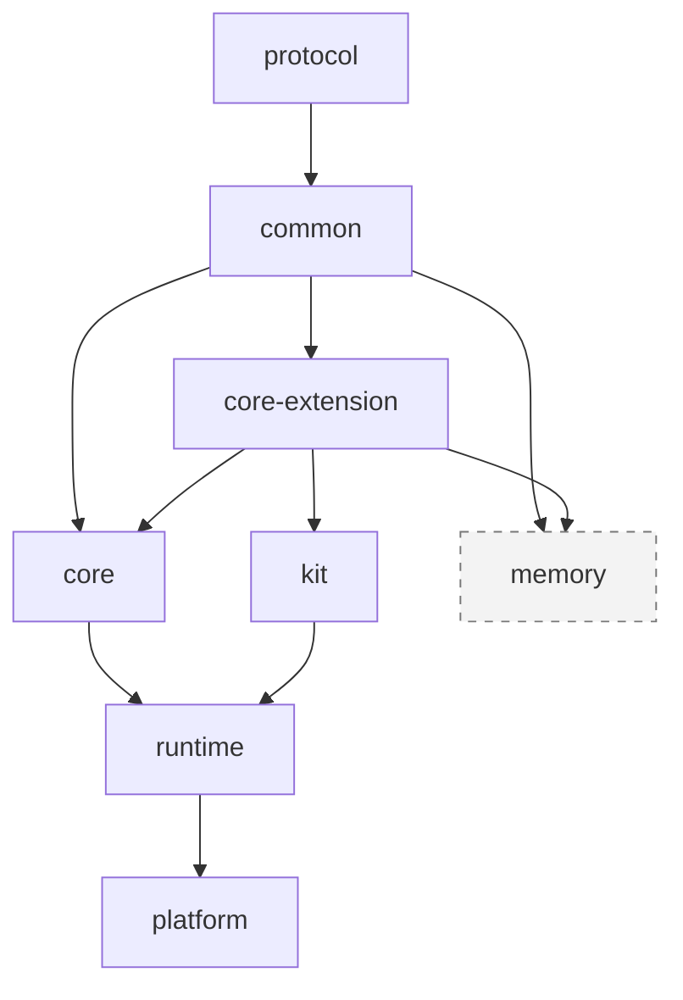
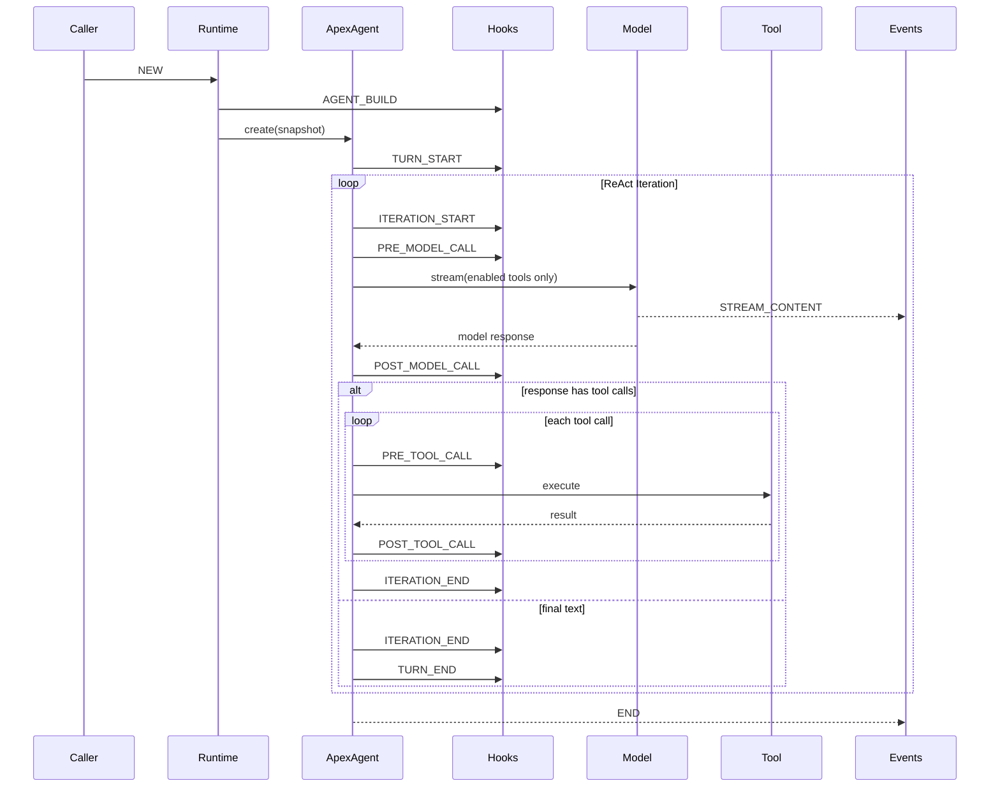
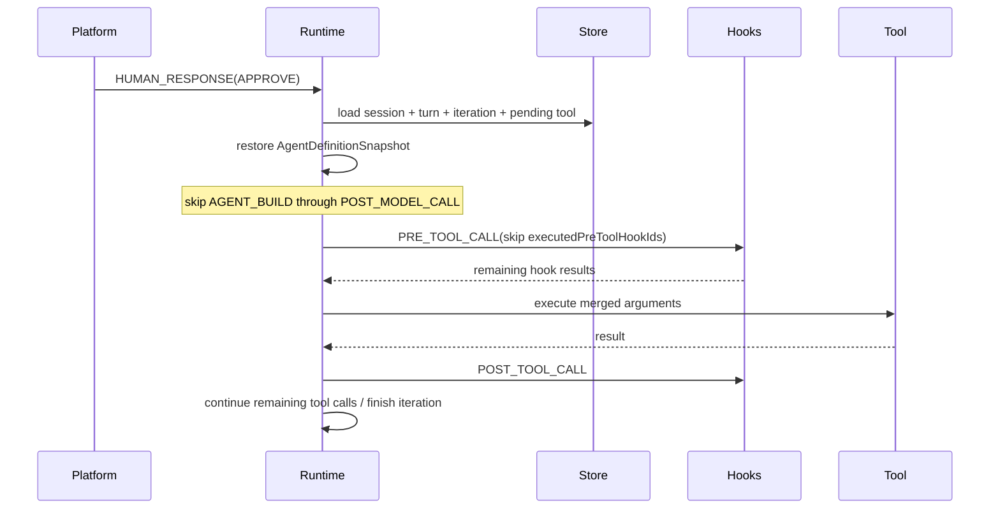
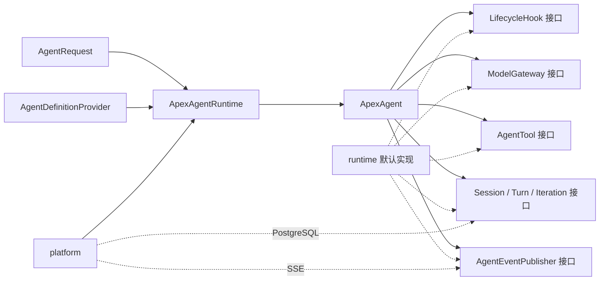

# Apex Agent 后端模块化重构设计

> 状态：已确认
> 日期：2026-07-28
> 范围：仅重构 `apex-agent` 后端，不修改 `apex-frontend`
> 基线：当前单模块后端共有 248 个生产源码文件、44 个测试源码文件；重构前完整后端测试为 137 个测试全部通过

## 1. 背景

当前 `apex-agent` 是一个单 Maven 模块，Agent 执行、生命周期 Hook、工具、Skill、MCP、SubAgent、Web/SSE、会话存储、执行记录、长期记忆与 Skill Learning 均处于同一源码树中。

主链路为：

```text
ChatController
  -> ChatService
  -> SuperAgentCoordinator
  -> SuperAgentFactory
  -> SuperAgentSessionService
  -> SuperAgent
  -> ModelResponseStreamer / ToolCallProcessor / HookRuntime
  -> SessionContextStore / AgentExecutionStore / MemoryLifecycleManager
  -> SseEmitter
```

现有实现已经形成 `Session -> Turn -> Iteration` 的运行层级，但模块职责仍然混杂：

- `SuperAgentContext` 同时持有会话身份、Spring AI 消息、Spring AI 工具、计划模式、Skill、Memory、人在回路状态和 `SseEmitter`。
- `SuperAgent` 直接依赖工具解析、Hook、会话存储、长期记忆、流式模型和 Spring AI 类型。
- 消息实体 `ToolConfirmationMessage` 反向依赖执行上下文和 Hook 类型，使公共协议无法独立发布。
- Hook 分发通过 Spring `ApplicationContext` 查找 Bean，runtime 无法脱离 Spring 容器使用。
- `memory` 包同时承担 Agent 必需的会话持久化和可选的长期记忆能力。
- Agent 定义、工具全集、默认启用工具、Skill 和 Hook 的配置与运行态没有明确分层。
- `react` 与 `plan-executor` 两种模式使提示词、工具可见性、工具合法性、消息类型和上下文状态互相耦合。
- Web 层、核心循环和 SSE 发送之间缺少稳定的端口接口。

本次重构将后端改为八个 Maven 模块，并把框架收敛为唯一的 ReAct 循环。不同业务能力通过构造和运行生命周期 Hook 介入，不再保留“执行模式”概念。

## 2. 已确认的设计决策

本方案以下列决策为不可变前提：

1. `apex-agent/pom.xml` 改为父聚合 POM。
2. 最终模块固定为 `protocol`、`common`、`core-extension`、`core`、`kit`、`runtime`、`platform`、`memory`。
3. `core-extension` 严格只包含接口；接口使用的实体、枚举和结果对象放在 `common`。
4. `SuperAgent` 及相关后端概念统一更名为 `ApexAgent`。
5. 删除 PlanExecutor 和全部执行模式概念，核心框架只有一个 ReAct 循环。
6. 保留 `PLAN_*`、`TASK_THINK_*` 协议实体，但默认运行链路不再产生这些事件。
7. 为兼容现有前端，所有出站事件的 `context.mode` 固定为 `"react"`。
8. 新增 `AGENT_BUILD` 生命周期点。普通新执行创建 `ApexAgent` 时执行；`HUMAN_RESPONSE` 恢复时不执行。
9. HUMAN_RESPONSE 恢复原 Turn 和原 Iteration，跳过 `PRE_TOOL_CALL` 之前已经完成的生命周期。
10. 只允许持久化当前挂起工具已经执行的 `PRE_TOOL_CALL` Hook 标识；不得用通用的“已执行 Hook 列表”恢复其他生命周期。
11. 工具配置分为可用全集和默认启用集合；只有当前启用工具能够进入模型入参并被真实执行。
12. Skill 分为可用全集和已激活集合。已激活 Skill 在同一 session 内跨 Turn 保留，不同 session 和用户之间隔离。
13. Skill 集合不由生命周期 Hook 动态增删；`activate_skill` 是改变激活状态的唯一默认入口。
14. 对话摘要压缩保留在 runtime。
15. 长期记忆、会话搜索和 Skill Learning 封存在 `memory`，其他模块不依赖 `memory`。
16. runtime 提供内存存储、Print 消息出口和默认 Agent，使外部项目只依赖 runtime、通过 `new` 对象即可运行。
17. MCP 进程管理和 HTTP SubAgent 都属于 runtime。
18. platform 保留 Spring Boot、Web/SSE、并发协调和 PostgreSQL 持久化。
19. Agent 数据库配置源本期不实现，只定义统一接口；本期提供 Java 对象、文件和 Spring 配置实现。
20. platform 正式切换到 PostgreSQL，不考虑现有 MySQL 或历史表数据兼容。
21. HTTP、SSE 和人在回路协议保持不变，不修改前端。

## 3. 目标与非目标

### 3.1 目标

- 建立单向、无环的模块依赖。
- 让核心循环只依赖公共模型和扩展接口。
- 让 runtime 无需 Spring 容器即可创建并运行 Agent。
- 让 platform 成为 runtime 的平台适配层，而不是核心能力的拥有者。
- 让 Agent 定义可以来自 Java 对象、配置文件或未来的数据库实现。
- 让生命周期 Hook、工具、模型、消息出口和存储均可替换。
- 完整保留 Turn、Iteration、人在回路、工具确认和多工具调用语义。
- 保证现有前端在不修改任何代码的情况下继续工作。
- 将可选且暂不启用的 Memory/Skill Learning 从主运行链路中隔离。

### 3.2 非目标

- 不修改 `apex-frontend`。
- 不新增或修改外部 HTTP/SSE 字段。
- 不修复 `END` 当前缺少 `execution_status` 的协议现状。
- 不实现数据库版 Agent 定义。
- 不保留 PlanExecutor 兼容执行路径。
- 不兼容旧 MySQL 配置或旧数据库数据。
- 不在本次重构中升级 Spring Boot、Spring AI 或模型供应商版本；只在父 POM 中集中管理现有依赖版本。
- 不把 `memory` 重新接入主运行链路。

## 4. 总体架构

### 4.1 目标依赖图



箭头表示“被依赖模块 -> 依赖它的模块”。对应 Maven 依赖关系为：

```text
common         -> protocol
core-extension -> common
core           -> common + core-extension
kit            -> core-extension
runtime        -> core + kit
platform       -> runtime
memory         -> common + core-extension
```

约束：

- `protocol` 不依赖任何项目模块。
- `common` 不依赖 Spring、Spring Boot、Spring AI、MyBatis、Servlet 或数据库驱动。
- `core-extension` 除接口外不包含类、枚举、record、默认实现、静态工厂或 Spring 注解。
- `core` 不依赖 runtime、kit、platform、memory、Servlet、SSE、Spring ApplicationContext 或数据库。
- `kit` 不依赖 core 的具体实现。
- `runtime` 不依赖 platform 和 memory。
- `platform` 可以引入完整 Spring 与数据库依赖。
- 没有任何模块依赖 `memory`。

### 4.2 Maven 目录

```text
apex-agent/
├── pom.xml
├── protocol/
│   └── pom.xml
├── common/
│   └── pom.xml
├── core-extension/
│   └── pom.xml
├── core/
│   └── pom.xml
├── kit/
│   └── pom.xml
├── runtime/
│   └── pom.xml
├── platform/
│   └── pom.xml
└── memory/
    └── pom.xml
```

统一坐标：

```text
groupId:    org.gemo.apex
version:    1.0-SNAPSHOT
artifactId: apex-agent-{module}
```

父 POM 负责：

- JDK 25 和 UTF-8。
- 统一依赖版本。
- Maven Compiler、Surefire、Enforcer 和测试插件版本。
- 模块清单。
- 禁止循环依赖和未声明依赖。
- 不承担 Spring Boot repackage；只有 platform 执行 repackage。

## 5. 模块职责

### 5.1 protocol

职责：维护所有对前端或远程 SubAgent 可见的公共协议。

包含：

- `ChatRequest`。
- `RequestType`。
- `AgentEventType`。
- `AgentMessage` 及全部具体消息。
- `STREAM_CONTENT`、`STREAM_THINK`。
- `PLAN_DECLARED`、`PLAN_CHANGE`。
- `TASK_THINK_DECLARED`、`TASK_THINK_CHANGE`。
- `INVOCATION_DECLARED`、`INVOCATION_CHANGE`。
- `ARTIFACT_DECLARED`、`ARTIFACT_CHANGE`。
- `ASK_HUMAN`、`TOOL_CONFIRMATION`、`END`。
- 工具确认中的展示字段、可编辑字段和选项 DTO。
- 协议字段常量和 JSON 序列化配置。

规则：

- 所有 JSON 字段名保持当前 snake_case。
- `AgentMessage` 的 Jackson 多态协议保持不变。
- 消息 DTO 不得依赖 `ApexAgentContext`、Hook 上下文、Spring AI、`SseEmitter` 或 platform 类型。
- 现有 `ToolConfirmationMessage.from(SuperAgentContext, ...)` 必须移出 protocol；core 使用独立消息工厂组装 DTO。
- `PLAN_*`、`TASK_THINK_*` 继续存在，仅作为兼容协议，不代表默认运行时仍支持 PlanExecutor。

允许的依赖：

- Jackson 注解和数据绑定所需的最小依赖。
- Lombok 可保留，但更推荐使用明确的 POJO/record，避免协议构造受 Lombok 版本影响。

### 5.2 common

职责：维护真正跨模块的、与实现框架无关的公共实体。

建议包含：

- `AgentDefinition`、`AgentDefinitionSnapshot`、`AgentMetadata`。
- `AgentRequest`、`HumanResponseCommand`。
- `SessionContext`、`SessionStatus`。
- `Turn`、`TurnStatus`。
- `Iteration`、`IterationStatus`。
- `AgentMessageEntry`、`ModelRequest`、`ModelResponse`、`ModelStreamChunk`。
- `ToolDefinition`、`ToolCall`、`ToolResult`、`ToolExecutionStatus`。
- `ToolSetDefinition`：工具全集、默认启用集合。
- `SkillDefinition`、`SkillSetDefinition`。
- `HookPoint`、`HookBinding`、`HookFlowAction`、`HookErrorPolicy`。
- `HookContext` 的各类数据视图和 `HookResult`。
- `PendingHumanInteraction`、`PendingToolExecution`、`SuspensionPoint`。
- `MessageOperation`。
- `ExecutionStatus`。
- 运行时不可变快照及持久化所需的中立数据结构。

规则：

- 不包含 Spring 或 Spring AI 类型。
- 不包含 `ToolCallback`、`ChatResponse`、`SseEmitter`、`ApplicationContext`。
- 不包含数据库实体或 ORM 注解。
- 集合字段在跨边界时使用不可变副本。
- 对持久化快照中的 Hook 使用稳定的 `hookId`，不使用 Spring Bean 名或 Java 类名。

### 5.3 core-extension

职责：只声明扩展接口，不提供实现。

建议接口：

```java
public interface AgentDefinitionProvider {
    AgentDefinition load(String agentKey);
}

public interface ModelGateway {
    ModelResponse stream(ModelRequest request, ModelStreamObserver observer);
}

public interface AgentTool {
    ToolDefinition definition();
    ToolResult execute(ToolCall call, ToolExecutionContext context);
}

public interface ToolProvider {
    List<AgentTool> loadTools(AgentDefinitionSnapshot definition);
}

public interface LifecycleHook {
    HookResult apply(HookContext context);
}

public interface HookResolver {
    LifecycleHook resolve(String extensionId);
}

public interface AgentEventPublisher {
    void publish(AgentMessage message);
}

public interface SessionRepository {
    Optional<SessionSnapshot> load(String sessionId);
    void save(SessionSnapshot snapshot);
}

public interface ConversationRepository {
    void append(...);
    List<AgentMessageEntry> load(...);
    void compact(...);
}

public interface ExecutionRepository {
    void saveTurn(Turn turn);
    void saveIteration(Iteration iteration);
    Optional<Turn> findTurn(...);
    Optional<Iteration> findIteration(...);
}

public interface ConversationWindowManager {
    List<AgentMessageEntry> prepare(...);
}
```

还应声明：

- `IdGenerator`。
- `TimeProvider`。
- `AgentDefinitionSnapshotRepository`，也可以作为 `SessionRepository` 的快照职责。
- `SkillProvider`。
- `SkillActivator`。
- 必要的序列化端口。

严格限制：

- 不使用 `default` 方法。
- 不提供 NoOp 或 InMemory 实现。
- 不使用 `@Component`、`@Service`、`@Repository`。
- 所有接口参数和返回值只能来自 JDK、protocol 或 common。

### 5.4 core

职责：实现 Agent 核心语义。

包含：

- `ApexAgent` 主循环。
- `ApexAgentContext`。
- `AgentRuntimeContext`。
- Turn/Iteration 创建、流转和结束。
- 生命周期调度器。
- Agent 定义构造和冻结。
- Prompt/模型请求的中立编排。
- 工具调用编排。
- 工具启用状态管理和执行前二次校验。
- 人在回路挂起状态生成。
- HUMAN_RESPONSE 恢复状态机。
- 协议消息工厂。
- 会话、Turn、Iteration 持久化接口的调用。

不包含：

- Spring Bean 查找。
- 模型厂商实现。
- Spring AI `ToolCallback`。
- MCP、HTTP SubAgent、文件 Skill。
- `SseEmitter`。
- PostgreSQL/MyBatis。
- 长期记忆和 Skill Learning。

core 只定义循环与接口使用，不决定扩展的来源。

### 5.5 kit

职责：提供可复用的基础工具和生命周期扩展。

包含：

- `ask_human`。
- `ToolConfirmHook`。
- `PlainTextTruncateHook`。
- Tool/Hook 匹配器。
- Tool Confirmation 规格构造器。
- Skill 基础定义和通用辅助能力。
- 不依赖 Spring 容器的通用 Hook 组合器。

明确删除：

- `WritePlanTool`。
- `UpdatePlanTool`。
- PlanExecutor 工具守卫。

kit 中的实现只通过 `core-extension` 接口和 common 上下文工作，不强制使用 core 实现类。

### 5.6 runtime

职责：提供可以直接实例化的默认运行时。

包含：

- `ApexAgentRuntime` 和 Builder API。
- 默认 Agent 定义。
- 默认 ReAct Prompt。
- Spring AI `ChatModel`/消息/ToolCallback 与 common 模型之间的适配。
- 默认模型网关。
- 默认工具执行器。
- 内存 Session/Conversation/Turn/Iteration 存储。
- 对话窗口管理和摘要压缩。
- Print 消息出口。
- Java 对象和文件版 AgentDefinitionProvider。
- 默认 HookResolver/ToolProvider 注册表。
- MCP stdio 客户端生命周期和工具适配。
- HTTP SubAgent 工具和远程 SSE 消息解析。
- 普通 Skill 加载、资源读取和 `activate_skill`。

runtime 可以使用最小范围的 Spring AI 依赖，但不得要求 Spring IoC 容器。

MCP 和 SubAgent 是 runtime 的可选能力：

- 未配置时不得启动外部进程或创建 HTTP 客户端。
- 初始化失败时应产生明确的配置异常或受控降级，策略由 runtime Builder 配置。
- 资源必须由 runtime 实例负责关闭，建议实现 `AutoCloseable`。

### 5.7 platform

职责：把 runtime 接入当前 Web 平台。

包含：

- `ApexApplication`。
- Spring Boot 自动装配。
- `ChatController`、`ChatService`。
- `ApexAgentCoordinator`。
- 同 session 并发防护。
- 异步线程池和用户上下文传播。
- `X-User-Id` Filter。
- `SseEmitterAgentEventPublisher`。
- Spring YAML AgentDefinitionProvider。
- Spring Bean/配置到 runtime Hook、Tool 注册表的适配。
- PostgreSQL Session/Conversation/Turn/Iteration 存储。
- Agent 列表接口。
- platform 配置与数据库迁移脚本。

platform 不拥有核心循环，也不重新实现 runtime 的工具和 Hook 语义。

### 5.8 memory

职责：封存当前长期记忆与 Skill Learning 能力，使其可以独立编译和测试，但不进入默认产品链路。

包含：

- 用户画像和事实记忆。
- 执行历史记忆。
- Agent 经验记忆。
- 记忆召回、抽取、写入和管理。
- pgvector 搜索。
- `session_search`。
- Skill 使用记录。
- Skill 经验抽取、调度和增强。
- Memory/Skill Learning 自有的仓储和 schema。

边界：

- 不包含 runtime 必需的 Session/Turn/Iteration 存储实现。
- 不包含普通 Skill 定义、加载或 `activate_skill`。
- platform、runtime、core 和 kit 均不依赖 memory。
- platform 默认配置不再引用 `skillExperienceAugmentHook` 或 `skillUsageRecorderHook`。
- memory 可以实现 core-extension 中的扩展接口，供未来显式集成，但本期不装配。

## 6. 核心领域模型

### 6.1 Session

Session 表示同一 `sessionId` 下可持续多轮的会话边界。

建议状态：

```text
IN_PROGRESS
COMPLETED
FAILED
HUMAN_IN_THE_LOOP
```

Session 持久化：

- `sessionId`、`agentKey`、`userId`。
- 当前状态。
- 当前 Turn/Iteration 定位。
- 构造完成后的 `AgentDefinitionSnapshot`。
- 对话消息和摘要边界。
- 当前启用工具集合，仅在 Turn 进行中或挂起时保存。
- session 级已激活 Skill 集合。
- PendingHumanInteraction/PendingToolExecution。
- 最近活跃时间。

不持久化：

- `SseEmitter`。
- Spring Bean。
- Spring AI `ToolCallback` 实例。
- MCP Client/HTTP Client。
- 通用的已执行生命周期 Hook 列表。

### 6.2 Turn

Turn 表示一次 `RequestType.NEW` 用户输入开始，到完成、失败或挂起恢复完成为止的业务轮次。

规则：

- 同一 Session 的 `turnNo` 单调递增。
- HUMAN_RESPONSE 不创建新 Turn。
- HUMAN_RESPONSE 恢复原 Turn。
- 新 Turn 重置 `enabledTools` 为 `defaultEnabledTools`。
- 新 Turn 不清空 session 级 `activatedSkills`。
- Turn 挂起时状态为 `SUSPENDED`，但不触发 `TURN_END`。

### 6.3 Iteration

Iteration 表示一个 Turn 内的一次模型推理以及由该模型响应触发的工具处理。

规则：

- 每次模型调用创建一个新 Iteration。
- 模型返回工具调用并继续 ReAct 循环时，下一次模型调用创建下一 Iteration。
- 工具确认或 `ask_human` 挂起时保留当前 Iteration。
- HUMAN_RESPONSE 恢复原 Iteration，不重新调用模型。
- 同一模型响应包含多个工具调用时按响应顺序处理。
- 前面已完成工具的响应必须保留；挂起恢复后只继续未完成调用。

## 7. Agent 定义

### 7.1 配置结构

删除 `default-execution-mode` 和全部 PlanExecutor Prompt 后，Agent 定义至少包含：

```yaml
agent-key: default_agent
name: 通用智能体
description: 通用智能体

prompt:
  system: classpath:agents/default_agent/REACT_PROMPT.md
  rules: classpath:agents/default_agent/AGENT.md

tools:
  available:
    - ask_human
    - activate_skill
    - read_skill_resource
    - meeting-server/*
  default-enabled:
    - ask_human
    - activate_skill
    - read_skill_resource
    - meeting-server/*

skills:
  available:
    - meeting-skill

hooks:
  agent-build:
    - id: normalize-agent-definition
      extension: normalizeAgentDefinition
      order: 10
  pre-tool-call:
    - id: confirm-contact-detail
      extension: toolConfirmHook
      order: 100
      tools: ["contacts_get_detail"]
      options: {}
  post-tool-call:
    - id: truncate-plain-text
      extension: plainTextTruncateHook
      order: 200
      tools: ["*"]
      options:
        max-length: 4000
```

要求：

- 每个 Hook Binding 必须有稳定且在当前生命周期点内唯一的 `id`。
- `extension` 是扩展注册键，不等于 Spring Bean 名。
- `default-enabled` 必须是 `available` 的子集。
- 重复工具名、Skill 名、Hook ID 在构造阶段直接失败。
- runtime Builder 可以直接传同构 Java 对象，不要求 YAML。

### 7.2 配置来源

统一入口为 `AgentDefinitionProvider`。

本期实现：

- `ProgrammaticAgentDefinitionProvider`：runtime，直接接收 Java 对象。
- `FileAgentDefinitionProvider`：runtime，支持 classpath 和文件系统。
- `SpringPropertiesAgentDefinitionProvider`：platform，将 `application.yml` 转换为中立定义。
- `LayeredAgentDefinitionProvider`：保持现有全局配置与 workspace 配置的叠加能力。

本期不实现：

- `DatabaseAgentDefinitionProvider`。
- Agent 配置管理 REST API。

数据库实现未来只需实现同一接口，不得侵入 core。

### 7.3 定义快照

每次普通创建 `ApexAgent` 时：

1. 从 Provider 加载原始定义。
2. 创建可变构造草稿。
3. 执行 `AGENT_BUILD` Hook。
4. 校验工具、Skill、Hook 和 Prompt。
5. 冻结为不可变 `AgentDefinitionSnapshot`。
6. 该快照作为当前 Turn 的运行定义。
7. Session 挂起时持久化快照。

持久化快照是必要条件：HUMAN_RESPONSE 恢复不能重新执行 `AGENT_BUILD`，但必须继续使用挂起前由构造 Hook 产生的最终定义。

快照只保存可序列化定义：

- Prompt 文本或稳定资源版本。
- 工具名、默认启用工具名。
- Skill 定义或稳定引用。
- Hook Binding ID、extension、顺序、匹配规则和 options。
- 定义版本。

工具实例、Hook 实例和客户端连接由 runtime 根据快照重新解析。

## 8. 生命周期

### 8.1 生命周期点

最终生命周期顺序：

1. `AGENT_BUILD`
2. `TURN_START`
3. `ITERATION_START`
4. `PRE_MODEL_CALL`
5. `POST_MODEL_CALL`
6. `PRE_TOOL_CALL`
7. `POST_TOOL_CALL`
8. `ITERATION_END`
9. `TURN_END`

`AGENT_BUILD` 是新增点，其余复用现有概念。

### 8.2 正常执行顺序



### 8.3 Hook 能力

Hook 通过显式 `HookResult` 修改运行时，不直接持有 core 实现对象。

可修改项：

- 工作消息：追加、删除、替换。
- 当前 Turn 的启用工具集合。
- 当前工具参数。
- 当前工具结果。
- 构造阶段的 Agent 定义草稿，包括工具全集、默认启用工具和 Hook 配置。
- Skill 定义的元数据或说明内容可以在构造阶段规范化，但不允许运行期动态增删可用/已激活 Skill 集合。

工具启用变更规则：

- 只能启用 `availableTools` 中存在的工具。
- 禁用立即生效。
- 变更在当前 Turn 后续 Iteration 中持续有效。
- 挂起时保存，恢复时继续使用。
- 新 Turn 重置为 `defaultEnabledTools`。

### 8.4 流控动作

| 生命周期点 | 允许动作 |
| --- | --- |
| `AGENT_BUILD` | `CONTINUE` |
| `TURN_START` | `CONTINUE`、`END_TURN` |
| `ITERATION_START` | `CONTINUE`、`SKIP_ITERATION`、`END_TURN` |
| `PRE_MODEL_CALL` | `CONTINUE`、`SKIP_ITERATION`、`END_TURN` |
| `POST_MODEL_CALL` | `CONTINUE`、`SKIP_ITERATION`、`END_TURN` |
| `PRE_TOOL_CALL` | `CONTINUE`、`BLOCK_TOOL`、`REQUEST_CONFIRMATION`、`SKIP_ITERATION`、`END_TURN` |
| `POST_TOOL_CALL` | `CONTINUE`、`SKIP_ITERATION`、`END_TURN` |
| `ITERATION_END` | `CONTINUE`、`END_TURN` |
| `TURN_END` | `CONTINUE` |

非法动作视为 Hook 执行失败，并按错误策略处理。

### 8.5 Hook 错误策略

- `AGENT_BUILD` 固定为 fail-fast。
- 其他 Hook 支持 `FAIL_FAST` 和 `CONTINUE`。
- 默认策略为 `FAIL_FAST`。
- `CONTINUE` 必须记录结构化日志和指标，但不在持久化快照中保存“已执行 Hook 列表”。
- Hook 对消息、参数、结果或工具集合的修改以单个 Hook 为原子边界：失败时不得留下部分修改。

## 9. ReAct 主循环

core 中只保留一个循环：

```text
prepare turn
while iteration < maxIterations:
    begin iteration
    run ITERATION_START
    run PRE_MODEL_CALL
    call model with current messages and enabled tools
    run POST_MODEL_CALL

    if no tool call:
        finish iteration
        finish turn
        return

    for toolCall in modelResponse.toolCalls:
        run PRE_TOOL_CALL
        check tool is enabled
        execute tool
        run POST_TOOL_CALL
        append tool response

    finish iteration

fail when maxIterations exceeded
```

关键规则：

- `maxIterations` 从硬编码常量改为 runtime 配置，默认仍为 30。
- 模型看见的工具只来自 `enabledTools`。
- 工具执行前必须再次检查工具仍被启用，防止伪造或过期 ToolCall 绕过模型入参。
- 工具参数改写在调用真实工具前完成。
- 工具结果改写在写入对话前完成。
- `AssistantMessage` 与每个 `ToolResult` 必须一一匹配。
- 一个 ToolCall 失败只生成对应工具响应；是否终止 Turn 由错误策略或 Hook 决定。
- `ask_human` 是普通可配置工具，但其结果由 HUMAN_RESPONSE 补齐。
- 不存在 Stage、Plan、PlanExecutor Prompt 或模式切换。

## 10. HUMAN_RESPONSE 恢复

### 10.1 总体原则

HUMAN_RESPONSE 是原执行的延续，不是新消息 Turn，也不是新的模型 Iteration。

恢复时：

- 不执行 `AGENT_BUILD`。
- 不执行 `TURN_START`。
- 不执行 `ITERATION_START`。
- 不执行 `PRE_MODEL_CALL`。
- 不再次调用模型。
- 不执行 `POST_MODEL_CALL`。
- 从挂起工具尚未执行的 `PRE_TOOL_CALL` Hook 开始继续。

### 10.2 允许持久化的 Hook 进度

只允许在 `PendingToolExecution` 中保存：

```text
executedPreToolHookIds: List<String>
```

该列表：

- 只属于当前挂起 ToolCall。
- 只记录成功执行完成的 `PRE_TOOL_CALL` Hook Binding ID。
- 不记录 Bean 名、类名或对象。
- 不记录其他生命周期点。
- 工具完成、拒绝或执行失败收口后立即清除。

不得保存：

- `TURN_START` 已执行列表。
- 模型调用前后 Hook 已执行列表。
- `POST_TOOL_CALL` 已执行列表。
- Iteration/Turn 结束 Hook 已执行列表。
- 全局通用 Hook 游标。

Turn、Iteration 和挂起阶段由明确状态字段表达，而不是通过 Hook 历史推断。

### 10.3 工具确认挂起

`PendingToolExecution` 至少保存：

- `sessionId`、`turnNo`、`iterationNo`。
- `toolIndex`。
- `toolCallId`。
- `invocationId`。
- `toolName`。
- Hook 改写后的参数。
- 可编辑参数键。
- `confirmationId`。
- `executedPreToolHookIds`。
- `SuspensionPoint.PRE_TOOL_CALL`。
- 当前 `enabledToolNames`。
- 当前 `AgentDefinitionSnapshot` 引用或内容。

请求确认时：

1. PRE_TOOL_CALL Hook 按顺序执行。
2. 每个成功结束的 Hook ID 追加到 `executedPreToolHookIds`。
3. 某 Hook 返回 `REQUEST_CONFIRMATION` 时，该 Hook 也视为已执行。
4. 保存 PendingToolExecution 和会话快照。
5. 状态切为 `HUMAN_IN_THE_LOOP`。
6. 发送当前协议的 `TOOL_CONFIRMATION`。
7. 不执行 `ITERATION_END` 或 `TURN_END`。

### 10.4 批准恢复



批准时：

1. 校验 userId、agentKey、session 状态、toolCallId 和 confirmationId。
2. 只合并允许编辑的参数。
3. 从持久化的 AgentDefinitionSnapshot 恢复 Hook 顺序。
4. 重新解析 Hook 实例。
5. 调用 PRE_TOOL_CALL 分发器并传入 `executedPreToolHookIds` 跳过集合。
6. 只执行未执行的 PRE_TOOL_CALL Hook。
7. 新执行完成的 Hook ID继续追加并持久化。
8. 若后续 Hook 再次请求确认，则用更新后的列表再次挂起。
9. 所有 pre-hook 完成后再次校验工具仍启用。
10. 执行真实工具并正常运行 POST_TOOL_CALL。
11. 继续处理同一模型响应中剩余 ToolCall。
12. 完成原 Iteration，再进入下一 ReAct Iteration。

### 10.5 拒绝恢复

拒绝时：

- 不执行剩余 PRE_TOOL_CALL Hook。
- 不执行真实工具。
- 不执行 POST_TOOL_CALL。
- 为该 ToolCall 写入“用户拒绝”的 ToolResult。
- 清除 PendingToolExecution。
- 继续同一模型响应中剩余 ToolCall；若没有剩余调用，则结束当前 Iteration 并进入下一次模型推理。

### 10.6 ask_human 恢复

`ask_human` 恢复时：

- 把前端提交内容转换为对应 `toolCallId` 的 ToolResult。
- 不重新执行该 `ask_human` 调用之前的生命周期。
- 不重新执行模型。
- 继续同一模型响应中的其他未完成 ToolCall。
- 后续每个新 ToolCall 正常从自身 PRE_TOOL_CALL 开始。

## 11. 工具体系

### 11.1 三层状态

工具状态分为：

1. `registeredTools`：runtime 注册表中可以被解析的所有工具。
2. `availableTools`：当前 Agent 定义允许使用的工具全集。
3. `enabledTools`：当前 Turn 实际启用的工具。

Agent 配置保存 `availableTools` 和 `defaultEnabledTools`。

规则：

- `defaultEnabledTools ⊆ availableTools ⊆ registeredTools`。
- Agent 构造时完成校验。
- 生命周期只能在 `availableTools` 范围内改变 `enabledTools`。
- Prompt 只携带 `enabledTools`。
- 执行器只允许执行 `enabledTools`。
- 挂起恢复必须恢复当时的 `enabledTools`，避免确认前后工具权限漂移。
- 新 Turn 使用定义快照中的 `defaultEnabledTools` 重新初始化。

### 11.2 工具来源

runtime 默认支持：

- kit 基础工具。
- 调用方通过 Builder 注册的本地工具。
- MCP stdio 工具。
- HTTP SubAgent 工具。
- Skill 工具。

工具统一适配为 `AgentTool`，core 不感知来源。

### 11.3 MCP

- MCP 配置属于 Agent 定义引用和 runtime 外部资源配置。
- runtime 负责进程启动、初始化、超时、缓存和关闭。
- MCP ToolContext 只接收可序列化的 session 快照，不接收 `ApexAgentContext` 实例。
- MCP Client 缓存按 runtime 实例和 server 定义隔离。
- runtime 关闭时释放全部 MCP Client。

### 11.4 HTTP SubAgent

- SubAgent 继续复用当前 `/api/sse/chat` 协议。
- runtime 负责 HTTP 请求和 SSE 解析。
- protocol 提供消息反序列化模型。
- 子 Agent 的 `STREAM_CONTENT` 聚合为工具结果。
- `INVOCATION_*` 按当前行为透传。
- `ARTIFACT_*` 继续保持当前无生产者/忽略语义。
- 用户身份继续通过 `X-User-Id` 传播。

## 12. Skill

### 12.1 状态

Skill 使用两个 session 隔离集合：

- `availableSkills`：Agent 配置允许使用的 Skill 全集。
- `activatedSkills`：当前 session 已激活 Skill。

规则：

- `activatedSkills ⊆ availableSkills`。
- `activate_skill` 成功后把 Skill 名加入 session 的 `activatedSkills`。
- 新 Turn 不清空 `activatedSkills`。
- HUMAN_RESPONSE 恢复保持集合不变。
- 不同 session 和不同用户之间不共享激活状态。
- 生命周期 Hook 不动态增删这两个集合。
- Agent 定义重新加载时，如果可用 Skill 被删除，应在下一个普通新 Turn 构造快照时移除不再可用的激活项，并记录告警。

### 12.2 Prompt 注入

- 未激活 Skill 只以名称和摘要出现在可用 Skill 列表中。
- 已激活 Skill 的完整 instructions 由 runtime 在每次模型调用前作为固定上下文注入。
- 该注入不依赖历史 ToolResult 是否仍处于压缩窗口，因此跨 Turn 和对话压缩后仍有效。
- Skill 资源读取工具只能访问 `availableSkills` 中的资源。

### 12.3 Skill Learning

Skill Learning 全部移动到 memory：

- runtime 不记录 Skill 使用经验。
- runtime 不调度经验抽取。
- runtime 不注入历史 Skill 经验。
- 普通 Skill 激活和资源读取不受影响。

## 13. 消息发送

### 13.1 统一端口

core 只调用：

```java
public interface AgentEventPublisher {
    void publish(AgentMessage message);
}
```

实现：

- runtime：`PrintAgentEventPublisher`，按现有 JSON 协议输出到 PrintStream。
- platform：`SseEmitterAgentEventPublisher`，写入当前请求的 `SseEmitter`。

`ApexAgentContext` 不再持有 `SseEmitter`。

### 13.2 事件构造

core 内部使用消息工厂：

```text
AgentEventFactory
  -> streamContent(...)
  -> askHuman(...)
  -> toolConfirmation(...)
  -> end()
```

兼容要求：

- 所有运行消息的 `context.mode` 固定为 `"react"`。
- 不再输出 `stage_id`。
- `STREAM_CONTENT` 的 `content_id` 聚合语义不变。
- `ASK_HUMAN` 的 `tool_call_id` 不变。
- `TOOL_CONFIRMATION` 的 confirmation/tool/invocation 标识不变。
- `END` 继续保持当前空终止事件，不新增 `execution_status`。

### 13.3 END 的唯一发送

- `ApexAgent` 正常完成、失败或挂起退出当前传输时，通过事件端口发送一次 `END`。
- platform 在 Agent 尚未成功构造、任务被线程池拒绝等 core 无法接管的失败路径发送兜底 `END`。
- platform 的事件出口必须有“只结束一次”保护，防止 core 和兜底逻辑重复发送。
- `END` 只代表本次 SSE 结束，不改变人在回路业务语义。

## 14. runtime 公共 API

### 14.1 最小创建方式

目标 API：

```java
ChatModel chatModel = ...;

try (ApexAgentRuntime runtime = ApexAgentRuntime.builder()
        .chatModel(chatModel)
        .agentDefinition(agentDefinition)
        .build()) {

    ApexAgent agent = runtime.newAgent(AgentRequest.builder()
            .sessionId("session-1")
            .agentKey("default_agent")
            .userId("user-1")
            .query("请帮我处理这个任务")
            .build());

    agent.run();
}
```

默认值：

- 内存 Session/Conversation/Execution Repository。
- Print 事件出口。
- 默认 ReAct Prompt。
- 默认最大 Iteration 数 30。
- kit 基础工具。
- 无 MCP、无 SubAgent、无外部 Skill。
- 不启动 Spring ApplicationContext。

### 14.2 自定义扩展

```java
ApexAgentRuntime runtime = ApexAgentRuntime.builder()
        .modelGateway(modelGateway)
        .agentDefinitionProvider(definitionProvider)
        .sessionRepository(sessionRepository)
        .conversationRepository(conversationRepository)
        .executionRepository(executionRepository)
        .eventPublisher(eventPublisher)
        .registerTool(customTool)
        .registerHook("toolConfirmHook", toolConfirmHook)
        .registerSkill(skill)
        .build();
```

Builder 在 `build()` 时完成：

- 必需依赖校验。
- 工具、Hook、Skill 重名校验。
- 默认实现补齐。
- 资源生命周期归属确认。

### 14.3 恢复

```java
ApexAgent resumed = runtime.resumeAgent(HumanResponseCommand.builder()
        .sessionId("session-1")
        .agentKey("default_agent")
        .userId("user-1")
        .humanResponse(response)
        .build());

resumed.run();
```

`resumeAgent` 会创建恢复执行对象，但明确不分发 `AGENT_BUILD`，而是加载持久化的 `AgentDefinitionSnapshot`。

内存 runtime 只能在同一 runtime 实例存活期间恢复；platform 的 PostgreSQL 实现支持进程重启后恢复。

## 15. platform

### 15.1 HTTP 边界

保持不变：

```text
GET  /api/sse/agents
POST /api/sse/chat
Header: X-User-Id
```

`ChatRequest` 字段保持：

```text
query
sessionId
agentKey
type
humanResponse
```

platform 处理：

- 参数校验。
- 用户身份提取。
- session 并发防护。
- 创建请求级 SSE Publisher。
- `NEW` 调用 `runtime.newAgent`。
- `HUMAN_RESPONSE` 调用 `runtime.resumeAgent`。
- 异步执行。
- Emitter 完成和异常兜底。

### 15.2 Agent 列表

`GET /api/sse/agents` 从 `AgentDefinitionProvider` 读取元数据，不直接绑定 Spring `ApexGlobalProperties`。

响应结构继续为：

```json
{
  "code": 200,
  "data": [
    {
      "agentKey": "default_agent",
      "name": "通用智能体"
    }
  ],
  "message": "success"
}
```

### 15.3 并发

- 保留同一 `sessionId` 只允许一个活跃执行。
- session lock 由 platform 维护。
- runtime/core 不依赖 HTTP 409，但应通过明确异常表达并发冲突。
- platform 将冲突映射为 409。
- 用户上下文不再位于 memory 包，移动到 platform。
- 异步 TaskDecorator 继续传播并清理用户上下文。

## 16. PostgreSQL 持久化

### 16.1 原则

- platform 只支持 PostgreSQL。
- 移除 MySQL 驱动和 dev profile 的 MySQL 配置。
- 不兼容旧表数据。
- 使用 PostgreSQL JSONB 保存运行快照和中立消息载荷。
- 建议引入 Flyway 管理 platform schema。
- JDBC/MyBatis Plus 只存在于 platform。

### 16.2 建议表

### `apex_agent_session`

- `session_id`。
- `user_id`。
- `agent_key`。
- `status`。
- `current_turn_no`。
- `current_iteration_no`。
- `agent_definition_snapshot JSONB`。
- `enabled_tool_names JSONB`。
- `activated_skill_names JSONB`。
- `pending_human_interaction JSONB`。
- `pending_tool_execution JSONB`。
- `last_active_time`。
- `created_at`、`updated_at`。

### `apex_agent_turn`

- `session_id`。
- `turn_no`。
- `status`。
- `started_at`、`ended_at`。
- `error`。
- 主键 `(session_id, turn_no)`。

### `apex_agent_iteration`

- `session_id`。
- `turn_no`。
- `iteration_no`。
- `status`。
- `model_input JSONB`。
- `model_output JSONB`。
- `tool_calls JSONB`。
- `flow_action`。
- `error`。
- `started_at`、`ended_at`。
- 主键 `(session_id, turn_no, iteration_no)`。

### `apex_agent_dialogue_message`

- `id`。
- `session_id`。
- `turn_no`。
- `sort_no`。
- `role`。
- `message_type`。
- `content`。
- `payload JSONB`。
- `compacted`。
- `created_at`。
- 唯一约束 `(session_id, sort_no)`。

### `apex_agent_dialogue_summary`

- `session_id`。
- `content`。
- `payload JSONB`。
- `compacted_to_sort_no`。
- `source_turn_no`。
- `created_at`、`updated_at`。

### 16.3 Hook 持久化限制

platform schema 不再为 Turn/Iteration 保存通用 `hook_executions` 数组。

唯一允许持久化的执行 Hook 标识位于：

```text
apex_agent_session.pending_tool_execution.executedPreToolHookIds
```

Hook 审计使用日志、Tracing 和 Metrics，不使用恢复快照。

### 16.4 事务边界

- 新 Turn 创建、用户消息追加和 Session 快照保存为一个事务。
- 工具确认挂起、PendingToolExecution 和 Session 状态切换为一个事务。
- HUMAN_RESPONSE 参数合并和恢复占用同一 session 执行锁。
- 每个 ToolResult 追加后及时提交，保证多工具调用中途挂起时前序结果可恢复。
- Turn/Iteration 结束与 Session 状态更新保持一致。

## 17. PlanExecutor 清理

删除：

- `ModeEnum`。
- `PLAN_EXECUTOR`。
- `default-execution-mode` 配置。
- `executionMode` 上下文字段。
- `SuperAgentContext.Stage.EXECUTION` 这类仅为模式服务的内部 Stage。
- `StageToolResolver`、`StageToolPlan`。
- `ToolInterceptor` 中 PlanExecutor/ReAct 模式守卫。
- `StagePromptBuilder` 的模式分支。
- `PLAN_EXECUTOR_WRITE_PLAN_PROMPT.md`。
- `PLAN_EXECUTOR_RUN_PROMPT.md`。
- `WritePlanTool`。
- `UpdatePlanTool`。
- `Plan`、执行用 `Stage` 及相关状态。
- `TASK_THINK_CHANGE` 的运行生产逻辑。
- 数据库中的 `execution_mode`、`current_stage`、plan snapshot。

保留：

- protocol 中的 `PLAN_DECLARED`、`PLAN_CHANGE`。
- protocol 中的 `TASK_THINK_DECLARED`、`TASK_THINK_CHANGE`。
- 前端已有类型和兼容消费逻辑，且不做任何修改。

固定兼容字段：

```json
{
  "context": {
    "mode": "react"
  }
}
```

`"react"` 在新架构中只是线协议兼容值，不是 core 执行模式。

## 18. 重命名

主要重命名：

| 当前名称 | 目标名称 |
| --- | --- |
| `SuperAgent` | `ApexAgent` |
| `SuperAgentContext` | `ApexAgentContext` |
| `SuperAgentFactory` | 由 `ApexAgentRuntime`/`ApexAgentBuilder` 取代 |
| `SuperAgentCoordinator` | `ApexAgentCoordinator` |
| `SuperAgentSessionService` | 拆分为 runtime 会话服务与 core 恢复逻辑 |
| `SuperAgentConfiguration` | `ApexAgentPlatformConfiguration` |
| `StagePromptBuilder` | `AgentPromptBuilder` |

同步修改：

- JavaDoc、注释、日志和异常消息。
- 测试类名。
- Prompt 中“超级智能体（SuperAgent）”文字。
- 当前态文档。

不修改：

- `/api/sse/*`。
- `sessionId`、`agentKey` 等协议字段。
- SSE 事件名。
- 仓库根目录名称。

## 19. 当前代码迁移映射

| 当前包/类型 | 目标模块 |
| --- | --- |
| `message/*` | protocol |
| `domain/dto/ChatRequest` | protocol |
| 事件、请求、消息字段常量 | protocol |
| Agent/Turn/Iteration/Tool/Hook 中立实体 | common |
| `IAgentDefinitionLoader` 接口 | core-extension |
| 生命周期 Hook 接口 | core-extension |
| Session/Execution Store 接口 | core-extension |
| `SuperAgent` 主循环 | core，重写为 `ApexAgent` |
| `HumanInLoopResumer` | core，改为恢复状态机 |
| `ToolCallProcessor` | core，拆分编排与执行端口 |
| `AgentPromptAssembler` | core 编排 + runtime Spring AI 适配 |
| `ToolConfirmHook`、`PlainTextTruncateHook` | kit |
| `AskHumanTool` | kit |
| `WritePlanTool`、`UpdatePlanTool` | 删除 |
| `GlobalToolRegistry` | runtime，拆为 Tool/Hook/Skill 注册表 |
| `CustomToolCallingManager` | runtime Spring AI Tool 执行适配 |
| MCP 定义和客户端 | runtime |
| `SubAgentToolCallback`、消息 Handler | runtime |
| `skills` 非 learning 部分 | kit + runtime |
| 内存 Session/Execution Store | runtime |
| 对话摘要压缩 | runtime |
| Web、SSE、线程池、用户 Filter | platform |
| PostgreSQL Session/Execution Store | platform |
| 长期 Memory、搜索、管理接口 | memory |
| `skills/learning` | memory |

旧的 `AgentHookRuntime`/`DefaultAgentHookRuntime` 与新的 Lifecycle Runtime 重复，最终统一为一套生命周期扩展接口和一套 core 分发器，旧实现全部删除。

## 20. 分阶段实施

### 阶段 0：冻结行为

- 保留当前 137 个通过测试作为基线。
- 为以下链路补充特征测试：
  - 普通无工具 Turn。
  - 多 Iteration 工具循环。
  - 多 ToolCall 前序成功、后序挂起。
  - ask_human 挂起恢复。
  - Tool Confirmation 挂起恢复。
  - 已执行 PRE_TOOL_CALL Hook 不重复。
  - context.mode 为 react。
  - END 精确 JSON。
- 保存当前协议 Golden Files。

### 阶段 1：父 POM、protocol、common

- 改父聚合 POM。
- 搬迁并净化协议实体。
- 建立无 Spring common 模型。
- 保持 platform 临时调用旧链路，确保协议测试继续通过。

### 阶段 2：core-extension

- 定义 Model、Tool、Hook、Message、Storage、Definition 接口。
- 增加架构测试，保证模块只有接口。
- 为现有实现编写临时 Adapter，避免一次性重写全部功能。

### 阶段 3：core

- 实现 `ApexAgent`。
- 实现九个生命周期点。
- 实现工具启用状态。
- 实现 Turn/Iteration。
- 实现挂起快照和 HUMAN_RESPONSE 恢复。
- 删除 core 对 Spring、Web、Memory 的直接依赖。

### 阶段 4：kit

- 迁移 `ask_human`。
- 迁移工具确认和结果截断 Hook。
- 删除计划工具。
- 完成 Hook 行为单元测试。

### 阶段 5：runtime

- 实现 Builder 和无 Spring 容器启动。
- 实现 Spring AI Adapter。
- 实现内存 Store、Print Publisher 和摘要压缩。
- 迁移普通 Skill。
- 迁移 MCP 和 HTTP SubAgent。
- 提供 runtime-only 示例和集成测试。

### 阶段 6：platform

- 迁移 Spring Boot 应用。
- 接入 runtime。
- 实现 SSE Publisher、Coordinator 和用户上下文。
- 切换 PostgreSQL。
- 增加 Flyway schema。
- 删除 MySQL 依赖。
- 验证现有前端无缝连接。

### 阶段 7：memory 封存

- 搬迁长期 Memory、搜索、管理和 Skill Learning。
- 移除 platform/runtime 对 memory 的依赖和配置。
- 保持 memory 独立编译与单元测试。
- `session_search` 不再进入默认工具。

### 阶段 8：清理

- 删除 PlanExecutor。
- 删除旧 SuperAgent 类型。
- 删除重复 Hook Runtime 和死代码。
- 清理过时配置和 Prompt。
- 更新 `docs/reference/`、`docs/overview/`、`docs/spec/` 当前态文档。
- 全量验证。

每个阶段都必须保持 Maven 构建可运行。允许在迁移分支中短期存在 Adapter，但最终产物不得保留额外 legacy 模块。

## 21. 测试策略

### 21.1 架构测试

必须自动验证：

- common 不导入 `org.springframework.*`。
- core-extension 下所有顶级类型均为 interface。
- core 不依赖 runtime/platform/memory。
- kit 不依赖 core 具体实现。
- runtime 不依赖 platform/memory。
- 没有任何模块依赖 memory。
- protocol 消息不依赖执行上下文。

可以使用 Maven Enforcer、ArchUnit 和模块级编译测试组合实现。

### 21.2 core 测试

使用 Fake 接口测试，不启动 Spring：

- 九个生命周期点的完整顺序。
- Hook 排序和错误策略。
- Hook 修改消息、工具集合、参数、结果。
- 非法流控动作。
- 只将 enabledTools 发送给模型。
- 被禁用工具无法真实执行。
- 工具启用变更跨 Iteration 保留、新 Turn 重置。
- 最大 Iteration。
- 多 ToolCall 顺序和部分结果。
- Turn/Iteration 状态流转。

### 21.3 HUMAN_RESPONSE 测试

必须覆盖：

- HUMAN_RESPONSE 不执行 `AGENT_BUILD`。
- 恢复不执行 `TURN_START`、`ITERATION_START`、模型调用前后 Hook。
- 恢复不再次调用模型。
- 恢复同一 Turn/Iteration。
- 已执行 PRE_TOOL_CALL Hook 不重复。
- 未执行 PRE_TOOL_CALL Hook 继续按顺序执行。
- 后续 Hook 再次确认时更新唯一允许保存的 Hook ID 列表。
- 拒绝时不执行剩余 pre-hook、工具和 post-hook。
- 批准时参数只合并可编辑字段。
- 多 ToolCall 中前序结果不丢失。
- 恢复完成后清除 pending 和 executedPreToolHookIds。
- 配置文件变化时仍使用挂起前 AgentDefinitionSnapshot。

### 21.4 runtime 测试

- 不创建 Spring ApplicationContext，直接 `new` 并完成一次 Agent 执行。
- 默认内存存储。
- Print Publisher 输出协议 JSON。
- 文件 Agent 配置。
- 摘要压缩。
- MCP 资源关闭。
- HTTP SubAgent 协议解析。
- Skill 激活跨 Turn 保留。
- Skill 在不同 Session 之间隔离。
- 未激活和已激活 Skill Prompt 注入差异。

### 21.5 platform 测试

- Controller 路径、请求和响应不变。
- `X-User-Id` 校验和传播。
- session 并发返回 409。
- SSE 事件与 Golden Files 一致。
- END 只发送一次。
- NEW 与 HUMAN_RESPONSE 路由。
- PostgreSQL Repository。
- 事务和进程重启恢复。
- Agent 列表。

PostgreSQL 集成测试建议使用 Testcontainers；纯规则测试不得依赖外部数据库。

### 21.6 协议兼容测试

对以下事件执行精确 JSON 快照测试：

- `STREAM_CONTENT`。
- `ASK_HUMAN`。
- `TOOL_CONFIRMATION`。
- `END`。
- 保留的 `PLAN_*`、`TASK_THINK_*` 序列化。

特别断言：

```json
"mode": "react"
```

且 `END` 不额外增加字段。

前端源码不修改。最终联调阶段运行现有前端测试、typecheck 和 build，只用于证明兼容性。

## 22. 验收标准

### 模块

- 八个目标模块全部可独立编译。
- 父 POM 一次执行所有模块测试。
- 依赖图与本方案一致。
- core-extension 中没有实现类。
- common 没有 Spring 依赖。
- memory 没有被任何模块依赖。

### runtime

- 外部项目只依赖 `apex-agent-runtime`。
- 提供 ChatModel/ModelGateway 和 Agent 定义后，可通过普通 Java `new`/Builder 运行。
- 无需 Spring ApplicationContext。
- 默认使用内存存储和 Print Publisher。

### 执行

- 框架中不存在执行模式。
- 主循环只有 ReAct。
- Turn/Iteration 语义保持。
- 工具全集、默认启用集合和当前启用集合边界清晰。
- 只有启用工具进入模型并允许执行。
- 九个生命周期点工作正常。

### 恢复

- HUMAN_RESPONSE 不创建新 Turn/Iteration。
- HUMAN_RESPONSE 不执行 AGENT_BUILD 或模型调用前生命周期。
- 只保存已执行 PRE_TOOL_CALL Hook ID。
- 已执行 pre-hook 不重复，未执行 pre-hook 能继续。
- Agent 构造快照可以在恢复时重建同一运行定义。

### Skill

- Skill 可用全集和已激活集合分离。
- 激活状态在同一 Session 中跨 Turn 保留。
- 不同 Session/用户隔离。
- runtime 不接入 Skill Learning。

### platform

- 前端零修改。
- HTTP/SSE 协议零变化。
- `context.mode` 固定为 react。
- PostgreSQL 为唯一 platform 数据库。
- 不保留 MySQL 兼容逻辑。

## 23. 风险与控制

### 23.1 Spring AI 类型转换

当前持久化和核心循环直接使用 Spring AI Message。改为 common 中立模型后，流式 ToolCall、metadata 和 ToolResponse 的转换最容易发生信息丢失。

控制：

- 先建立双向 Adapter 契约测试。
- 使用真实 Spring AI 消息样本做 Round Trip。
- ToolCall ID、名称、参数和顺序必须精确保留。

### 23.2 构造快照与恢复

AGENT_BUILD 能修改最终定义，而 HUMAN_RESPONSE 又禁止重新执行构造 Hook，因此若不保存最终快照，恢复行为必然漂移。

控制：

- 挂起前持久化不可变 AgentDefinitionSnapshot。
- Snapshot 使用定义版本。
- 恢复时按快照解析扩展。
- 扩展 ID 无法解析时恢复失败，不静默换用最新定义。

### 23.3 PRE_TOOL_CALL Hook 标识

使用 Bean 名会让 runtime 与 Spring 绑定，使用顺序索引会在配置调整后指向错误 Hook。

控制：

- 配置强制稳定 `hookId`。
- 执行进度只保存 `hookId`。
- Hook 链来自挂起前定义快照。
- 不保存其他生命周期 Hook 历史。

### 23.4 Skill 跨 Turn 激活

仅依赖历史 ToolResult 会在摘要压缩后丢失 Skill instructions。

控制：

- activatedSkills 属于 SessionSnapshot。
- 每次模型调用前重新注入已激活 Skill instructions。
- Skill 不存在时在新 Turn 构造阶段清理并告警。

### 23.5 双重 END

core 发送 END，platform 又需要覆盖构造失败和线程池拒绝路径，容易重复。

控制：

- Publisher 包装一次性终止状态。
- core 接管后由 core 发送。
- core 未接管时由 platform 兜底。
- 用并发测试锁定。

### 23.6 Memory 封存后的行为变化

默认 Agent 将失去长期记忆召回、session_search 和 Skill Learning，但保留原始会话、摘要压缩和普通 Skill。

控制：

- 在发布说明中明确。
- runtime 保持对话连续性和摘要。
- memory 独立构建，未来通过扩展接口重新接入。

## 24. 最终目标形态

重构完成后，系统的核心关系应收敛为：



core 只负责一件事：按照 Turn/Iteration/ReAct 和生命周期契约推进 Agent。

runtime 负责提供开箱即用的默认实现。

platform 负责把 runtime 接入当前 Web 产品。

memory 保持封存，不再反向塑造核心框架。
