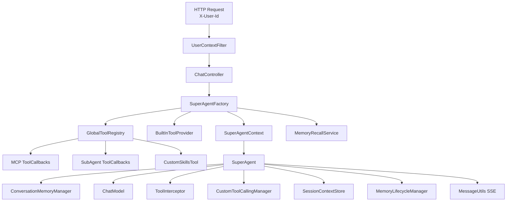

# 架构与执行流程

## 总体架构

## 请求入口

`UserContextFilter` 会校验请求头里的 `X-User-Id`。`ChatController` 提供：

- `GET /api/sse/agents`：获取可用 Agent 列表
- `POST /api/sse/chat`：通过 SSE 执行会话

`RequestType.NEW` 会创建新轮次上下文，`RequestType.HUMAN_RESPONSE` 会恢复被 `ask_human` 挂起的会话。

## 上下文创建

`SuperAgentFactory` 负责创建或恢复 `SuperAgentContext`，核心行为如下：

- 校验会话是否属于当前用户和当前 Agent
- 递增轮次、重置运行态字段、写入当前用户消息
- 召回本轮可用记忆
- 组装内置工具、MCP 工具、SubAgent 工具和 Skills 工具
- 强制把新会话起始阶段设为 `EXECUTION`
- 从 Agent 配置或 workspace `config.yml` 读取 `default-execution-mode`

如果缺少 `default-execution-mode`，创建新轮次会直接失败。

## 执行引擎

系统现在只保留一个内部阶段：`EXECUTION`。

### `react`

- 直接开放业务工具、`ask_human` 和 `activate_skill`
- 以“思考 -> 调用工具 -> 观察结果 -> 继续执行”的循环推进
- 通过 `STREAM_CONTENT` 向前端输出正文流

### `plan-executor`

分成两个受控子状态：

1. 当 `context.plan == null` 时，只允许调用 `write_plan_tool` 创建计划，并发送 `PLAN_DECLARED`
2. 计划存在后，先用 `update_plan_tool` 启动当前阶段，再执行业务工具；阶段内分析通过 `TASK_THINK_CHANGE` 追加到当前任务节点

## 工具调用链路

工具不会被模型直接执行，而是经过统一链路：

1. `ToolInterceptor` 按执行模式校验当前工具是否允许调用
2. `CustomToolCallingManager` 执行对应 `ToolCallback`
3. 工具结果封装为 `ToolResponseMessage`
4. 会话消息继续入链，进入下一轮模型推理

关键约束：

- `react` 禁止调用 `write_plan_tool` 和 `update_plan_tool`
- `plan-executor` 在计划创建前只允许 `write_plan_tool`
- `plan-executor` 在没有 `RUNNING` 阶段时，必须先调用 `update_plan_tool`

## SubAgent 协作

`SubAgentToolCallback` 通过 HTTP 调用目标 Agent 的 `/api/sse/chat`，并解析返回的 SSE 流。

父 Agent 侧当前会处理：

- `STREAM_CONTENT`：拼接为工具结果
- `INVOCATION_*`：补充 `mode`、`stage_id`、`executor` 后继续转发
- `PLAN_*`、`TASK_THINK_*`：当前默认不复用为父 Agent 自身的计划视图

`STREAM_THINK` 仍保留为兼容旧协议的消息类型，但当前主执行链路不再发送它。

## Memory 架构

`SessionContextStore` 负责保存会话元信息、对话消息和摘要。`MemoryRecallService` 会在每轮开始前召回：

- 用户画像 `PROFILE`
- 执行历史 `EXECUTION_HISTORY`
- Agent 经验 `EXPERIENCE`

`DefaultConversationMemoryManager` 负责压缩长对话，`MemoryLifecycleManager` 在轮次结束后异步抽取执行历史和经验记忆。

## 配置分层

配置来源分两层：

- `application.yml` 中的 `apex.global.*`
- `src/main/resources/agents/<agentKey>/config.yml`

`AgentWorkspaceService` 优先读取 workspace 配置；若缺失则回退到全局配置或默认提示词模板。
