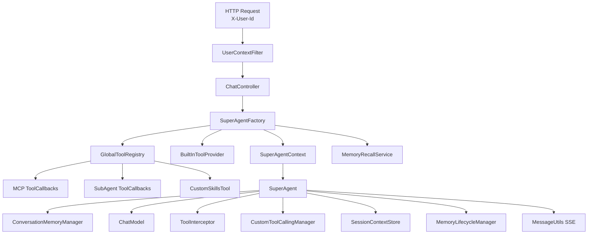

# 架构与执行流程

## 总体架构

## 请求入口

### 1. 用户身份注入

`UserContextFilter` 会强制校验请求头里的 `X-User-Id`。如果缺失，请求直接返回 `400`，后续所有会话、记忆、管理接口都会基于这个用户标识工作。

### 2. 聊天控制器

`ChatController` 提供两个主要接口：

- `GET /api/sse/agents`：列出可用 Agent
- `POST /api/sse/chat`：建立 SSE 会话并异步执行 Agent

如果请求类型是 `NEW`，控制器会创建新一轮上下文；如果是 `HUMAN_RESPONSE`，则恢复上一次被 `ask_human` 挂起的会话。

## 上下文创建

`SuperAgentFactory` 负责生成或恢复 `SuperAgentContext`，它会完成几件关键事情：

- 校验会话是否属于当前用户和当前 Agent
- 初始化回合号、排序号、挂起结果、当前阶段等运行态字段
- 把当前用户输入写入对话消息
- 召回本轮会话可用的记忆包
- 按 Agent 配置组装工具集

工具来源有四类：

- `BuiltInToolProvider`：内置工具
- `GlobalToolRegistry#getMcpToolCallbacks`：MCP 工具
- `GlobalToolRegistry#getSubAgentToolCallbacks`：子 Agent 工具
- `GlobalToolRegistry#getSkillsTool`：技能激活工具

## 执行引擎

### 阶段一：`THINKING`

这个阶段只允许两个工具：

- `activate_skill`
- `direct_answer`

如果模型判断问题可以直接回答，会调用 `direct_answer` 并结束整轮流程；否则只输出思考文本，进入下一阶段。

### 阶段二：`MODE_CONFIRMATION`

这个阶段只允许 `write_mode`。模型必须在这里做出执行模式选择：

- `ReAct`
- `PlanExecutor`

### 阶段三：`EXECUTION`

这里会按模式分流：

#### `ReAct`

- 直接开放业务工具
- 按“思考 -> 调用工具 -> 观察结果 -> 继续执行”的循环推进
- 最终输出纯文本答案结束

#### `PlanExecutor`

分成两个子步骤：

1. 先调用 `write_plan_tool` 写入结构化计划，并向前端发送 `PLAN_DECLARED`
2. 再逐阶段执行，每次用 `update_plan_tool` 回写阶段状态和变更

在计划执行期间，阶段内的流式内容会通过 `TASK_THINK_CHANGE` 持续推送到当前任务节点。

## 工具调用链路

工具并不是直接由模型执行，而是走一条完整的受控链路：

1. `ToolInterceptor` 先判断当前阶段是否允许调用该工具
2. `CustomToolCallingManager` 解析 ToolCall 并执行对应 `ToolCallback`
3. 工具结果被封装成 `ToolResponseMessage`
4. 对话历史继续追加，进入下一轮模型推理

这套机制解决了两个问题：

- 阶段权限收敛，防止模型在错误阶段乱调工具
- 不同工具实现形式被统一成同一套调用协议

## SubAgent 协作

SubAgent 通过 `SubAgentToolCallback` 以 HTTP 方式调用目标 Agent 的 `/api/sse/chat`，并解析其返回的 SSE 流。

在父 Agent 侧，消息会被二次处理：

- `STREAM_CONTENT`：被拼接为工具结果
- `STREAM_THINK`：只记日志，不向最终结果透传
- `INVOCATION_*`：补充 `mode`、`stage_id`、`executor` 后继续转发
- `PLAN_*`、`TASK_THINK_*`：当前实现中会被忽略

这意味着父子 Agent 协作已经打通，但父 Agent 目前主要吸收子 Agent 的正文与执行标记，不直接复用子 Agent 的计划视图。

## Memory 架构

### 会话层

`SessionContextStore` 有两套实现：

- `InMemorySessionContextStore`
- `JdbcSessionContextStore`

它负责保存：

- 会话元信息
- 未压缩对话消息
- 最新摘要消息
- 回合号与排序号

### 召回层

`MemoryRecallService` 在每轮开始前召回三类记忆：

- 用户画像 `PROFILE`
- 执行历史 `EXECUTION_HISTORY`
- Agent 经验 `EXPERIENCE`

召回结果会被拼成系统消息，注入到当前模型上下文。

### 压缩层

`DefaultConversationMemoryManager` 会在消息达到阈值后：

- 持久化当前未落库消息
- 调用 `LlmDialogueSummaryGenerator` 生成摘要
- 标记旧消息为已压缩
- 只保留摘要与最近若干条消息

### 抽取层

`MemoryLifecycleManager` 在回合结束后触发两类任务：

- 立即或异步抽取执行历史、Agent 经验
- 会话空闲达到阈值后抽取长期画像记忆

底层抽取由 `MemoryExtractionService` 完成，优先走 LLM 提取，失败时再降级为规则抽取。

## 配置分层

项目同时支持两层配置来源：

- `application.yml` 里的 `apex.global.*`
- `src/main/resources/agents/<agentKey>/config.yml`

`AgentWorkspaceService` 会优先读取 workspace 配置，不存在时再回落到全局配置或默认提示词模板。提示词文件也遵循同样的查找逻辑。

