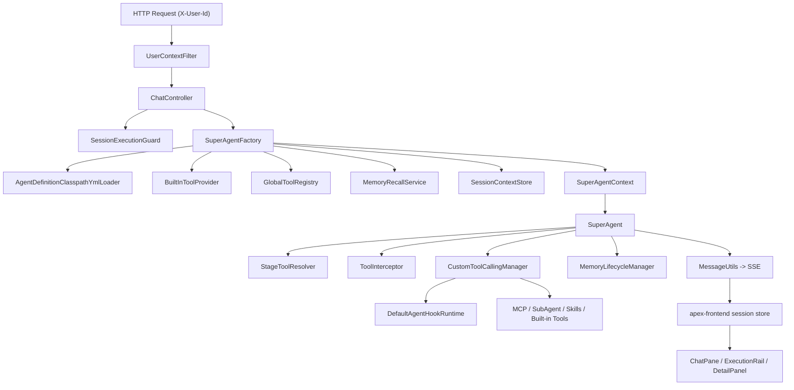

# 架构与执行流程

## 总体结构

当前仓库可以理解为两层：

- 后端 Agent 运行时：负责执行、工具、记忆、SSE
- 前端工作台：负责把 SSE 事件还原成可交互的会话界面

```mermaid
flowchart TD
    A["HTTP Request (X-User-Id)"] --> B["UserContextFilter"]
    B --> C["ChatController"]
    C --> D["SessionExecutionGuard"]
    C --> E["SuperAgentFactory"]
    E --> F["AgentDefinitionClasspathYmlLoader"]
    E --> G["BuiltInToolProvider"]
    E --> H["GlobalToolRegistry"]
    E --> I["MemoryRecallService"]
    E --> J["SessionContextStore"]
    E --> K["SuperAgentContext"]
    K --> L["SuperAgent"]
    L --> M["StageToolResolver"]
    L --> N["ToolInterceptor"]
    L --> O["CustomToolCallingManager"]
    O --> P["DefaultAgentHookRuntime"]
    O --> Q["MCP / SubAgent / Skills / Built-in Tools"]
    L --> R["MemoryLifecycleManager"]
    L --> S["MessageUtils -> SSE"]
    S --> T["apex-frontend session store"]
    T --> U["ChatPane / ExecutionRail / DetailPanel"]
```

## 请求入口

### `UserContextFilter`

职责：

- 校验请求头中的 `X-User-Id`
- 将用户标识写入 `UserContextHolder`

这意味着会话、记忆、恢复操作都默认以当前用户维度隔离。

### `ChatController`

当前暴露两个 SSE 相关入口：

- `GET /api/sse/agents`
- `POST /api/sse/chat`

`POST /api/sse/chat` 的关键流程：

1. 校验 `sessionId`
2. 用 `SessionExecutionGuard` 防止同一 `sessionId` 并发执行
3. 根据 `RequestType.NEW` 或 `RequestType.HUMAN_RESPONSE` 创建/恢复上下文
4. 把 `SseEmitter` 注入上下文
5. 调用 `SuperAgentFactory.executeContext`
6. 在 `finally` 中补发 `END`

## 上下文创建

### `SuperAgentFactory`

它是后端执行准备阶段的核心入口。

创建新轮次时会做这些事情：

- 读取既有会话并校验 userId / agentKey 是否一致
- 初始化本轮运行状态
- 装配所有可用工具
- 加载记忆召回包
- 追加本轮用户消息并持久化

恢复挂起会话时会做这些事情：

- 从 `SessionContextStore` 读取上下文
- 校验当前会话确实处于 `HUMAN_IN_THE_LOOP`
- 注入前端回传的 `humanResponse`
- 重新做记忆召回

## Agent 定义解析

### `AgentDefinitionClasspathYmlLoader`

该类把 agent 定义拆成了几个独立来源：

- 全局配置：`application.yml`
- workspace 配置：`agents/<agentKey>/config.yml`
- workspace prompt：
  - `REACT_PROMPT.md`
  - `PLAN_EXECUTOR_WRITE_PLAN_PROMPT.md`
  - `PLAN_EXECUTOR_RUN_PROMPT.md`
- workspace 说明：`AGENT.md`
- 缺省 prompt 回退：`agents/defaults/*` 或内置 `StageSystemPrompt`

解析策略有几个关键点：

- `workspace config` 里的 `allow-*` 白名单会覆盖全局配置
- `workspace config` 里的 `hooks` 会覆盖全局 Hook 配置
- `default-execution-mode` 可以来自 workspace，也可以来自全局 agent 配置

## 工具装配

### 1. 内置工具

`BuiltInToolProvider` 当前固定注册：

- `ask_human`
- `write_plan_tool`
- `update_plan_tool`
- `session_search`

### 2. MCP 工具

`GlobalToolRegistry` 会根据 agent 定义里的 MCP 名称：

- 读取 `apex.global.mcps.*`
- 用 stdio 拉起外部 MCP server
- 把远端工具转换成 Spring AI `ToolCallback`

如果外部命令失败，当前实现会记录日志并返回空工具列表，不会直接让整个进程崩掉。

### 3. SubAgent 工具

SubAgent 会被包装成工具调用，底层通过 HTTP + SSE 回调目标 agent 的 `/api/sse/chat`。

### 4. Skills 工具

Skill 加载链路大致是：

1. 从 `apex.global.skills.*` 找到目录
2. 用 `FileSystemSkillLoader` 读取 skill
3. 组合成 `Skills`
4. 暴露为 `activate_skill`

如果 skill 目录不存在，当前实现会记录警告并跳过。

## 执行模式控制

### `StageToolResolver`

它负责决定“当前这一轮到底哪些工具可调用，哪些只能写进 prompt 但不能直接调”。

核心规则：

- `react`
  `write_plan_tool` 不参与调用，其余允许按规则进入可调用集合
- `plan-executor` 且 `context.plan == null`
  只有 `write_plan_tool` 可调用，其他工具只写进 prompt 描述
- `plan-executor` 且计划已存在
  `update_plan_tool` 变成可调用工具，`write_plan_tool` 被移除

### `ToolInterceptor`

它做的是更硬的运行时守卫，比如：

- `plan-executor` 初始阶段必须先写计划
- 没有 `RUNNING` 阶段时，必须先 `update_plan_tool`

也就是说，工具能不能被模型真正调起，不只看是否注册，还看当前执行态是否合法。

## 工具调用与 Hook

### `CustomToolCallingManager`

工具执行经过统一调用管理器，关键职责包括：

- 发送 `INVOCATION_DECLARED` / `INVOCATION_CHANGE`
- 执行 pre-hook
- 触发 `TOOL_CONFIRMATION`
- 执行真实工具
- 执行 post-hook
- 在需要时把会话切换到 `HUMAN_IN_THE_LOOP`

### `DefaultAgentHookRuntime`

负责按 agent 配置执行 Hook：

- `pre-tool-call`
  可返回继续执行、更新参数、请求确认
- `post-tool-call`
  可替换工具结果

仓库里已经有两个非常典型的 Hook 场景：

- `ToolConfirmHook`
  在工具真正执行前，向前端发 `TOOL_CONFIRMATION`
- `PlainTextTruncateHook`
  对长文本工具结果做截断

## 人在回路

当前实现里有两种主要挂起恢复场景：

### 1. `ask_human`

模型主动调用 `ask_human`，前端收到 `ASK_HUMAN` 后收集答案，再用 `RequestType.HUMAN_RESPONSE` 恢复会话。

### 2. `TOOL_CONFIRMATION`

工具 pre-hook 要求确认时，后端发 `TOOL_CONFIRMATION`。前端允许：

- 批准
- 拒绝
- 修改可编辑参数

然后再以 `RequestType.HUMAN_RESPONSE` 恢复会话。

## SSE 输出与前端消费

### 后端侧

后端当前主链路会发送的事件，见 [消息标准](消息标准.md)。

最关键的是：

- `STREAM_CONTENT`
- `PLAN_DECLARED`
- `PLAN_CHANGE`
- `INVOCATION_DECLARED`
- `INVOCATION_CHANGE`
- `ARTIFACT_DECLARED`
- `ARTIFACT_CHANGE`
- `ASK_HUMAN`
- `TOOL_CONFIRMATION`
- `END`

### 前端侧

前端主要通过两个文件把事件还原成 UI：

- `apex-frontend/src/stores/session/store.ts`
- `apex-frontend/src/stores/session/reducer.ts`

状态映射关系大致是：

- 消息正文 -> `messages`
- 阶段计划 -> `stages`
- 工具调用 -> `invocations`
- 结构化产物 -> `artifacts`
- 人工输入挂起 -> `pendingPrompts`
- 工具确认挂起 -> `pendingConfirmations`

对于没有 `stage_id` 的 `react` 调用，前端会自动归到一个本地虚拟阶段 `react-stage`。

## Memory 子系统

### 配置入口

`MemoryConfiguration` 会根据 `apex.memory.store.type` 在两套实现间切换：

- `in-memory`
- `jdbc`

### 主要职责拆分

- `SessionContextStore`
  保存/恢复会话上下文
- `MemoryRecallService`
  每轮执行前召回记忆
- `DefaultConversationMemoryManager`
  执行对话摘要压缩
- `MemoryLifecycleManager`
  在回合结束后异步抽取执行历史与经验记忆
- `MemoryController`
  提供记忆管理接口
- `SessionSearchService`
  执行历史会话搜索

### 数据类别

当前召回与管理的主要记忆类型包括：

- `PROFILE`
- `EXECUTION_HISTORY`
- `EXPERIENCE`

## Skill 经验学习链路

`activate_skill` 相关能力当前已经形成闭环：

1. `SkillUsageRecorderHook` 记录 skill 使用事件
2. `SkillUsageBatchService` 聚合待处理记录
3. `SkillExperienceScheduler` 按 cron 定时跑批
4. `SkillExperienceExtractor` 调模型抽取经验
5. `SkillExperienceAugmentHook` 在后续 skill 激活时注入经验片段

这套链路的配置入口在：

- `apex.skills.learning.*`

## 当前实现边界

- 当前资源目录没有完整的 `default_agent` workspace
- 当前外部 MCP 与 skill 依赖仍是示例绝对路径
- JDBC 记忆与搜索实现明显偏向 PostgreSQL/pgvector，但依赖配置尚未完全收口
- 前端保留了对旧事件 `STREAM_THINK` 的兼容，但主链路文档应以当前真实发送事件为准
